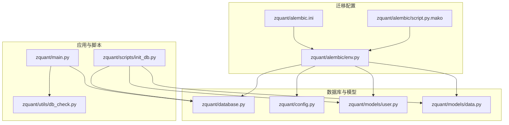
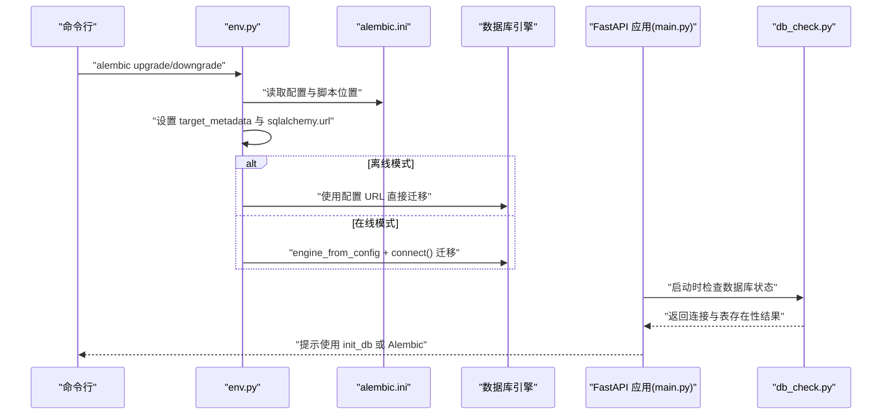
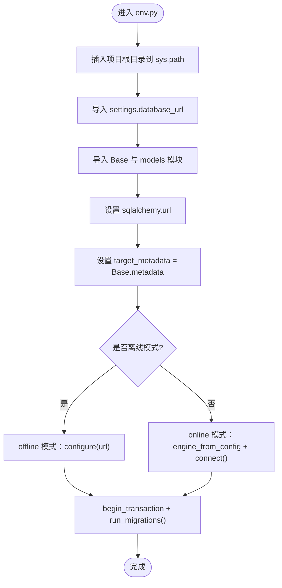
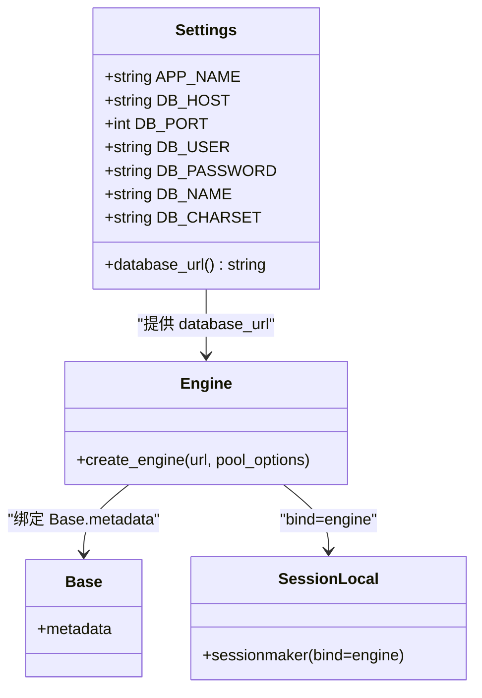
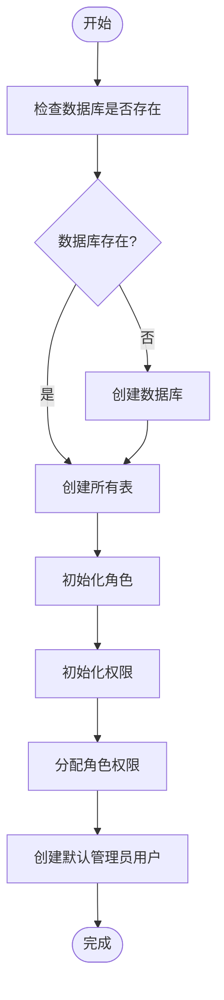
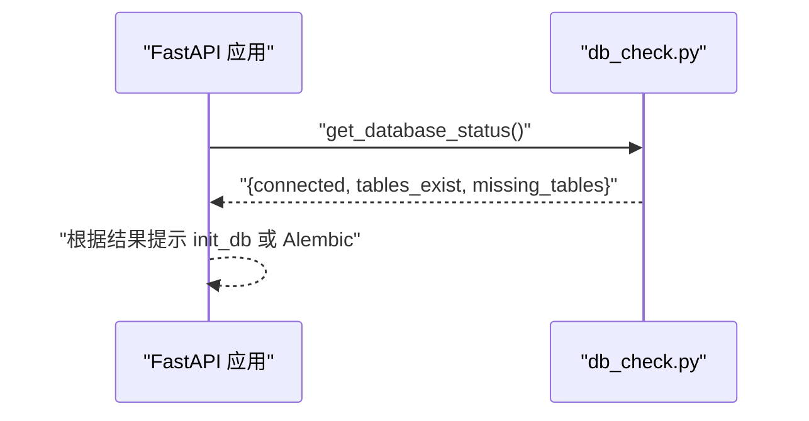
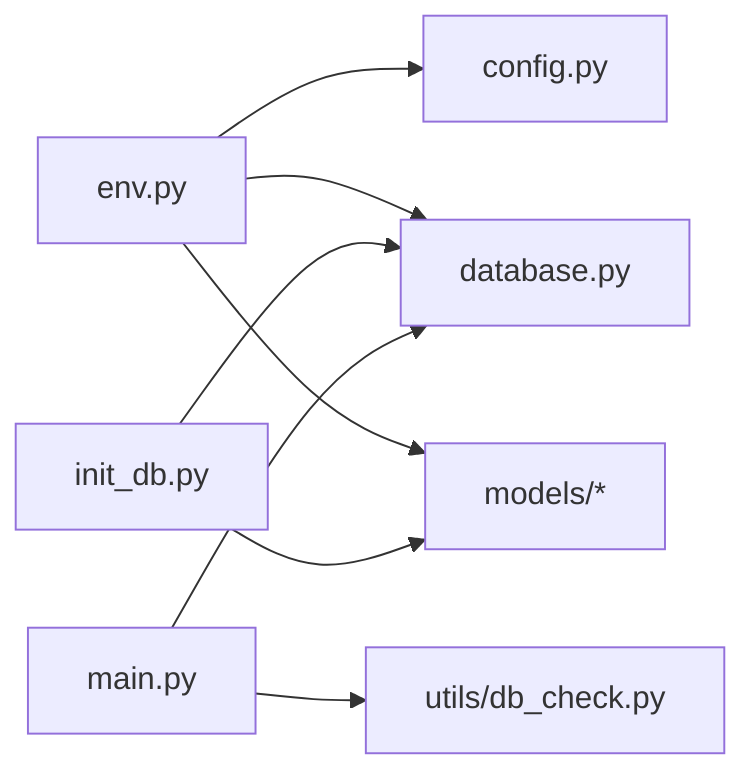

# 迁移管理

<cite>
**本文引用的文件**
- [zquant/alembic/env.py](file://zquant/alembic/env.py)
- [zquant/alembic.ini](file://zquant/alembic.ini)
- [zquant/alembic/script.py.mako](file://zquant/alembic/script.py.mako)
- [zquant/database.py](file://zquant/database.py)
- [zquant/config.py](file://zquant/config.py)
- [zquant/scripts/init_db.py](file://zquant/scripts/init_db.py)
- [zquant/main.py](file://zquant/main.py)
- [zquant/utils/db_check.py](file://zquant/utils/db_check.py)
- [zquant/models/user.py](file://zquant/models/user.py)
- [zquant/models/data.py](file://zquant/models/data.py)
</cite>

## 目录
1. [简介](#简介)
2. [项目结构](#项目结构)
3. [核心组件](#核心组件)
4. [架构总览](#架构总览)
5. [详细组件分析](#详细组件分析)
6. [依赖关系分析](#依赖关系分析)
7. [性能考虑](#性能考虑)
8. [故障排查指南](#故障排查指南)
9. [结论](#结论)
10. [附录](#附录)

## 简介
本文件系统性阐述 zquant 的数据库迁移机制，围绕 Alembic（env.py）与 SQLAlchemy 模型的模式变更管理展开，覆盖迁移脚本生成、升级（upgrade）与降级（downgrade）流程；解释 env.py 如何集成 FastAPI 应用与数据库引擎；说明初始化脚本（如 init_db.py）在首次部署时如何创建数据库结构；并给出实际迁移操作示例（新增字段、修改表结构、数据迁移等），以及迁移策略如何保障生产环境的数据安全与服务连续性。

## 项目结构
与迁移相关的目录与文件分布如下：
- Alembic 配置与入口
  - zquant/alembic/ini：配置脚本位置、日志与路径
  - zquant/alembic/env.py：迁移环境配置，绑定数据库引擎与模型元数据
  - zquant/alembic/script.py.mako：迁移模板，定义 upgrade/downgrade 入口
- 数据库与模型
  - zquant/database.py：数据库引擎、Base、会话管理
  - zquant/config.py：数据库连接 URL 构建
  - zquant/models/*：SQLAlchemy 模型定义
- 初始化与运行时集成
  - zquant/scripts/init_db.py：首次部署初始化脚本
  - zquant/main.py：FastAPI 应用启动时进行数据库状态检查
  - zquant/utils/db_check.py：数据库连接与表存在性检查

**图示来源**
- [zquant/alembic.ini](file://zquant/alembic.ini#L1-L45)
- [zquant/alembic/env.py](file://zquant/alembic/env.py#L1-L71)
- [zquant/alembic/script.py.mako](file://zquant/alembic/script.py.mako#L1-L24)
- [zquant/database.py](file://zquant/database.py#L1-L155)
- [zquant/config.py](file://zquant/config.py#L1-L166)
- [zquant/models/user.py](file://zquant/models/user.py#L1-L113)
- [zquant/models/data.py](file://zquant/models/data.py#L1-L1227)
- [zquant/main.py](file://zquant/main.py#L1-L247)
- [zquant/scripts/init_db.py](file://zquant/scripts/init_db.py#L1-L289)
- [zquant/utils/db_check.py](file://zquant/utils/db_check.py#L1-L127)

**章节来源**
- [zquant/alembic.ini](file://zquant/alembic.ini#L1-L45)
- [zquant/alembic/env.py](file://zquant/alembic/env.py#L1-L71)
- [zquant/alembic/script.py.mako](file://zquant/alembic/script.py.mako#L1-L24)
- [zquant/database.py](file://zquant/database.py#L1-L155)
- [zquant/config.py](file://zquant/config.py#L1-L166)
- [zquant/models/user.py](file://zquant/models/user.py#L1-L113)
- [zquant/models/data.py](file://zquant/models/data.py#L1-L1227)
- [zquant/main.py](file://zquant/main.py#L1-L247)
- [zquant/scripts/init_db.py](file://zquant/scripts/init_db.py#L1-L289)
- [zquant/utils/db_check.py](file://zquant/utils/db_check.py#L1-L127)

## 核心组件
- Alembic 环境配置（env.py）
  - 通过 sys.path 插入项目根目录，导入 settings 与 Base，并批量导入模型模块，使 target_metadata 指向 Base.metadata
  - 提供离线与在线两种迁移模式：offline（直接使用配置 URL）与 online（基于连接的配置）
- Alembic 配置文件（alembic.ini）
  - 指定脚本位置、路径分隔符、日志配置
  - 提供 sqlalchemy.url 占位符，实际 URL 由 env.py 注入
- 迁移模板（script.py.mako）
  - 定义 upgrade()/downgrade() 入口，由 Alembic 自动生成的脚本填充具体变更
- 数据库引擎与模型（database.py、config.py）
  - database.py 创建 engine、SessionLocal、Base，并提供 get_db/get_db_context 等会话管理
  - config.py 提供 Settings.database_url，用于构建数据库连接字符串
- 初始化脚本（init_db.py）
  - 首次部署时创建数据库、创建所有表、初始化角色与权限、创建默认管理员用户
- 应用集成（main.py、utils/db_check.py）
  - 应用启动时检查数据库连接与表存在性，缺失时提示使用 init_db 或 Alembic 进行迁移

**章节来源**
- [zquant/alembic/env.py](file://zquant/alembic/env.py#L1-L71)
- [zquant/alembic.ini](file://zquant/alembic.ini#L1-L45)
- [zquant/alembic/script.py.mako](file://zquant/alembic/script.py.mako#L1-L24)
- [zquant/database.py](file://zquant/database.py#L1-L155)
- [zquant/config.py](file://zquant/config.py#L1-L166)
- [zquant/scripts/init_db.py](file://zquant/scripts/init_db.py#L1-L289)
- [zquant/main.py](file://zquant/main.py#L1-L247)
- [zquant/utils/db_check.py](file://zquant/utils/db_check.py#L1-L127)

## 架构总览
下面的序列图展示了 Alembic 在不同模式下的迁移执行流程，以及与 FastAPI 应用的集成点。

**图示来源**
- [zquant/alembic/env.py](file://zquant/alembic/env.py#L1-L71)
- [zquant/alembic.ini](file://zquant/alembic.ini#L1-L45)
- [zquant/main.py](file://zquant/main.py#L1-L247)
- [zquant/utils/db_check.py](file://zquant/utils/db_check.py#L1-L127)

## 详细组件分析

### Alembic 环境配置（env.py）
- 路径与导入
  - 将项目根目录插入 sys.path，导入 settings 与 Base，并批量导入模型模块，确保所有模型纳入 target_metadata
- URL 注入
  - 从 settings.database_url 注入 sqlalchemy.url，统一由配置层提供连接信息
- 迁移模式
  - offline：直接使用配置 URL，适合无应用进程的环境
  - online：基于 engine_from_config + connect()，适合与应用共享连接池的场景
- 目标元数据
  - target_metadata = Base.metadata，确保 Alembic 能感知所有模型定义

**图示来源**
- [zquant/alembic/env.py](file://zquant/alembic/env.py#L1-L71)

**章节来源**
- [zquant/alembic/env.py](file://zquant/alembic/env.py#L1-L71)

### Alembic 配置文件（alembic.ini）
- 脚本位置与路径分隔符
  - script_location 指向 zquant/alembic，prepend_sys_path 为 .，便于在项目内解析
- 日志配置
  - 定义 root/sqlalchemy/alembic 日志器、处理器与格式器，便于迁移过程可观测
- URL 占位符
  - sqlalchemy.url 为占位符，实际由 env.py 注入

**章节来源**
- [zquant/alembic.ini](file://zquant/alembic.ini#L1-L45)

### 迁移模板（script.py.mako）
- 作用
  - 定义 upgrade()/downgrade() 函数入口，Alembic 自动生成的脚本会填充具体 SQL 变更
- 使用方式
  - 通过 alembic revision --autogenerate 生成脚本，随后 alembic upgrade/head 或 downgrade/版本号 执行

**章节来源**
- [zquant/alembic/script.py.mako](file://zquant/alembic/script.py.mako#L1-L24)

### 数据库引擎与模型（database.py、config.py）
- database.py
  - 创建 engine，配置连接池参数（pool_pre_ping、pool_recycle、pool_size、max_overflow、pool_timeout 等）
  - 提供 SessionLocal 与 Base，以及 get_db/get_db_context 会话管理
- config.py
  - Settings.database_url 构建 mysql+pymysql://... 的连接字符串
  - 支持从环境变量与 .env 文件读取配置，优先级明确

**图示来源**
- [zquant/config.py](file://zquant/config.py#L1-L166)
- [zquant/database.py](file://zquant/database.py#L1-L155)

**章节来源**
- [zquant/config.py](file://zquant/config.py#L1-L166)
- [zquant/database.py](file://zquant/database.py#L1-L155)

### 初始化脚本（init_db.py）
- 功能概览
  - 检查并创建数据库（若不存在），创建所有表，初始化角色与权限，分配角色权限，创建默认管理员用户
- 关键流程
  - create_database_if_not_exists：尝试连接目标库，若报错码为未知数据库则创建数据库
  - Base.metadata.create_all(bind=engine)：创建所有表
  - 初始化角色、权限、角色权限分配
  - 创建默认管理员用户

**图示来源**
- [zquant/scripts/init_db.py](file://zquant/scripts/init_db.py#L1-L289)

**章节来源**
- [zquant/scripts/init_db.py](file://zquant/scripts/init_db.py#L1-L289)

### 应用集成与状态检查（main.py、utils/db_check.py）
- main.py 启动事件
  - 调用 get_database_status 检查连接与表存在性
  - 若表缺失，提示使用 init_db 或 Alembic 迁移
- utils/db_check.py
  - check_database_connection：验证连接可用性
  - check_required_tables：校验必需表是否存在
  - get_database_status：汇总连接与表状态

**图示来源**
- [zquant/main.py](file://zquant/main.py#L1-L247)
- [zquant/utils/db_check.py](file://zquant/utils/db_check.py#L1-L127)

**章节来源**
- [zquant/main.py](file://zquant/main.py#L1-L247)
- [zquant/utils/db_check.py](file://zquant/utils/db_check.py#L1-L127)

## 依赖关系分析
- Alembic 与配置/模型
  - env.py 依赖 settings.database_url 与 Base.metadata，确保迁移能感知模型定义
- 数据库引擎与应用
  - database.py 的 engine 与 SessionLocal 既服务于应用请求，也可用于迁移（online 模式）
- 初始化脚本与模型
  - init_db.py 通过 Base.metadata.create_all 创建表，依赖 models 中的模型定义
- 应用与迁移
  - main.py 通过 db_check.py 在启动时判断是否需要迁移或初始化

**图示来源**
- [zquant/alembic/env.py](file://zquant/alembic/env.py#L1-L71)
- [zquant/config.py](file://zquant/config.py#L1-L166)
- [zquant/database.py](file://zquant/database.py#L1-L155)
- [zquant/models/user.py](file://zquant/models/user.py#L1-L113)
- [zquant/models/data.py](file://zquant/models/data.py#L1-L1227)
- [zquant/scripts/init_db.py](file://zquant/scripts/init_db.py#L1-L289)
- [zquant/main.py](file://zquant/main.py#L1-L247)
- [zquant/utils/db_check.py](file://zquant/utils/db_check.py#L1-L127)

**章节来源**
- [zquant/alembic/env.py](file://zquant/alembic/env.py#L1-L71)
- [zquant/config.py](file://zquant/config.py#L1-L166)
- [zquant/database.py](file://zquant/database.py#L1-L155)
- [zquant/models/user.py](file://zquant/models/user.py#L1-L113)
- [zquant/models/data.py](file://zquant/models/data.py#L1-L1227)
- [zquant/scripts/init_db.py](file://zquant/scripts/init_db.py#L1-L289)
- [zquant/main.py](file://zquant/main.py#L1-L247)
- [zquant/utils/db_check.py](file://zquant/utils/db_check.py#L1-L127)

## 性能考虑
- 连接池配置
  - database.py 中的 pool_pre_ping、pool_recycle、pool_size、max_overflow、pool_timeout 等参数直接影响迁移期间的连接稳定性与资源占用
- 迁移模式选择
  - 在线模式可复用应用连接池，减少额外连接开销；离线模式简单直接，适合无应用进程的环境
- 大表迁移
  - 对于大表的索引、唯一约束、列变更，建议在低峰时段执行，并评估锁等待与阻塞风险

[本节为通用指导，无需特定文件来源]

## 故障排查指南
- 数据库连接失败
  - 检查 .env/.env 文件与环境变量配置，确认 DB_HOST/DB_PORT/DB_USER/DB_PASSWORD/DB_NAME
  - 使用 utils/db_check.py 的 check_database_connection 快速定位错误码（如未知数据库）
- 表缺失
  - 使用 utils/db_check.py 的 check_required_tables 列出缺失表
  - 首次部署使用 init_db.py 创建数据库与表；后续使用 Alembic 迁移
- 迁移执行失败
  - 确认 alembic.ini 的脚本位置与路径分隔符配置
  - 在线模式下检查 engine 配置与连接池参数
- 应用启动提示迁移
  - 根据提示运行 init_db.py 或执行 alembic upgrade head

**章节来源**
- [zquant/utils/db_check.py](file://zquant/utils/db_check.py#L1-L127)
- [zquant/scripts/init_db.py](file://zquant/scripts/init_db.py#L1-L289)
- [zquant/alembic.ini](file://zquant/alembic.ini#L1-L45)
- [zquant/database.py](file://zquant/database.py#L1-L155)
- [zquant/main.py](file://zquant/main.py#L1-L247)

## 结论
zquant 的迁移机制通过 Alembic 与 SQLAlchemy 模型紧密耦合，借助 env.py 将配置与模型元数据统一注入迁移环境；init_db.py 提供首次部署的快速初始化能力；main.py 与 utils/db_check.py 在应用启动阶段提供数据库状态检查与引导提示。该体系在开发与生产环境中均可稳定工作，结合合理的迁移策略与运维流程，能够保障数据安全与服务连续性。

[本节为总结，无需特定文件来源]

## 附录

### 迁移操作示例（步骤说明）
- 新增字段
  - 在模型中添加列定义，保存后执行 alembic revision --autogenerate 生成脚本，再执行 alembic upgrade head
  - 参考文件：[zquant/models/user.py](file://zquant/models/user.py#L1-L113)、[zquant/alembic/env.py](file://zquant/alembic/env.py#L1-L71)、[zquant/alembic/script.py.mako](file://zquant/alembic/script.py.mako#L1-L24)
- 修改表结构（如重命名列、添加索引）
  - 在模型中调整列定义或索引，执行 autogenerate 生成脚本，再执行 upgrade
  - 参考文件：[zquant/models/data.py](file://zquant/models/data.py#L1-L1227)、[zquant/alembic/env.py](file://zquant/alembic/env.py#L1-L71)
- 数据迁移（如字段拆分、计算字段）
  - 在 upgrade 中编写数据处理逻辑，必要时在 downgrade 中回滚
  - 参考文件：[zquant/alembic/script.py.mako](file://zquant/alembic/script.py.mako#L1-L24)
- 首次部署
  - 使用 init_db.py 创建数据库与表，初始化角色与权限
  - 参考文件：[zquant/scripts/init_db.py](file://zquant/scripts/init_db.py#L1-L289)

### 生产环境迁移策略
- 低影响窗口
  - 选择业务低峰时段执行大表结构变更
- 回滚预案
  - 在 downgrade 中实现幂等回滚，确保可逆
- 渐进式发布
  - 先在预生产环境验证，再逐步推广至生产
- 监控与告警
  - 结合日志与数据库监控，及时发现锁等待与性能异常

[本节为通用指导，无需特定文件来源]