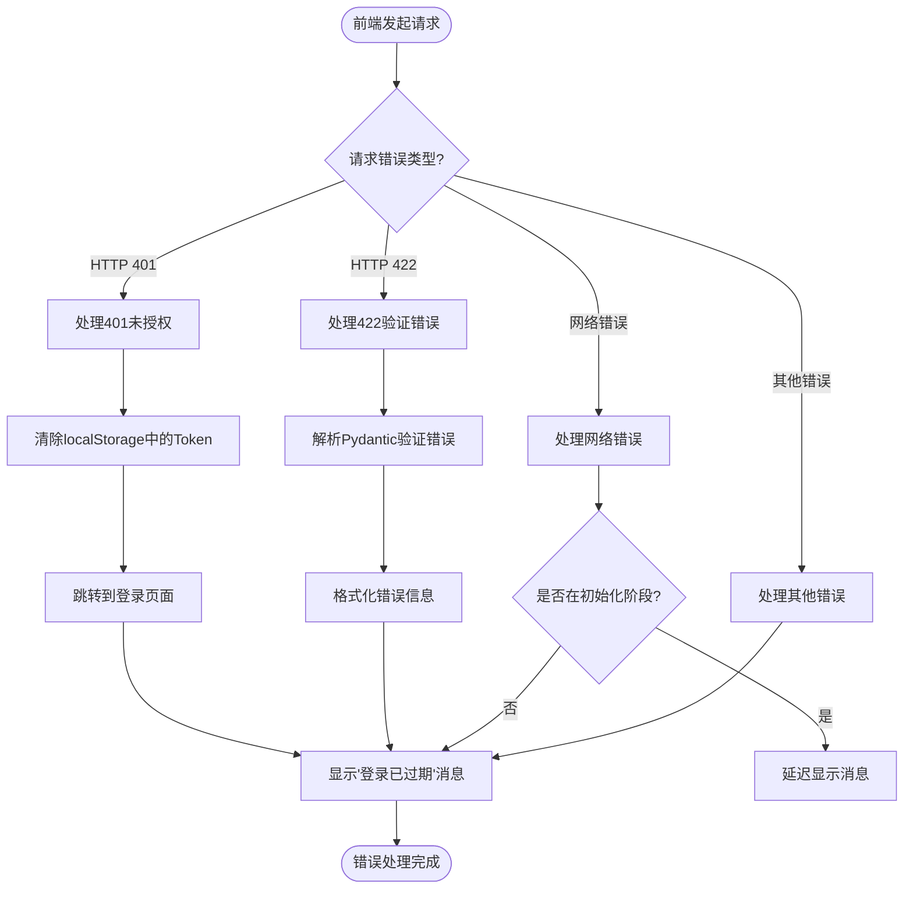

# 前后端通信机制

<cite>
**本文档引用的文件**   
- [index.ts](file://web/src/services/zquant/index.ts)
- [auth.ts](file://web/src/services/zquant/auth.ts)
- [backtest.ts](file://web/src/services/zquant/backtest.ts)
- [factor.ts](file://web/src/services/zquant/factor.ts)
- [main.py](file://zquant/main.py)
- [auth.py](file://zquant/api/v1/auth.py)
- [backtest.py](file://zquant/api/v1/backtest.py)
- [factor.py](file://zquant/api/v1/factor.py)
- [security.py](file://zquant/middleware/security.py)
- [logging.py](file://zquant/middleware/logging.py)
- [deps.py](file://zquant/api/deps.py)
- [auth.py](file://zquant/services/auth.py)
- [backtest.py](file://zquant/services/backtest.py)
- [factor.py](file://zquant/services/factor.py)
- [requestErrorConfig.ts](file://web/src/requestErrorConfig.ts)
</cite>

## 目录
1. [项目结构](#项目结构)
2. [前端API客户端封装](#前端api客户端封装)
3. [后端FastAPI应用入口](#后端fastapi应用入口)
4. [认证流程](#认证流程)
5. [回测任务创建流程](#回测任务创建流程)
6. [因子配置更新流程](#因子配置更新流程)
7. [错误处理与重试策略](#错误处理与重试策略)
8. [中间件与安全机制](#中间件与安全机制)

## 项目结构

zquant系统采用前后端分离架构，前端基于React框架构建，后端采用FastAPI框架。前端代码位于`web/`目录，后端代码位于`zquant/`目录。

**图源**
- [web/src/services/zquant/](file://web/src/services/zquant/)
- [zquant/main.py](file://zquant/main.py)
- [zquant/api/v1/](file://zquant/api/v1/)

## 前端API客户端封装

前端在`web/src/services/zquant/`目录下封装了API客户端，使用UmiJS的`request`函数（基于Fetch API）与后端进行通信。每个服务模块（如认证、回测、因子）都有独立的TS文件进行封装。

### 认证服务封装

**图源**
- [auth.ts](file://web/src/services/zquant/auth.ts)
- [auth.py](file://zquant/api/v1/auth.py)

### 回测服务封装

**图源**
- [backtest.ts](file://web/src/services/zquant/backtest.ts)
- [backtest.py](file://zquant/api/v1/backtest.py)

### 因子服务封装

**图源**
- [factor.ts](file://web/src/services/zquant/factor.ts)
- [factor.py](file://zquant/api/v1/factor.py)

## 后端FastAPI应用入口

后端入口文件`zquant/main.py`负责创建FastAPI应用实例，配置中间件，并注册各个API路由模块。

**图源**
- [main.py](file://zquant/main.py)

## 认证流程

系统采用JWT（JSON Web Token）进行认证，包含访问Token和刷新Token机制。

**图源**
- [auth.ts](file://web/src/services/zquant/auth.ts)
- [auth.py](file://zquant/api/v1/auth.py)
- [deps.py](file://zquant/api/deps.py)
- [auth.py](file://zquant/services/auth.py)

## 回测任务创建流程

回测任务的创建涉及前端请求、后端路由分发、服务层调用和数据库操作。

**图源**
- [backtest.ts](file://web/src/services/zquant/backtest.ts)
- [backtest.py](file://zquant/api/v1/backtest.py)
- [backtest.py](file://zquant/services/backtest.py)

## 因子配置更新流程

因子配置更新展示了系统如何处理复杂的业务逻辑和数据验证。

**图源**
- [factor.ts](file://web/src/services/zquant/factor.ts)
- [factor.py](file://zquant/api/v1/factor.py)
- [factor.py](file://zquant/services/factor.py)

## 错误处理与重试策略

系统实现了完善的错误处理机制，从前端到后端都有相应的处理策略。

**图源**
- [requestErrorConfig.ts](file://web/src/requestErrorConfig.ts)

## 中间件与安全机制

系统通过多层中间件实现安全防护、日志记录和性能监控。

**图源**
- [main.py](file://zquant/main.py)
- [security.py](file://zquant/middleware/security.py)
- [logging.py](file://zquant/middleware/logging.py)