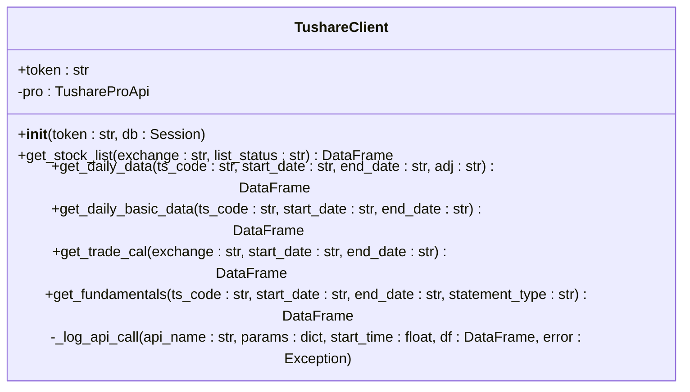
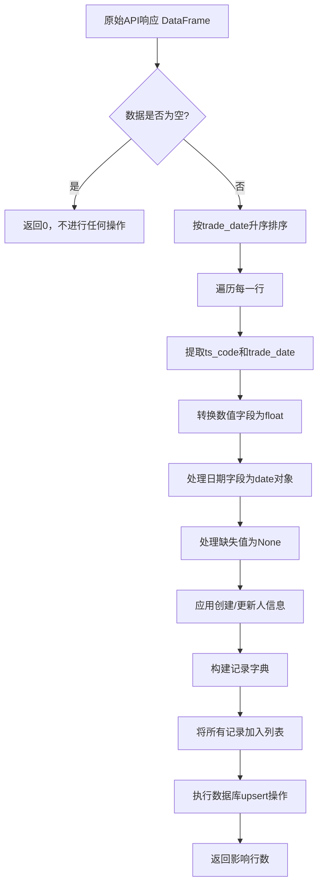
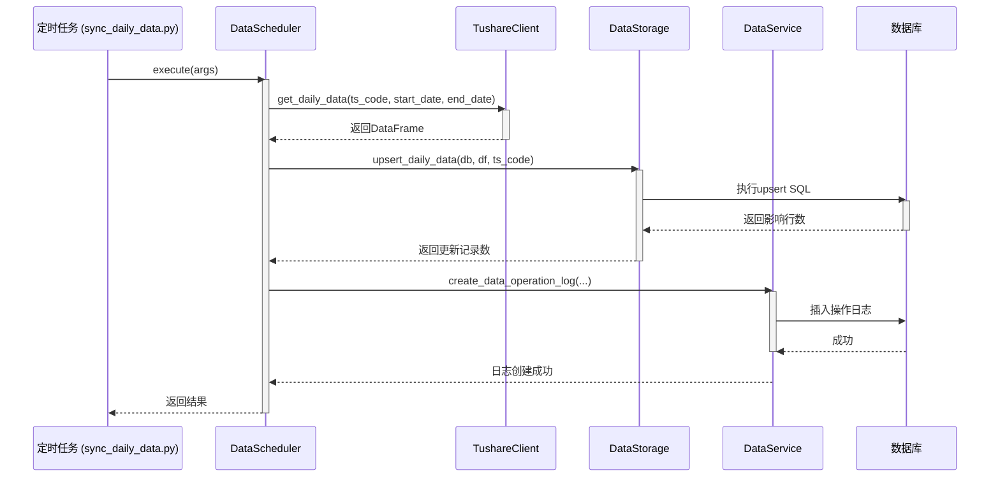
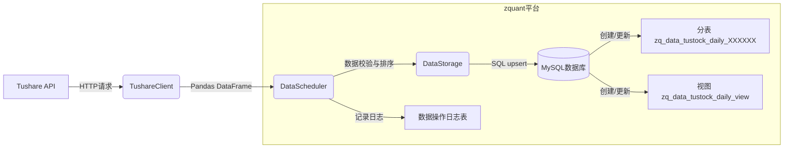

# 外部数据集成流程

<cite>
**本文档引用的文件**   
- [tushare.py](file://zquant/data/etl/tushare.py)
- [scheduler.py](file://zquant/data/etl/scheduler.py)
- [data.py](file://zquant/services/data.py)
- [storage.py](file://zquant/data/storage.py)
- [processor.py](file://zquant/data/processor.py)
- [data.py](file://zquant/models/data.py)
- [sync_daily_data.py](file://zquant/scheduler/job/sync_daily_data.py)
- [sync_daily_basic_data.py](file://zquant/scheduler/job/sync_daily_basic_data.py)
</cite>

## 目录
1. [ETL流程设计原理](#etl流程设计原理)
2. [Tushare API封装与数据获取](#tushare-api封装与数据获取)
3. [数据清洗与转换逻辑](#数据清洗与转换逻辑)
4. [定时任务调度机制](#定时任务调度机制)
5. [数据流图与完整性保障](#数据流图与完整性保障)

## ETL流程设计原理

zquant平台的ETL（Extract, Transform, Load）流程设计遵循模块化和可扩展的原则，旨在高效、可靠地从外部数据源Tushare获取金融数据，并将其持久化到本地MySQL数据库中。整个流程分为三个核心阶段：数据抽取（Extract）、数据转换（Transform）和数据加载（Load）。

在数据抽取阶段，系统通过`TushareClient`类封装Tushare API，实现对股票列表、日线数据、每日指标、财务数据等各类数据的调用。该客户端负责处理API认证、频率限制和错误重试，确保数据获取的稳定性。

在数据转换阶段，原始的API响应数据（通常为Pandas DataFrame）会经过一系列清洗和标准化处理。这包括字段映射、类型转换、缺失值处理以及日期格式的统一。此过程由`DataProcessor`和`DataStorage`类协同完成，确保数据质量符合业务要求。

在数据加载阶段，经过清洗的数据被写入本地数据库。系统采用分表策略，为每只股票创建独立的数据表（如`zq_data_tustock_daily_000001`），以优化查询性能。同时，系统会动态创建视图（View）来聚合所有分表，为上层应用提供统一的查询接口。

**Section sources**
- [tushare.py](file://zquant/data/etl/tushare.py#L23-L392)
- [storage.py](file://zquant/data/storage.py#L57-L800)
- [processor.py](file://zquant/data/processor.py#L46-L800)

## Tushare API封装与数据获取

### Tushare客户端封装

`TushareClient`类是与Tushare API交互的核心组件，它封装了所有API调用的细节，为上层应用提供了简洁的接口。其主要功能包括：

1.  **Token管理**：客户端在初始化时，会优先从数据库的配置表中读取已加密的Tushare Token。如果未提供Token，则会抛出异常，确保了敏感信息的安全性。
2.  **API调用**：客户端提供了多个方法来调用Tushare的不同API，例如`get_stock_list()`、`get_daily_data()`、`get_daily_basic_data()`等。这些方法将复杂的API参数封装为简单的函数调用。
3.  **日志记录**：通过`_log_api_call()`方法，客户端会详细记录每次API调用的参数、执行时间、返回结果（包括数据条数、列名）以及任何错误信息。这为监控和调试提供了强大的支持。

**Diagram sources **
- [tushare.py](file://zquant/data/etl/tushare.py#L39-L392)

### 频率限制与错误处理

为了应对Tushare API的频率限制和网络波动，系统实现了健壮的错误处理和重试机制。虽然`tushare.py`文件本身不直接包含重试逻辑，但其设计为上层调度器提供了基础：

1.  **异常捕获**：每个API调用都被`try-except`块包围，任何异常都会被捕获，并通过`_log_api_call()`方法记录详细的错误信息和堆栈跟踪。
2.  **上层重试**：实际的重试逻辑由调度器（`DataScheduler`）或定时任务（`SyncDailyDataJob`）在更高层次实现。当`TushareClient`抛出异常时，调度器可以捕获并决定是否进行重试，从而实现了更灵活的重试策略（如指数退避）。

## 数据清洗与转换逻辑

### 字段映射与类型标准化

数据清洗是确保数据一致性和准确性的关键步骤。`DataStorage`类中的`upsert_*`系列方法负责将从Tushare API获取的原始数据（DataFrame）转换为符合数据库模型的字典列表。

1.  **字段映射**：Tushare API返回的字段名（如`ts_code`, `trade_date`）与数据库表的字段名保持一致，减少了映射的复杂性。对于`Fundamental`（财务数据），系统将整行数据序列化为JSON字符串存储，实现了灵活的字段扩展。
2.  **类型标准化**：
    *   **数值型**：使用`float()`函数将字符串或对象类型的数值转换为浮点数。对于可能为`None`的值，会进行空值检查。
    *   **日期型**：通过`parse_date_field()`函数将字符串格式的日期（如`"20231001"`）转换为Python的`date`对象，确保数据库存储的日期格式正确。
    *   **字符串型**：对字符串进行清理，去除首尾空格，并限制最大长度。

### 缺失值处理

系统对缺失值（NaN）的处理策略如下：

1.  **数据库字段**：在数据库模型中，非主键和非必填字段被定义为`nullable=True`，允许存储`NULL`值。
2.  **数据转换**：在`DataStorage`的`upsert_*`方法中，当遇到`NaN`或`None`值时，会直接将其赋值为`None`，最终在数据库中体现为`NULL`。对于`Fundamental`表，`clean_nan_values()`函数会将`NaN`和`Inf`值转换为`None`，以确保JSON序列化成功。

**Diagram sources **
- [storage.py](file://zquant/data/storage.py#L149-L211)
- [storage.py](file://zquant/data/storage.py#L285-L371)

## 定时任务调度机制

### Scheduler协调任务触发

`DataScheduler`类是ETL流程的调度核心，它协调`TushareClient`和`DataStorage`，完成从数据获取到持久化的完整流程。

1.  **初始化**：`DataScheduler`在初始化时会创建`TushareClient`和`DataStorage`的实例，建立与外部API和本地数据库的连接。
2.  **表存在性检查**：在执行任何同步操作前，`_ensure_tables_exist()`方法会检查目标数据库表是否存在。如果不存在，它会自动创建表，确保了系统的自包含性。
3.  **任务执行**：`DataScheduler`提供了一系列`sync_*`方法，如`sync_daily_data()`和`sync_all_daily_data()`。这些方法定义了具体的同步逻辑，例如：
    *   `sync_daily_data()`：同步单只股票的日线数据。
    *   `sync_all_daily_data()`：根据参数选择最优策略（批量API或循环调用）来同步所有股票的数据。

### 与服务层协作

`DataScheduler`与`DataService`服务层紧密协作，共同完成数据持久化和操作日志记录。

1.  **数据持久化**：`DataScheduler`调用`DataStorage`的`upsert_*`方法将数据写入数据库。`DataStorage`利用SQLAlchemy的`ON DUPLICATE KEY UPDATE`机制，实现了“存在则更新，不存在则插入”的upsert操作。
2.  **操作日志**：每次同步操作完成后，`DataScheduler`会调用`DataService.create_data_operation_log()`方法，创建一条数据操作日志。该日志记录了操作的表名、类型、结果、开始/结束时间、影响的记录数等关键信息，为数据同步的监控和审计提供了依据。

**Diagram sources **
- [scheduler.py](file://zquant/data/etl/scheduler.py#L40-L800)
- [data.py](file://zquant/services/data.py#L450-L506)
- [storage.py](file://zquant/data/storage.py#L149-L211)

## 数据流图与完整性保障

### 完整数据流路径

从Tushare API到本地MySQL数据库的完整数据流如下图所示：

**Diagram sources **
- [tushare.py](file://zquant/data/etl/tushare.py#L39-L392)
- [scheduler.py](file://zquant/data/etl/scheduler.py#L40-L800)
- [storage.py](file://zquant/data/storage.py#L57-L800)
- [data.py](file://zquant/models/data.py#L175-L273)

### 错误重试与日志记录

系统通过多层次的机制保障数据同步的可靠性：

1.  **错误重试**：虽然`tushare.py`不直接实现重试，但其详尽的错误日志为上层调度器提供了决策依据。`DataScheduler`和`SyncDailyDataJob`等组件可以基于这些日志信息，在发生网络错误或API限流时进行重试。
2.  **日志记录**：
    *   **API调用日志**：`TushareClient`记录了每次API调用的详细信息，包括参数、执行时间和结果，便于排查API层面的问题。
    *   **操作日志**：`DataService`创建的操作日志记录了数据同步任务的宏观状态（成功、失败、部分成功）和统计信息，是监控数据同步健康状况的核心。
3.  **数据一致性保障**：
    *   **分表与视图**：分表策略保证了单表数据量不会过大，而视图则提供了统一的查询入口，两者结合既保证了性能又保证了易用性。
    *   **upsert机制**：使用`ON DUPLICATE KEY UPDATE`确保了数据的幂等性，即使任务重复执行，也不会产生重复数据。
    *   **事务处理**：数据库操作在事务中进行，保证了数据写入的原子性。

**Section sources**
- [tushare.py](file://zquant/data/etl/tushare.py#L79-L132)
- [scheduler.py](file://zquant/data/etl/scheduler.py#L245-L314)
- [data.py](file://zquant/services/data.py#L450-L506)