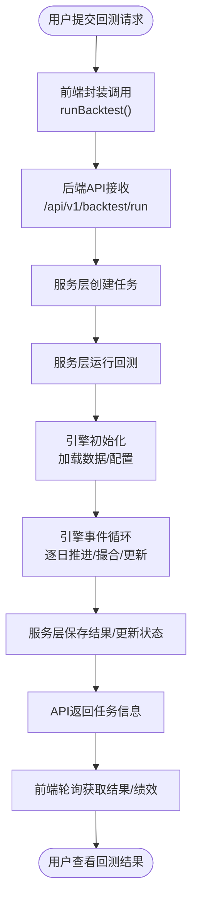

# 实时与批处理数据流

<cite>
**本文引用的文件**
- [web/src/services/zquant/backtest.ts](file://web/src/services/zquant/backtest.ts)
- [zquant/api/v1/backtest.py](file://zquant/api/v1/backtest.py)
- [zquant/services/backtest.py](file://zquant/services/backtest.py)
- [zquant/backtest/engine.py](file://zquant/backtest/engine.py)
- [web/src/pages/backtest/create.tsx](file://web/src/pages/backtest/create.tsx)
- [web/src/pages/backtest/index.tsx](file://web/src/pages/backtest/index.tsx)
- [zquant/scheduler/manager.py](file://zquant/scheduler/manager.py)
- [zquant/scheduler/executor.py](file://zquant/scheduler/executor.py)
- [zquant/scheduler/executors/common_executor.py](file://zquant/scheduler/executors/common_executor.py)
- [zquant/scheduler/job/sync_daily_data.py](file://zquant/scheduler/job/sync_daily_data.py)
- [zquant/scheduler/job/base.py](file://zquant/scheduler/job/base.py)
- [zquant/data/etl/scheduler.py](file://zquant/data/etl/scheduler.py)
- [zquant/models/scheduler.py](file://zquant/models/scheduler.py)
</cite>

## 目录
1. [引言](#引言)
2. [项目结构](#项目结构)
3. [核心组件](#核心组件)
4. [架构总览](#架构总览)
5. [详细组件分析](#详细组件分析)
6. [依赖分析](#依赖分析)
7. [性能考量](#性能考量)
8. [故障排查指南](#故障排查指南)
9. [结论](#结论)

## 引言
本文件对比分析 zquant 系统中的两类数据流：实时数据流与批处理任务流。  
- 实时数据流：用户在前端发起回测请求，后端接收请求并启动回测引擎，随后通过 WebSocket 或轮询方式推送进度与结果。  
- 批处理任务流：调度器管理各类同步任务（如日线数据同步），按 Cron/间隔等周期调度执行，具备状态管理、重试与日志追踪能力。

## 项目结构
围绕两类数据流的关键模块分布如下：
- 前端回测交互：web/src/services/zquant/backtest.ts、web/src/pages/backtest/create.tsx、web/src/pages/backtest/index.tsx
- 后端回测链路：zquant/api/v1/backtest.py、zquant/services/backtest.py、zquant/backtest/engine.py
- 批处理调度链路：zquant/scheduler/manager.py、zquant/scheduler/executor.py、zquant/scheduler/executors/common_executor.py、zquant/scheduler/job/sync_daily_data.py、zquant/scheduler/job/base.py、zquant/data/etl/scheduler.py、zquant/models/scheduler.py

图表来源
- [web/src/pages/backtest/create.tsx](file://web/src/pages/backtest/create.tsx#L1-L377)
- [web/src/pages/backtest/index.tsx](file://web/src/pages/backtest/index.tsx#L1-L201)
- [web/src/services/zquant/backtest.ts](file://web/src/services/zquant/backtest.ts#L1-L211)
- [zquant/api/v1/backtest.py](file://zquant/api/v1/backtest.py#L1-L424)
- [zquant/services/backtest.py](file://zquant/services/backtest.py#L1-L278)
- [zquant/backtest/engine.py](file://zquant/backtest/engine.py#L1-L498)
- [zquant/scheduler/manager.py](file://zquant/scheduler/manager.py#L1-L475)
- [zquant/scheduler/executor.py](file://zquant/scheduler/executor.py#L1-L152)
- [zquant/scheduler/executors/common_executor.py](file://zquant/scheduler/executors/common_executor.py#L1-L135)
- [zquant/scheduler/job/base.py](file://zquant/scheduler/job/base.py#L1-L302)
- [zquant/scheduler/job/sync_daily_data.py](file://zquant/scheduler/job/sync_daily_data.py#L1-L242)
- [zquant/data/etl/scheduler.py](file://zquant/data/etl/scheduler.py#L1-L800)
- [zquant/models/scheduler.py](file://zquant/models/scheduler.py#L1-L203)

章节来源
- [web/src/services/zquant/backtest.ts](file://web/src/services/zquant/backtest.ts#L1-L211)
- [zquant/api/v1/backtest.py](file://zquant/api/v1/backtest.py#L1-L424)
- [zquant/services/backtest.py](file://zquant/services/backtest.py#L1-L278)
- [zquant/backtest/engine.py](file://zquant/backtest/engine.py#L1-L498)
- [zquant/scheduler/manager.py](file://zquant/scheduler/manager.py#L1-L475)
- [zquant/scheduler/executor.py](file://zquant/scheduler/executor.py#L1-L152)
- [zquant/scheduler/executors/common_executor.py](file://zquant/scheduler/executors/common_executor.py#L1-L135)
- [zquant/scheduler/job/sync_daily_data.py](file://zquant/scheduler/job/sync_daily_data.py#L1-L242)
- [zquant/scheduler/job/base.py](file://zquant/scheduler/job/base.py#L1-L302)
- [zquant/data/etl/scheduler.py](file://zquant/data/etl/scheduler.py#L1-L800)
- [zquant/models/scheduler.py](file://zquant/models/scheduler.py#L1-L203)

## 核心组件
- 前端回测服务封装：提供 runBacktest、getBacktestTasks、getBacktestResult、getPerformance 等 API 调用封装。
- 后端回测 API：接收回测请求，创建任务并调用服务层执行；提供任务列表、结果与绩效查询。
- 回测服务：负责任务创建、策略动态加载、引擎运行、结果持久化与状态更新。
- 回测引擎：加载数据、撮合订单、模拟交易、计算收益与指标。
- 批处理调度管理器：基于 APScheduler 的后台调度器，支持 Cron/间隔调度、线程池并发、重试与状态追踪。
- 通用执行器与数据同步执行器：根据配置路由到具体同步策略（如日线数据同步）。
- 同步脚本基类与日线同步任务：统一参数解析、日期校验、错误处理与执行摘要输出。
- ETL 调度器：封装 Tushare 数据拉取、分表存储、视图更新与操作日志记录。
- 调度模型：定义任务类型、状态、配置与执行历史的数据库模型。

章节来源
- [web/src/services/zquant/backtest.ts](file://web/src/services/zquant/backtest.ts#L1-L211)
- [zquant/api/v1/backtest.py](file://zquant/api/v1/backtest.py#L1-L424)
- [zquant/services/backtest.py](file://zquant/services/backtest.py#L1-L278)
- [zquant/backtest/engine.py](file://zquant/backtest/engine.py#L1-L498)
- [zquant/scheduler/manager.py](file://zquant/scheduler/manager.py#L1-L475)
- [zquant/scheduler/executor.py](file://zquant/scheduler/executor.py#L1-L152)
- [zquant/scheduler/executors/common_executor.py](file://zquant/scheduler/executors/common_executor.py#L1-L135)
- [zquant/scheduler/job/base.py](file://zquant/scheduler/job/base.py#L1-L302)
- [zquant/scheduler/job/sync_daily_data.py](file://zquant/scheduler/job/sync_daily_data.py#L1-L242)
- [zquant/data/etl/scheduler.py](file://zquant/data/etl/scheduler.py#L1-L800)
- [zquant/models/scheduler.py](file://zquant/models/scheduler.py#L1-L203)

## 架构总览
两类数据流在控制流上的关键差异：
- 实时流：用户在前端提交回测请求，后端同步执行回测并返回任务状态；前端通过轮询或 WebSocket 获取进度与结果。
- 批处理流：调度器按配置周期调度任务，任务在独立线程中执行，执行结果与状态持久化至数据库，支持重试与延迟检测。

图表来源
- [web/src/pages/backtest/create.tsx](file://web/src/pages/backtest/create.tsx#L1-L377)
- [web/src/services/zquant/backtest.ts](file://web/src/services/zquant/backtest.ts#L1-L211)
- [zquant/api/v1/backtest.py](file://zquant/api/v1/backtest.py#L1-L424)
- [zquant/services/backtest.py](file://zquant/services/backtest.py#L1-L278)
- [zquant/backtest/engine.py](file://zquant/backtest/engine.py#L1-L498)

## 详细组件分析

### 实时数据流：回测请求到结果的端到端流程
- 前端交互
  - 回测创建页收集策略代码、股票池、日期范围、交易成本等配置，调用 runBacktest 发送回测请求。
  - 回测列表页展示任务状态与时间轴，支持查看详情与导出结果。
- 后端处理
  - 回测 API 接收请求，创建任务并调用服务层 run_backtest。
  - 服务层动态加载策略类，构造回测引擎并运行，计算指标并持久化结果。
  - API 层提供任务列表、结果与绩效查询接口。
- 引擎执行
  - 引擎加载价格与每日指标数据，按交易日历推进，撮合订单，更新投资组合与成本，最终产出回测结果。

图表来源
- [web/src/pages/backtest/create.tsx](file://web/src/pages/backtest/create.tsx#L1-L377)
- [web/src/services/zquant/backtest.ts](file://web/src/services/zquant/backtest.ts#L1-L211)
- [zquant/api/v1/backtest.py](file://zquant/api/v1/backtest.py#L1-L424)
- [zquant/services/backtest.py](file://zquant/services/backtest.py#L1-L278)
- [zquant/backtest/engine.py](file://zquant/backtest/engine.py#L1-L498)

章节来源
- [web/src/pages/backtest/create.tsx](file://web/src/pages/backtest/create.tsx#L1-L377)
- [web/src/pages/backtest/index.tsx](file://web/src/pages/backtest/index.tsx#L1-L201)
- [web/src/services/zquant/backtest.ts](file://web/src/services/zquant/backtest.ts#L1-L211)
- [zquant/api/v1/backtest.py](file://zquant/api/v1/backtest.py#L1-L424)
- [zquant/services/backtest.py](file://zquant/services/backtest.py#L1-L278)
- [zquant/backtest/engine.py](file://zquant/backtest/engine.py#L1-L498)

### 批处理任务流：调度、执行与状态管理
- 调度管理器
  - 基于 APScheduler 的后台调度器，支持 Cron 与间隔调度，线程池并发执行，合并错过任务，限制最大实例数。
  - 提供添加、移除、暂停、恢复、手动触发任务的能力；提供任务状态查询（下次运行时间、是否延迟/过期）。
- 执行器路由
  - 通用执行器根据配置字段路由到不同执行器：脚本执行器、数据同步执行器、因子计算执行器等。
  - 数据同步执行器通过策略工厂创建具体同步策略（如日线数据同步）。
- 同步脚本基类与日线同步任务
  - 统一参数解析、日期校验、错误处理与执行摘要输出；日线同步任务支持单只/列表/全量按天/按时间段同步。
- ETL 调度器
  - 封装 Tushare 数据拉取、分表存储、视图更新与操作日志记录，支持批量/单只同步策略。
- 调度模型
  - 定义任务类型、调度状态、任务配置与执行历史，执行历史记录状态、开始/结束时间、时长、结果摘要与错误信息。

图表来源
- [zquant/scheduler/manager.py](file://zquant/scheduler/manager.py#L1-L475)
- [zquant/scheduler/executors/common_executor.py](file://zquant/scheduler/executors/common_executor.py#L1-L135)
- [zquant/scheduler/executor.py](file://zquant/scheduler/executor.py#L1-L152)
- [zquant/scheduler/job/base.py](file://zquant/scheduler/job/base.py#L1-L302)
- [zquant/scheduler/job/sync_daily_data.py](file://zquant/scheduler/job/sync_daily_data.py#L1-L242)
- [zquant/data/etl/scheduler.py](file://zquant/data/etl/scheduler.py#L1-L800)

章节来源
- [zquant/scheduler/manager.py](file://zquant/scheduler/manager.py#L1-L475)
- [zquant/scheduler/executor.py](file://zquant/scheduler/executor.py#L1-L152)
- [zquant/scheduler/executors/common_executor.py](file://zquant/scheduler/executors/common_executor.py#L1-L135)
- [zquant/scheduler/job/base.py](file://zquant/scheduler/job/base.py#L1-L302)
- [zquant/scheduler/job/sync_daily_data.py](file://zquant/scheduler/job/sync_daily_data.py#L1-L242)
- [zquant/data/etl/scheduler.py](file://zquant/data/etl/scheduler.py#L1-L800)
- [zquant/models/scheduler.py](file://zquant/models/scheduler.py#L1-L203)

### 同步任务的执行周期、依赖与状态管理
- 执行周期
  - Cron 表达式：支持分/时/日/月/周维度的精确调度。
  - 间隔调度：按秒数间隔执行。
- 依赖关系
  - 任务配置中通过字段（如 command、task_action）决定执行器与策略。
  - 通用执行器根据 task_action 路由到具体执行器（如 DataSyncExecutor）。
  - DataSyncExecutor 通过策略工厂创建具体同步策略（如 sync_daily_data）。
- 状态管理
  - ScheduledTask：任务配置与调度状态。
  - TaskExecution：执行历史，记录状态、起止时间、时长、结果摘要与错误信息。
  - 调度器提供任务状态查询，判断是否延迟/过期。

章节来源
- [zquant/scheduler/manager.py](file://zquant/scheduler/manager.py#L1-L475)
- [zquant/scheduler/executors/common_executor.py](file://zquant/scheduler/executors/common_executor.py#L1-L135)
- [zquant/scheduler/executor.py](file://zquant/scheduler/executor.py#L1-L152)
- [zquant/models/scheduler.py](file://zquant/models/scheduler.py#L1-L203)

## 依赖分析
- 前端对后端 API 的依赖：通过服务封装统一调用，降低耦合。
- 后端对引擎与服务的依赖：API 仅负责协议与鉴权，业务逻辑集中在服务层，引擎专注回测执行。
- 批处理对调度器与执行器的依赖：调度器负责生命周期与并发，执行器负责路由与策略执行。
- 同步任务对 ETL 调度器与数据存储的依赖：ETL 负责数据拉取与落库，调度器负责周期与状态。

图表来源
- [web/src/services/zquant/backtest.ts](file://web/src/services/zquant/backtest.ts#L1-L211)
- [zquant/api/v1/backtest.py](file://zquant/api/v1/backtest.py#L1-L424)
- [zquant/services/backtest.py](file://zquant/services/backtest.py#L1-L278)
- [zquant/backtest/engine.py](file://zquant/backtest/engine.py#L1-L498)
- [zquant/scheduler/manager.py](file://zquant/scheduler/manager.py#L1-L475)
- [zquant/scheduler/executors/common_executor.py](file://zquant/scheduler/executors/common_executor.py#L1-L135)
- [zquant/scheduler/executor.py](file://zquant/scheduler/executor.py#L1-L152)
- [zquant/scheduler/job/base.py](file://zquant/scheduler/job/base.py#L1-L302)
- [zquant/scheduler/job/sync_daily_data.py](file://zquant/scheduler/job/sync_daily_data.py#L1-L242)
- [zquant/data/etl/scheduler.py](file://zquant/data/etl/scheduler.py#L1-L800)

## 性能考量
- 实时回测
  - 引擎按交易日历推进，撮合与成本计算在内存中完成，适合中小规模股票池与短期回测窗口。
  - 建议：对大规模数据可考虑分批加载、缓存热点数据、优化订单撮合与成本计算路径。
- 批处理同步
  - 批量同步时禁用视图更新，完成后统一更新，减少锁竞争与写放大。
  - 线程池并发执行任务，合理设置线程数以平衡吞吐与资源占用。
  - 对 Tushare 接口调用进行限速与重试，避免超时与限流导致的失败。
- 通用建议
  - 对高频查询与写入建立索引，优化数据库连接池与事务粒度。
  - 对长时间运行任务增加心跳与进度上报，便于监控与告警。

[本节为通用指导，无需列出具体文件来源]

## 故障排查指南
- 实时回测
  - 若回测失败，后端服务层会更新任务状态并记录错误信息；前端可轮询获取错误详情。
  - 引擎在策略执行异常时会记录日志并继续推进，便于定位具体日期与错误原因。
- 批处理同步
  - 调度器提供任务状态查询，可判断是否延迟/过期；执行历史记录错误摘要，便于快速定位。
  - 同步脚本基类统一处理日期校验与异常捕获，打印执行摘要，便于人工核对。
  - ETL 调度器记录操作日志，包含插入/更新/删除计数与错误信息，支持按主表汇总记录。

章节来源
- [zquant/services/backtest.py](file://zquant/services/backtest.py#L1-L278)
- [zquant/backtest/engine.py](file://zquant/backtest/engine.py#L1-L498)
- [zquant/scheduler/manager.py](file://zquant/scheduler/manager.py#L1-L475)
- [zquant/scheduler/job/base.py](file://zquant/scheduler/job/base.py#L1-L302)
- [zquant/data/etl/scheduler.py](file://zquant/data/etl/scheduler.py#L1-L800)
- [zquant/models/scheduler.py](file://zquant/models/scheduler.py#L1-L203)

## 结论
- 实时数据流强调低延迟与交互性：前端通过轮询或 WebSocket 获取进度与结果，后端在单次请求内完成回测并返回。
- 批处理数据流强调稳定性与可观测性：调度器统一管理任务生命周期，执行器按配置路由到具体策略，ETL 层负责数据一致性与日志追踪。
- 两类数据流在资源调度、监控告警与日志追踪方面各有侧重：实时流偏向即时反馈，批处理流偏向长期稳定与可审计。

[本节为总结性内容，无需列出具体文件来源]