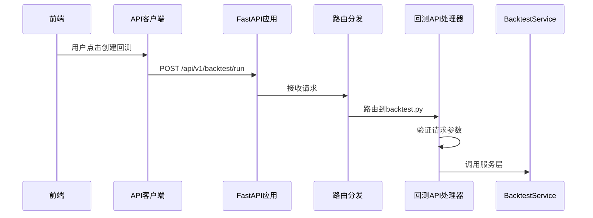
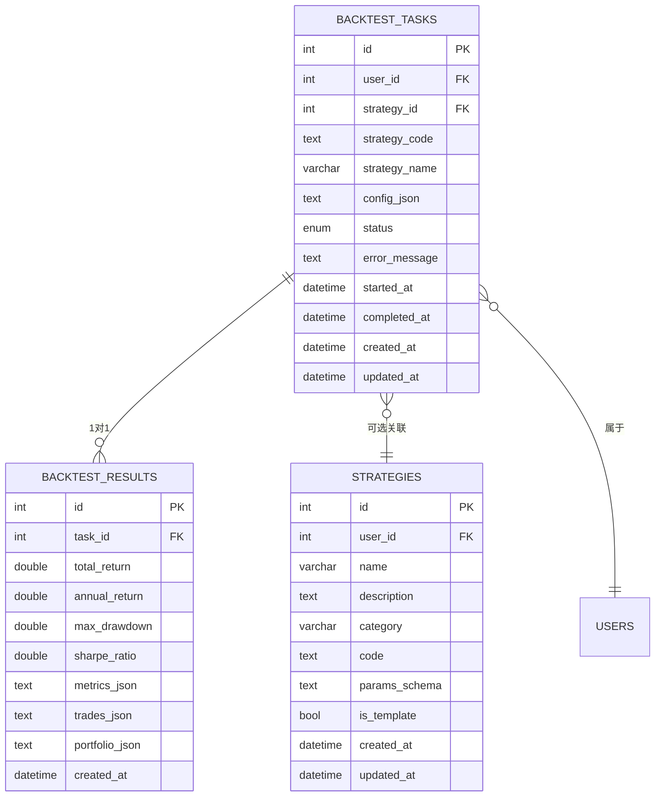
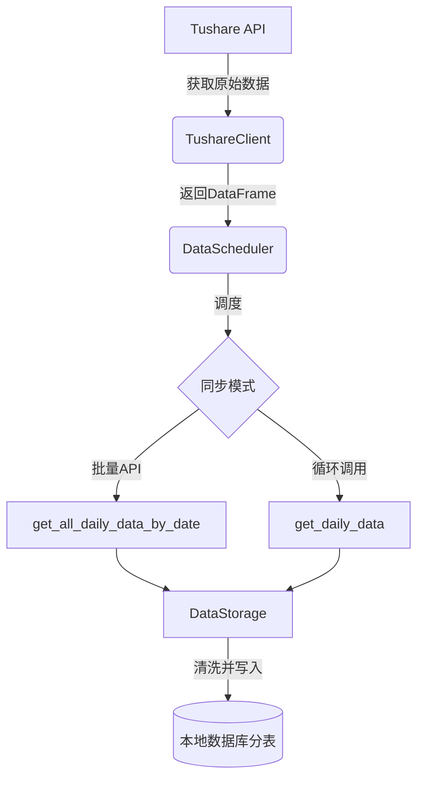
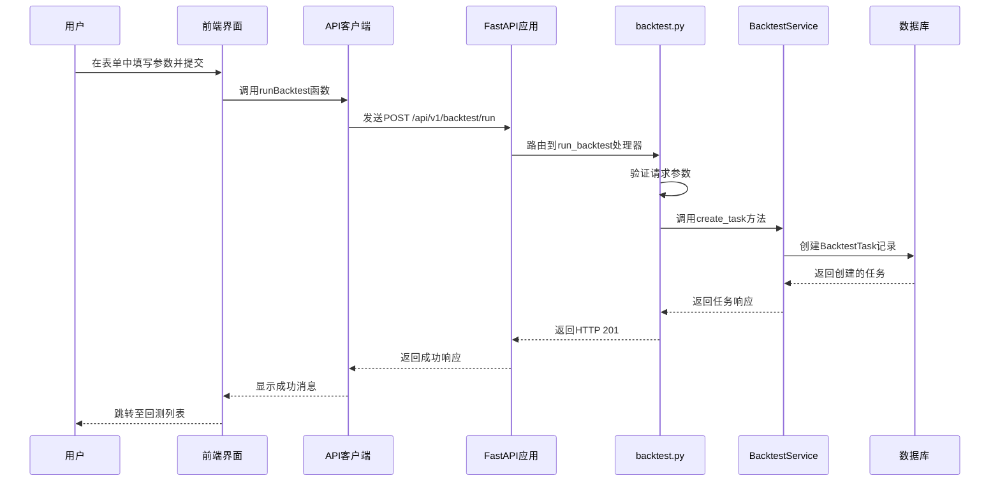

# 数据流与交互

<cite>
**本文档引用的文件**   
- [main.py](file://zquant/main.py)
- [backtest.py](file://zquant/api/v1/backtest.py)
- [data.py](file://zquant/api/v1/data.py)
- [tushare.py](file://zquant/data/etl/tushare.py)
- [scheduler.py](file://zquant/data/etl/scheduler.py)
- [backtest.ts](file://web/src/services/zquant/backtest.ts)
- [data.ts](file://web/src/services/zquant/data.ts)
- [create.tsx](file://web/src/pages/backtest/create.tsx)
- [backtest.py](file://zquant/services/backtest.py)
- [data.py](file://zquant/services/data.py)
- [sync_daily_data.py](file://zquant/scheduler/job/sync_daily_data.py)
</cite>

## 目录
1. [引言](#引言)
2. [前端用户操作与API客户端](#前端用户操作与api客户端)
3. [后端API层处理](#后端api层处理)
4. [服务层业务逻辑执行](#服务层业务逻辑执行)
5. [数据库持久化](#数据库持久化)
6. [外部数据流：Tushare ETL流程](#外部数据流tushare-etl流程)
7. [典型场景数据流转：创建回测任务](#典型场景数据流转创建回测任务)
8. [实时与批处理数据流模式](#实时与批处理数据流模式)
9. [结论](#结论)

## 引言
zquant系统是一个集成了数据服务、回测引擎等功能的量化分析平台。本系统采用前后端分离的架构，前端通过API客户端与后端FastAPI应用进行交互。核心数据流始于前端用户的操作，经由API层路由分发，由服务层执行业务逻辑，并最终通过数据库完成数据的持久化。同时，系统通过Tushare API获取外部原始数据，经过ETL流程清洗处理后存入本地数据库，支持实时数据流（如回测结果推送）和批处理任务（如每日数据同步）两种模式。

## 前端用户操作与API客户端
用户在前端界面（如创建回测任务页面）进行操作，这些操作通过前端的API客户端（位于`web/src/services/zquant/`目录下）封装为HTTP请求发送至后端。例如，当用户在`/backtest/create`页面点击“创建”按钮时，前端会调用`runBacktest`函数。

**Section sources**
- [backtest.ts](file://web/src/services/zquant/backtest.ts#L31-L39)
- [create.tsx](file://web/src/pages/backtest/create.tsx#L161-L189)

## 后端API层处理
后端的FastAPI应用以`main.py`为入口，通过`app.include_router`将不同功能的API路由注册到应用中。当API客户端发送请求时，请求首先到达`main.py`，然后根据URL前缀被路由到对应的API处理器。

例如，`/api/v1/backtest/run`的POST请求会被路由到`api/v1/backtest.py`文件中的`run_backtest`函数。该函数负责接收请求参数，验证数据，并调用服务层的`BacktestService`来执行业务逻辑。

**Diagram sources **
- [main.py](file://zquant/main.py#L217-L231)
- [backtest.py](file://zquant/api/v1/backtest.py#L90-L121)

**Section sources**
- [main.py](file://zquant/main.py#L117-L247)
- [backtest.py](file://zquant/api/v1/backtest.py#L90-L121)

## 服务层业务逻辑执行
API处理器将请求委派给服务层（位于`zquant/services/`目录下）来执行具体的业务逻辑。服务层是业务逻辑的核心，它不直接处理HTTP请求，而是专注于数据处理和业务规则的实现。

在回测场景中，`backtest.py`中的`run_backtest`函数会调用`BacktestService.create_task`来创建一个回测任务。`BacktestService`类负责管理回测任务的生命周期，包括创建、运行和查询结果。它会与数据库交互以持久化任务状态，并在需要时调用其他服务（如`StrategyService`）来获取策略代码。

**Section sources**
- [backtest.py](file://zquant/services/backtest.py#L43-L98)

## 数据库持久化
服务层通过SQLAlchemy ORM与数据库进行交互，完成数据的持久化。系统定义了多个数据库模型（位于`zquant/models/`目录下），如`BacktestTask`、`BacktestResult`和`Strategy`，这些模型映射到数据库中的具体表。

当`BacktestService`创建一个新任务时，它会实例化一个`BacktestTask`对象，并通过数据库会话（`db`）的`add`和`commit`方法将其保存到`zq_backtest_tasks`表中。同样，当回测完成时，计算出的绩效指标会被保存到`zq_backtest_results`表中。

**Diagram sources **
- [backtest.py](file://zquant/models/backtest.py#L48-L119)

**Section sources**
- [backtest.py](file://zquant/models/backtest.py#L48-L119)

## 外部数据流：Tushare ETL流程
系统通过Tushare API获取外部金融数据。这一过程由`zquant/data/etl/`目录下的ETL（Extract, Transform, Load）流程管理。

`TushareClient`类封装了与Tushare API的交互，提供`get_daily_data`、`get_daily_basic_data`等方法来获取不同类型的原始数据。`DataScheduler`类则负责调度数据同步任务，它会调用`TushareClient`获取数据，并通过`DataStorage`类将清洗后的数据存入本地数据库的分表中（如`zq_data_tustock_daily_000001`）。

批处理任务（如每日数据同步）由`zquant/scheduler/job/`下的脚本（如`sync_daily_data.py`）定义，并通过系统的任务调度器定期执行。

**Diagram sources **
- [tushare.py](file://zquant/data/etl/tushare.py#L39-L392)
- [scheduler.py](file://zquant/data/etl/scheduler.py#L40-L800)
- [sync_daily_data.py](file://zquant/scheduler/job/sync_daily_data.py#L80-L242)

**Section sources**
- [tushare.py](file://zquant/data/etl/tushare.py#L39-L392)
- [scheduler.py](file://zquant/data/etl/scheduler.py#L40-L800)

## 典型场景数据流转：创建回测任务
以下序列图详细描述了从用户创建回测任务到任务被持久化的全过程。

**Diagram sources **
- [create.tsx](file://web/src/pages/backtest/create.tsx#L161-L189)
- [backtest.py](file://zquant/api/v1/backtest.py#L90-L121)
- [backtest.py](file://zquant/services/backtest.py#L43-L98)

## 实时与批处理数据流模式
zquant系统支持两种主要的数据流模式：

1.  **实时数据流**：以用户请求驱动，如回测任务的创建和执行。这类流程响应迅速，通常在秒级内完成，数据流路径为：**前端 -> API客户端 -> API处理器 -> 服务层 -> 数据库**。
2.  **批处理任务**：由系统定时器或管理员手动触发，用于处理大量数据，如同步所有股票的日线数据。这类任务通常耗时较长，采用异步或后台作业的方式执行，数据流路径为：**定时任务 -> ETL调度器 -> Tushare API -> 数据存储 -> 数据库**。

## 结论
zquant系统构建了一个清晰、高效的数据流动路径。从前端用户操作开始，请求通过API客户端和后端API层，由服务层执行核心业务逻辑，最终在数据库中完成持久化。同时，系统通过独立的ETL流程从Tushare等外部源获取数据，确保了数据的丰富性和时效性。这种分层架构使得系统各组件职责分明，易于维护和扩展。