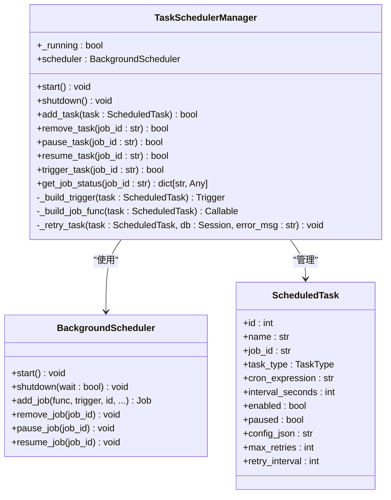
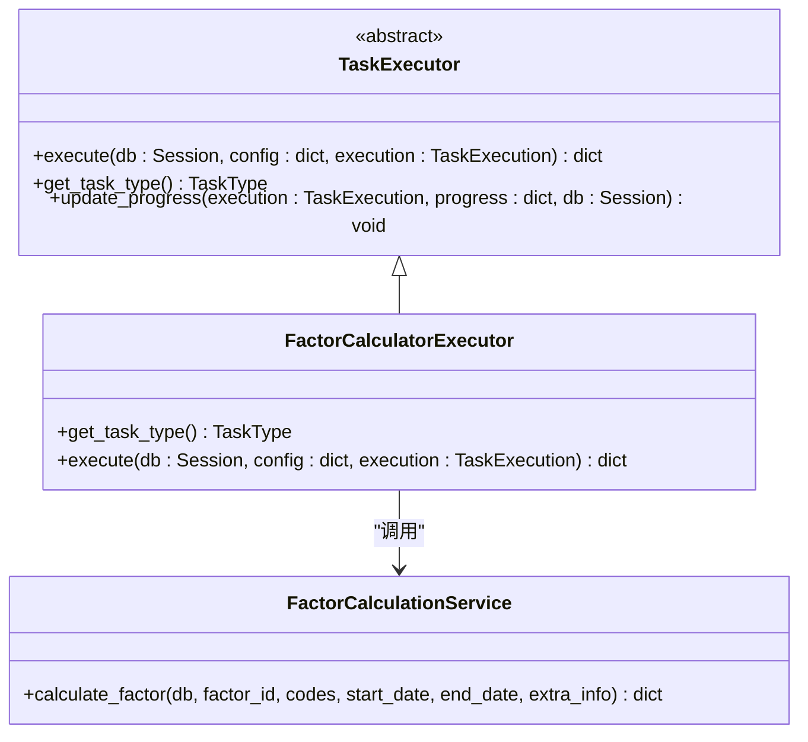
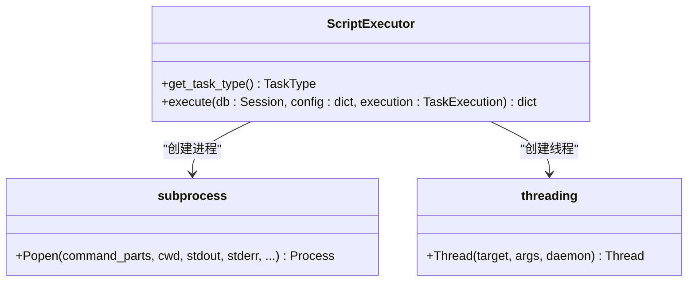
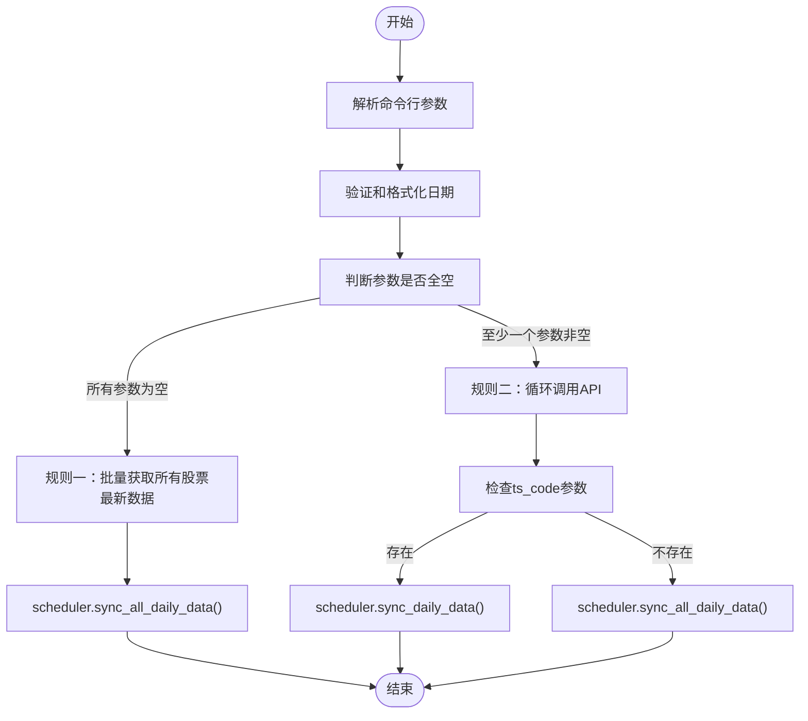
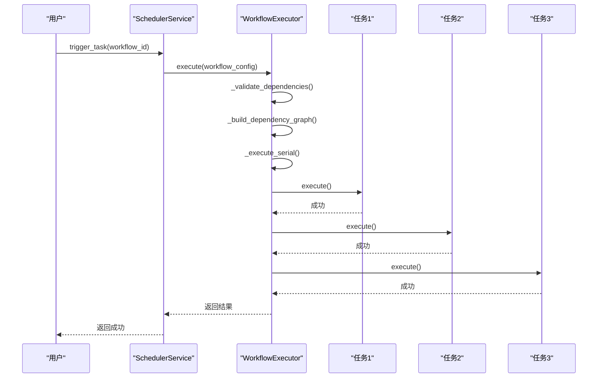
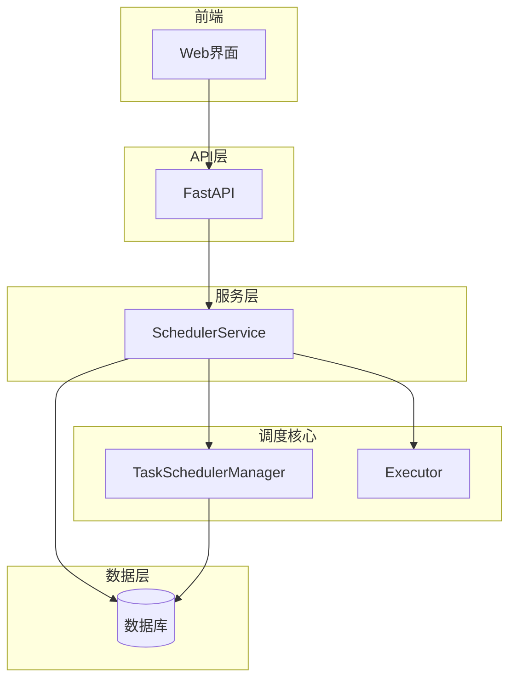
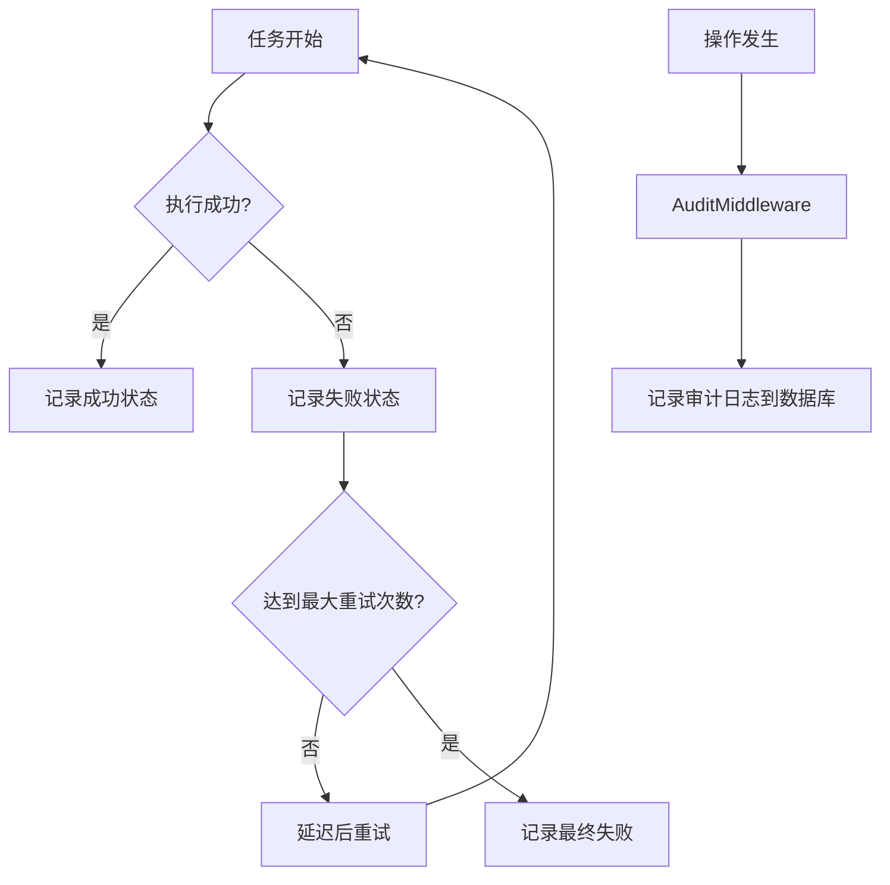

# 任务调度系统

<cite>
**本文档引用的文件**   
- [manager.py](file://zquant/scheduler/manager.py)
- [factor_calculator.py](file://zquant/scheduler/executors/factor_calculator.py)
- [script_executor.py](file://zquant/scheduler/executors/script_executor.py)
- [sync_daily_data.py](file://zquant/scheduler/job/sync_daily_data.py)
- [sync_factor_data.py](file://zquant/scheduler/job/sync_factor_data.py)
- [workflow_executor.py](file://zquant/scheduler/executors/workflow_executor.py)
- [base.py](file://zquant/scheduler/base.py)
- [executor.py](file://zquant/scheduler/executor.py)
- [scheduler.py](file://zquant/services/scheduler.py)
- [init_scheduler.py](file://zquant/scripts/init_scheduler.py)
- [audit.py](file://zquant/middleware/audit.py)
- [models/scheduler.py](file://zquant/models/scheduler.py)
- [api/v1/scheduler.py](file://zquant/api/v1/scheduler.py)
</cite>

## 目录
1. [引言](#引言)
2. [核心组件](#核心组件)
3. [调度器管理器](#调度器管理器)
4. [执行器模型](#执行器模型)
5. [具体任务示例](#具体任务示例)
6. [工作流调度](#工作流调度)
7. [服务层与API](#服务层与api)
8. [与数据ETL和因子计算的协同](#与数据etl和因子计算的协同)
9. [创建自定义定时任务教程](#创建自定义定时任务教程)
10. [可靠性保障](#可靠性保障)
11. [结论](#结论)

## 引言
zquant任务调度系统是一个基于APScheduler构建的健壮、灵活的定时任务管理系统。该系统旨在自动化执行各种数据同步、因子计算和外部脚本任务，确保数据的新鲜度和系统的高效运行。本系统通过`SchedulerManager`管理任务的生命周期（增删改查），利用多种执行器（Executor）模型来处理不同类型的任务，并通过`workflow_executor.py`编排复杂的任务依赖关系。服务层（`scheduler.py`）为前端API提供了接口，同时将任务状态持久化到数据库中。该系统与数据ETL（`data/etl/`）和因子计算模块紧密协作，构成了一个完整的数据处理流水线。

## 核心组件
zquant任务调度系统由多个核心组件构成，它们协同工作以实现完整的调度功能。核心组件包括任务调度管理器（`SchedulerManager`）、多种任务执行器（`Executor`）、任务定义（`ScheduledJob`）和服务层（`scheduler.py`）。这些组件通过清晰的接口和依赖关系，共同构建了一个可扩展、易维护的调度框架。

**Section sources**
- [manager.py](file://zquant/scheduler/manager.py#L46-L475)
- [executor.py](file://zquant/scheduler/executor.py#L36-L152)
- [models/scheduler.py](file://zquant/models/scheduler.py#L68-L203)
- [scheduler.py](file://zquant/services/scheduler.py#L39-L710)

## 调度器管理器
`SchedulerManager`是整个调度系统的核心，它基于APScheduler库实现，负责管理所有定时任务的生命周期。`TaskSchedulerManager`类封装了`BackgroundScheduler`，使其在后台线程中运行，不会阻塞主线程。所有任务通过`ThreadPoolExecutor`在线程池中异步执行，确保了系统的响应性和并发处理能力。

`TaskSchedulerManager`提供了`start`和`shutdown`方法来控制调度器的启停。其`add_task`方法是关键，它接收一个`ScheduledTask`对象，根据任务的`cron_expression`或`interval_seconds`构建相应的触发器（`CronTrigger`或`IntervalTrigger`），并将其包装成一个可执行的函数，最终添加到APScheduler中。该方法还处理了手动任务（`MANUAL_TASK`）的特殊情况，这类任务不会被添加到调度器，只能手动触发。

为了确保任务执行的可靠性，调度器实现了错误重试机制。当任务执行失败时，`_retry_task`方法会在独立线程中延迟重试，重试次数和间隔由任务配置决定。此外，`get_job_status`方法提供了对任务状态的增强查询，不仅能判断任务是否存在，还能检测任务是否延迟或过期。

**Diagram sources**
- [manager.py](file://zquant/scheduler/manager.py#L46-L475)

**Section sources**
- [manager.py](file://zquant/scheduler/manager.py#L46-L475)

## 执行器模型
zquant系统采用执行器（Executor）模型来解耦任务的调度与执行逻辑。不同的任务类型由不同的执行器处理，这种设计模式极大地提高了系统的灵活性和可扩展性。核心基类是`TaskExecutor`，它定义了`execute`和`get_task_type`两个抽象方法。

### factor_calculator.py
`FactorCalculatorExecutor`是专门用于执行因子计算任务的执行器。它实现了`TaskExecutor`接口，其`execute`方法会调用`FactorCalculationService.calculate_factor`来执行具体的计算逻辑。该执行器通过`task_action`配置项（必须为`calculate_factor`）来识别任务，并支持通过`factor_id`、`codes`、`start_date`和`end_date`等参数精确控制计算范围。执行结果会被格式化并返回，包含成功、失败的记录数等信息。

**Diagram sources**
- [factor_calculator.py](file://zquant/scheduler/executors/factor_calculator.py#L40-L123)
- [base.py](file://zquant/scheduler/base.py#L35-L72)

**Section sources**
- [factor_calculator.py](file://zquant/scheduler/executors/factor_calculator.py#L40-L123)

### script_executor.py
`ScriptExecutor`用于执行外部命令或脚本，是系统与外部世界交互的重要桥梁。它通过`subprocess.Popen`创建子进程来执行`config`中指定的`command`。该执行器具有强大的功能，包括：
*   **超时控制**：通过`timeout_seconds`参数防止任务无限期挂起。
*   **实时输出捕获**：使用独立线程实时读取和记录子进程的`stdout`和`stderr`，并根据日志级别进行分类。
*   **工作目录智能识别**：自动将脚本所在目录作为工作目录，解决了路径问题。
*   **环境变量设置**：确保子进程使用UTF-8编码，避免中文乱码。

**Diagram sources**
- [script_executor.py](file://zquant/scheduler/executors/script_executor.py#L43-L248)

**Section sources**
- [script_executor.py](file://zquant/scheduler/executors/script_executor.py#L43-L248)

## 具体任务示例
系统通过`sync_daily_data.py`和`sync_factor_data.py`等文件定义了具体的任务示例，这些文件既是可独立运行的脚本，也是定时任务的执行目标。

### sync_daily_data.py
该任务负责同步股票的日线数据。它继承自`BaseSyncJob`，遵循统一的参数解析和错误处理规范。其核心逻辑在`execute`方法中，通过`DataScheduler`服务来执行数据同步。任务支持多种参数，如`--codelist`（股票列表）、`--ts-code`（单只股票）和日期范围。它实现了两种执行规则：
1.  **规则一**：当所有参数均未传入时，使用批量API一次性获取所有股票的最新交易日数据。
2.  **规则二**：当至少有一个参数传入时，循环调用API获取指定范围的数据。

**Diagram sources**
- [sync_daily_data.py](file://zquant/scheduler/job/sync_daily_data.py#L80-L242)

**Section sources**
- [sync_daily_data.py](file://zquant/scheduler/job/sync_daily_data.py#L80-L242)

### sync_factor_data.py
该任务负责同步股票的技术因子数据。其结构与`sync_daily_data.py`类似，同样继承自`BaseSyncJob`。主要区别在于它调用`DataScheduler`的`sync_factor_data`和`sync_all_factor_data`方法。该任务的配置（如Cron表达式`0 18 * * *`）通常与`sync_daily_data.py`配合，确保在日线数据同步完成后才开始计算因子，保证了数据的时效性和一致性。

**Section sources**
- [sync_factor_data.py](file://zquant/scheduler/job/sync_factor_data.py#L64-L137)

## 工作流调度
`workflow_executor.py`实现了工作流调度功能，允许用户将多个独立任务编排成一个有依赖关系的工作流。`WorkflowExecutor`支持两种执行模式：串行（serial）和并行（parallel）。

*   **串行执行**：任务按依赖顺序依次执行。执行器通过拓扑排序算法确定任务的执行顺序，确保前置任务完成后才执行后续任务。
*   **并行执行**：无依赖关系的任务可以同时执行。执行器使用`ThreadPoolExecutor`在一个循环中持续检查哪些任务的依赖已满足，然后并行执行这一批任务。

工作流的配置通过`config`中的`tasks`列表定义，每个任务项包含`task_id`和`dependencies`（依赖的任务ID列表）。系统在执行前会进行严格的验证，包括检查任务是否存在、是否启用以及是否存在循环依赖。

**Diagram sources**
- [workflow_executor.py](file://zquant/scheduler/executors/workflow_executor.py#L39-L385)

**Section sources**
- [workflow_executor.py](file://zquant/scheduler/executors/workflow_executor.py#L39-L385)

## 服务层与API
服务层（`scheduler.py`）是连接数据库和API的桥梁。`SchedulerService`类提供了丰富的业务逻辑方法，如`create_task`、`list_tasks`、`trigger_task`等。这些方法在操作数据库的同时，也会与`TaskSchedulerManager`交互，确保内存中的调度状态与数据库一致。

API层（`api/v1/scheduler.py`）基于FastAPI框架，为前端提供了RESTful接口。每个API端点都依赖于`SchedulerService`。例如，`POST /tasks`会调用`SchedulerService.create_task`来创建任务，并在任务启用时将其添加到`TaskSchedulerManager`中。API还集成了权限控制（`is_admin`）和审计日志（`AuditMiddleware`），确保了系统的安全性和可追溯性。

**Section sources**
- [scheduler.py](file://zquant/services/scheduler.py#L39-L710)
- [api/v1/scheduler.py](file://zquant/api/v1/scheduler.py#L51-L341)

## 与数据ETL和因子计算的协同
任务调度系统与数据ETL（`data/etl/`）和因子计算模块紧密协作，共同确保数据的新鲜度。`init_scheduler.py`脚本中定义的`STEP`系列任务清晰地展示了这一协同工作流：
1.  **STEP1**: 同步交易日历。
2.  **STEP2**: 同步股票列表。
3.  **STEP3 & STEP4**: 同步日线数据。
4.  **STEP5**: 同步财务数据。
5.  **STEP6**: 统计数据表。
6.  **STEP7 & STEP8**: 同步因子数据。
7.  **STEP9**: 计算因子。

这个工作流确保了数据从基础信息到高级指标的逐层构建。`sync_daily_data.py`和`sync_factor_data.py`等任务作为ETL流程的触发器，而`factor_calculator.py`则作为因子计算流程的执行器。通过精确的Cron表达式配置，整个流程可以自动化、有序地运行。

**Section sources**
- [init_scheduler.py](file://zquant/scripts/init_scheduler.py#L222-L558)

## 创建自定义定时任务教程
创建一个自定义的定时任务需要以下步骤：

1.  **在数据库中注册任务**：通过调用`SchedulerService.create_task`方法，提供任务名称、类型、触发器（Cron或间隔）和配置。例如，创建一个每天18:00执行的因子计算任务。
2.  **编写执行逻辑**：如果任务是通过命令执行的，需要编写一个Python脚本（如`my_custom_job.py`），该脚本应继承`BaseSyncJob`以获得统一的参数处理和日志功能。如果任务是数据库任务，则需要在`config`中指定`task_action`，并确保有相应的执行器（如`DataSyncExecutor`）能处理该动作。
3.  **监控执行日志**：任务执行时，其输出会被`ScriptExecutor`或`TaskExecutor`捕获并记录到日志中。用户可以通过Web界面的“同步日志”页面查看详细的执行日志和历史记录，以便进行监控和故障排查。

**Section sources**
- [init_scheduler.py](file://zquant/scripts/init_scheduler.py#L222-L558)
- [base.py](file://zquant/scheduler/job/base.py#L51-L302)

## 可靠性保障
系统通过多种机制保障调度的可靠性：

*   **错误重试**：`TaskSchedulerManager`内置了重试逻辑。当任务执行失败时，`_retry_task`方法会根据`max_retries`和`retry_interval`配置在独立线程中进行重试。
*   **执行超时处理**：`ScriptExecutor`通过`subprocess.TimeoutExpired`异常处理超时，一旦任务执行时间超过`timeout_seconds`，进程将被终止，防止任务长时间占用资源。
*   **执行历史审计**：`middleware/audit.py`中的`AuditMiddleware`会记录所有敏感操作（如创建、删除、触发任务）的审计日志，包括操作者、时间、IP地址和操作结果，为问题追踪和安全审计提供了依据。
*   **状态持久化**：所有任务的配置和执行历史（`TaskExecution`）都持久化在数据库中，即使系统重启，任务状态也不会丢失。

**Diagram sources**
- [manager.py](file://zquant/scheduler/manager.py#L373-L463)
- [script_executor.py](file://zquant/scheduler/executors/script_executor.py#L193-L203)
- [audit.py](file://zquant/middleware/audit.py#L91-L159)

**Section sources**
- [manager.py](file://zquant/scheduler/manager.py#L373-L463)
- [script_executor.py](file://zquant/scheduler/executors/script_executor.py#L193-L203)
- [audit.py](file://zquant/middleware/audit.py#L91-L159)

## 结论
zquant任务调度系统是一个设计精良、功能完备的自动化框架。它通过`SchedulerManager`实现了对任务生命周期的全面管理，利用灵活的执行器模型（`factor_calculator.py`、`script_executor.py`）处理多样化的任务需求，并通过`workflow_executor.py`支持复杂的工作流编排。服务层（`scheduler.py`）为API提供了坚实的基础，确保了任务状态的持久化和接口的健壮性。该系统与数据ETL和因子计算模块的深度集成，构建了一个高效、可靠的数据处理流水线。其内置的错误重试、超时处理和审计日志等机制，进一步保障了系统的稳定性和可维护性。通过`init_scheduler.py`等脚本，系统还提供了便捷的初始化和配置方式，极大地降低了使用和维护成本。