# 回测引擎

<cite>
**本文档引用文件**   
- [engine.py](file://zquant/backtest/engine.py)
- [context.py](file://zquant/backtest/context.py)
- [order.py](file://zquant/backtest/order.py)
- [cost.py](file://zquant/backtest/cost.py)
- [performance.py](file://zquant/backtest/performance.py)
- [strategy.py](file://zquant/backtest/strategy.py)
- [simple_ma.py](file://zquant/strategy/examples/simple_ma.py)
- [dual_ma.py](file://zquant/strategy/examples/dual_ma.py)
- [rsi_strategy.py](file://zquant/strategy/examples/rsi_strategy.py)
- [backtest.py](file://zquant/services/backtest.py)
- [backtest.py](file://zquant/api/v1/backtest.py)
- [index.tsx](file://web/src/pages/backtest/index.tsx)
- [create.tsx](file://web/src/pages/backtest/create.tsx)
- [backtest.ts](file://web/src/services/zquant/backtest.ts)
- [backtest.py](file://zquant/models/backtest.py)
</cite>

## 目录
1. [引言](#引言)
2. [核心架构与流程](#核心架构与流程)
3. [BacktestEngine核心流程](#backtestengine核心流程)
4. [BacktestContext状态管理](#backtestcontext状态管理)
5. [Order订单模拟机制](#order订单模拟机制)
6. [交易成本计算](#交易成本计算)
7. [绩效指标生成](#绩效指标生成)
8. [策略接口与实现](#策略接口与实现)
9. [策略代码示例](#策略代码示例)
10. [数据服务集成](#数据服务集成)
11. [前端数据交互](#前端数据交互)
12. [性能优化策略](#性能优化策略)
13. [常见问题排查](#常见问题排查)
14. [结论](#结论)

## 引言
zquant回测引擎是一个完整的量化策略回测系统，提供从策略编写、市场数据注入、订单执行模拟到绩效分析的全流程支持。该引擎采用模块化设计，核心组件包括回测引擎、上下文管理、订单系统、成本计算器和绩效分析器。系统支持用户通过继承BaseStrategy类实现自定义策略，并通过context对象与回测环境交互。引擎与数据服务层紧密集成，能够获取历史行情数据，并通过API与前端页面进行数据交互，为用户提供直观的回测结果展示。

## 核心架构与流程

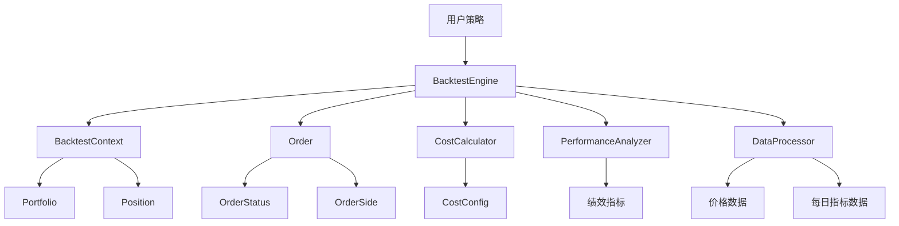

**图示来源**  
- [engine.py](file://zquant/backtest/engine.py#L41-L498)
- [context.py](file://zquant/backtest/context.py#L32-L188)
- [order.py](file://zquant/backtest/order.py#L32-L86)
- [cost.py](file://zquant/backtest/cost.py#L33-L116)
- [performance.py](file://zquant/backtest/performance.py#L36-L330)
- [strategy.py](file://zquant/backtest/strategy.py#L33-L82)

**本节来源**  
- [engine.py](file://zquant/backtest/engine.py#L41-L498)
- [context.py](file://zquant/backtest/context.py#L32-L188)
- [order.py](file://zquant/backtest/order.py#L32-L86)
- [cost.py](file://zquant/backtest/cost.py#L33-L116)
- [performance.py](file://zquant/backtest/performance.py#L36-L330)
- [strategy.py](file://zquant/backtest/strategy.py#L33-L82)

## BacktestEngine核心流程

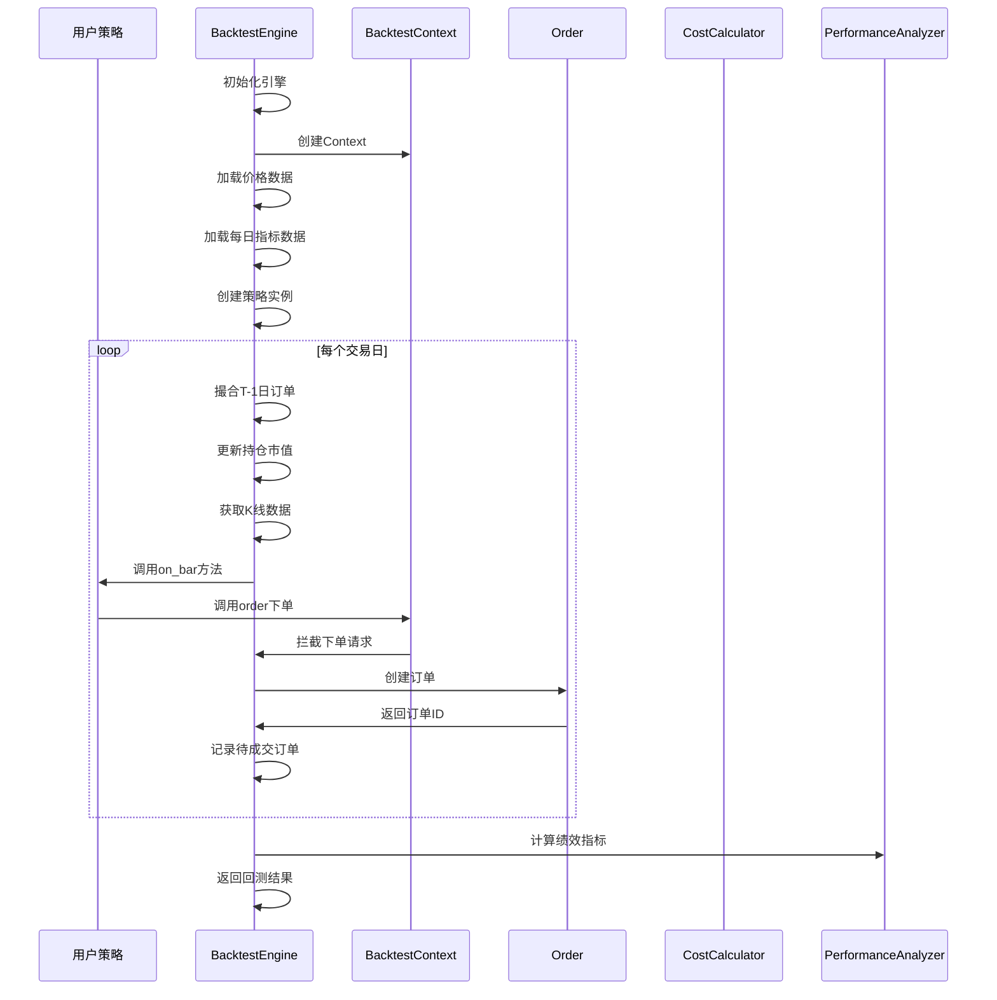

**图示来源**  
- [engine.py](file://zquant/backtest/engine.py#L41-L498)

**本节来源**  
- [engine.py](file://zquant/backtest/engine.py#L41-L498)

## BacktestContext状态管理

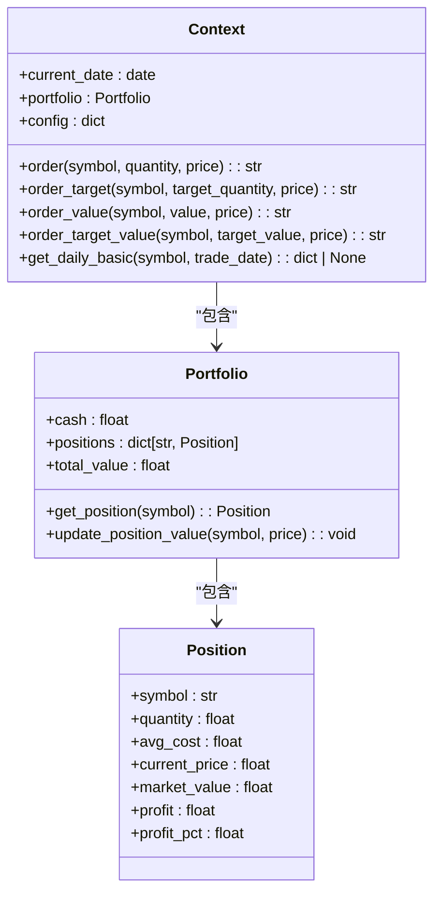

**图示来源**  
- [context.py](file://zquant/backtest/context.py#L82-L188)

**本节来源**  
- [context.py](file://zquant/backtest/context.py#L82-L188)

## Order订单模拟机制

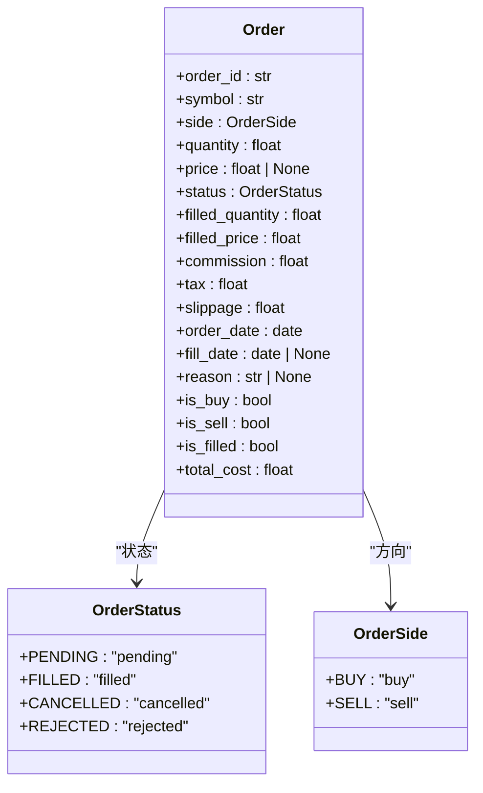

**图示来源**  
- [order.py](file://zquant/backtest/order.py#L32-L86)

**本节来源**  
- [order.py](file://zquant/backtest/order.py#L32-L86)

## 交易成本计算

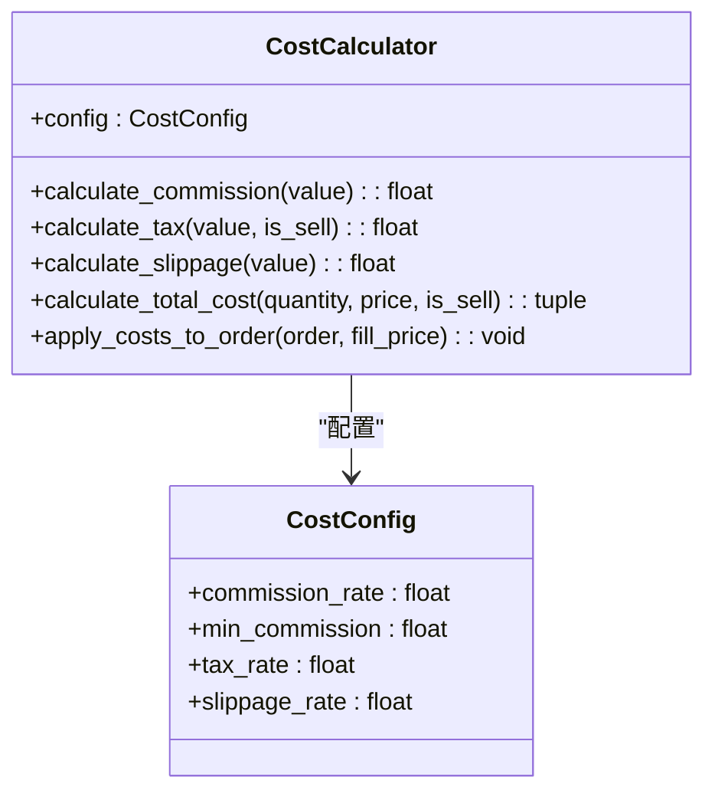

**图示来源**  
- [cost.py](file://zquant/backtest/cost.py#L33-L116)

**本节来源**  
- [cost.py](file://zquant/backtest/cost.py#L33-L116)

## 绩效指标生成

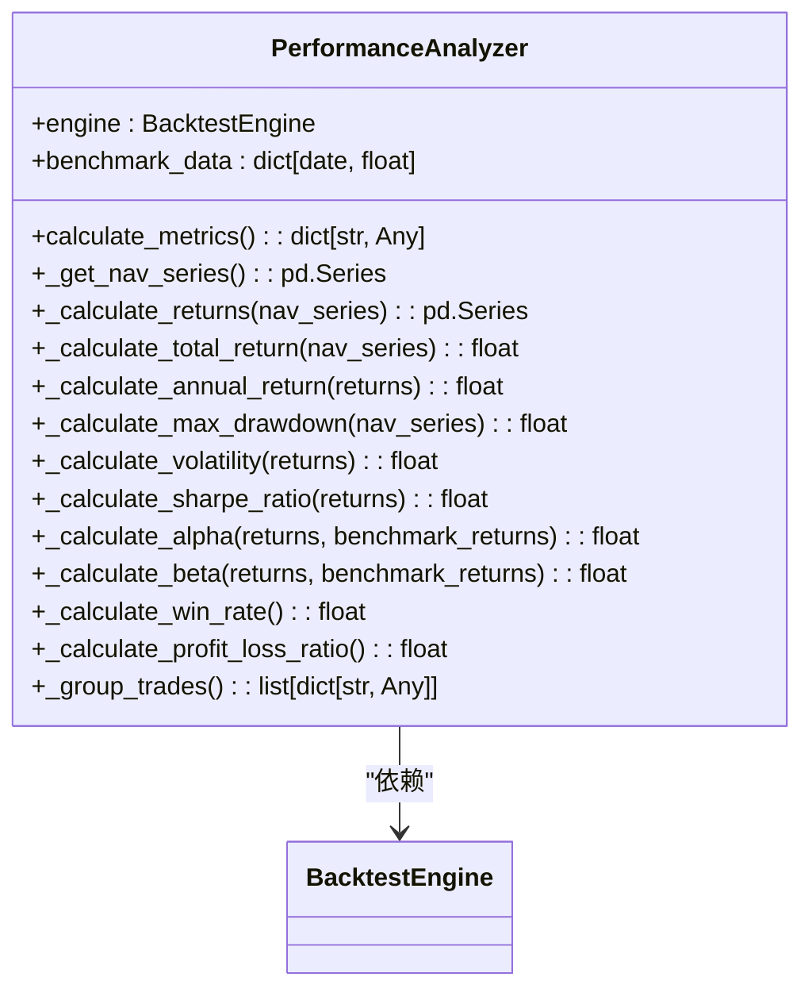

**图示来源**  
- [performance.py](file://zquant/backtest/performance.py#L36-L330)

**本节来源**  
- [performance.py](file://zquant/backtest/performance.py#L36-L330)

## 策略接口与实现

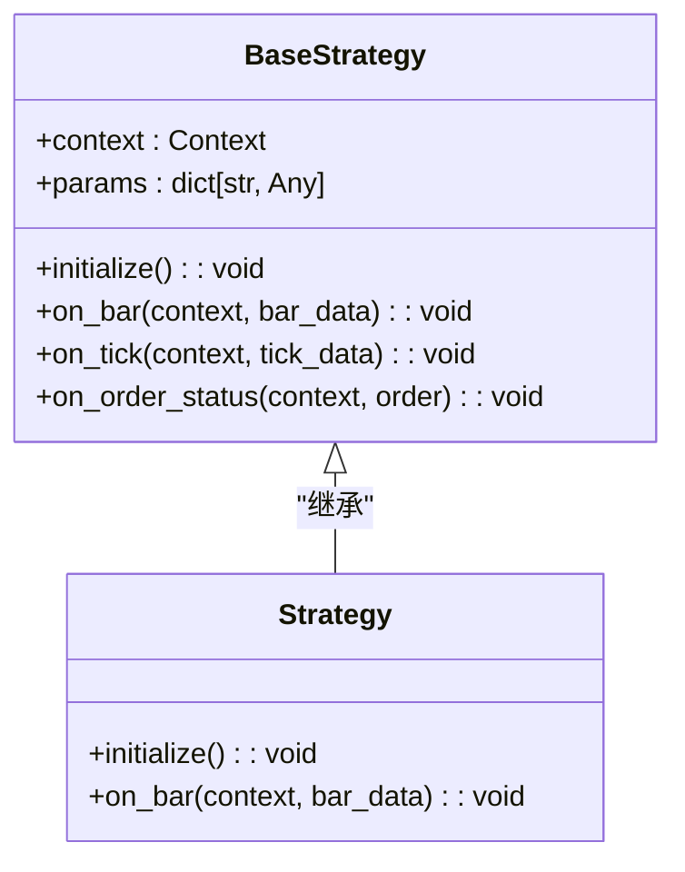

**图示来源**  
- [strategy.py](file://zquant/backtest/strategy.py#L33-L82)

**本节来源**  
- [strategy.py](file://zquant/backtest/strategy.py#L33-L82)

## 策略代码示例

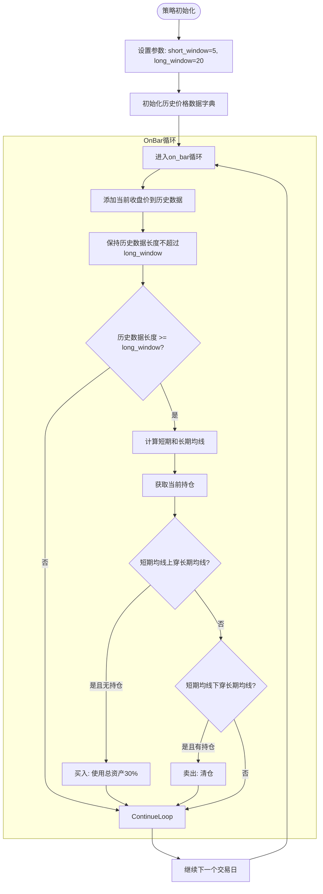

**图示来源**  
- [simple_ma.py](file://zquant/strategy/examples/simple_ma.py#L12-L59)

**本节来源**  
- [simple_ma.py](file://zquant/strategy/examples/simple_ma.py#L12-L59)
- [dual_ma.py](file://zquant/strategy/examples/dual_ma.py#L27-L99)
- [rsi_strategy.py](file://zquant/strategy/examples/rsi_strategy.py#L24-L93)

## 数据服务集成

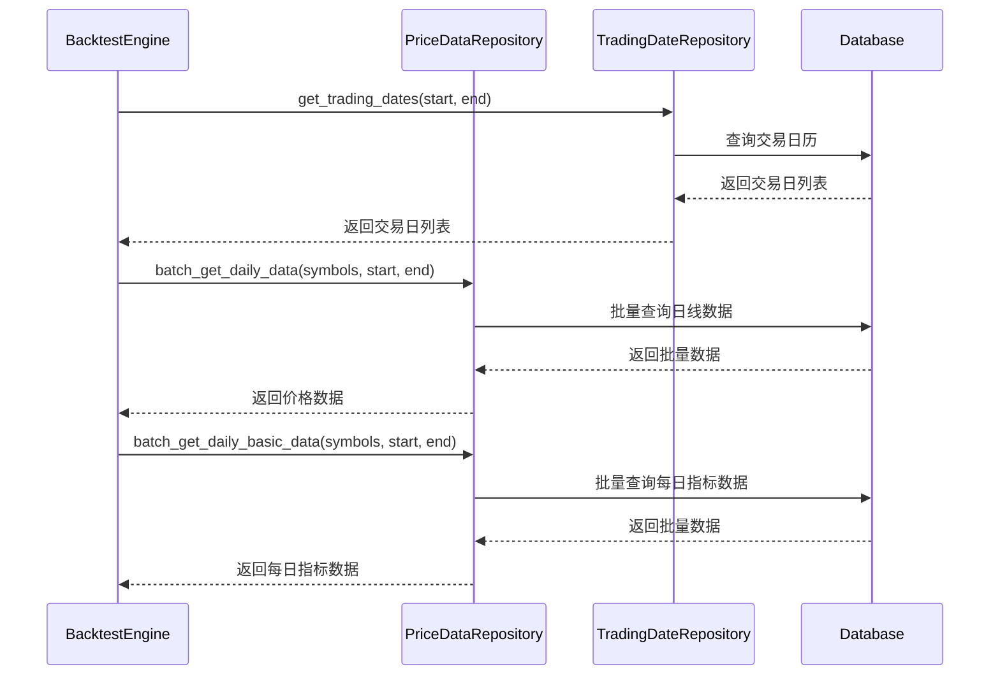

**图示来源**  
- [engine.py](file://zquant/backtest/engine.py#L83-L138)
- [engine.py](file://zquant/backtest/engine.py#L140-L181)

**本节来源**  
- [engine.py](file://zquant/backtest/engine.py#L83-L181)

## 前端数据交互

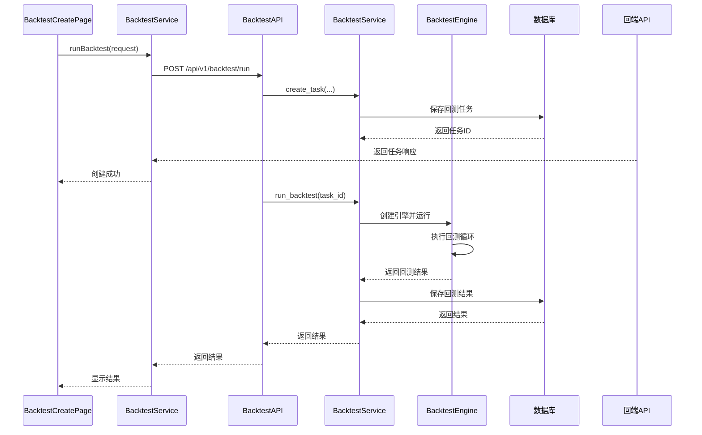

**图示来源**  
- [create.tsx](file://web/src/pages/backtest/create.tsx#L161-L189)
- [backtest.ts](file://web/src/services/zquant/backtest.ts#L31-L39)
- [backtest.py](file://zquant/api/v1/backtest.py#L90-L116)
- [backtest.py](file://zquant/services/backtest.py#L101-L154)

**本节来源**  
- [create.tsx](file://web/src/pages/backtest/create.tsx#L161-L189)
- [backtest.ts](file://web/src/services/zquant/backtest.ts#L31-L39)
- [backtest.py](file://zquant/api/v1/backtest.py#L90-L116)
- [backtest.py](file://zquant/services/backtest.py#L101-L154)

## 性能优化策略

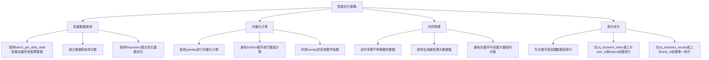

**本节来源**  
- [engine.py](file://zquant/backtest/engine.py#L110-L114)
- [engine.py](file://zquant/backtest/engine.py#L145-L148)
- [backtest.py](file://zquant/models/backtest.py#L54-L60)
- [backtest.py](file://zquant/models/backtest.py#L98-L99)

## 常见问题排查

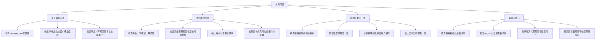

**本节来源**  
- [cost.py](file://zquant/backtest/cost.py#L77-L87)
- [engine.py](file://zquant/backtest/engine.py#L327-L329)
- [engine.py](file://zquant/backtest/engine.py#L385-L391)
- [engine.py](file://zquant/backtest/engine.py#L397-L404)
- [engine.py](file://zquant/backtest/engine.py#L207-L209)
- [engine.py](file://zquant/backtest/engine.py#L421-L449)

## 结论
zquant回测引擎通过模块化设计实现了完整的量化策略回测功能。引擎核心由BacktestEngine类驱动，通过事件循环处理每日K线数据并调用用户策略的on_bar方法。BacktestContext类管理回测过程中的所有状态，包括投资组合、持仓和时间推进。Order类模拟了限价单和市价单的交易行为，支持T+1延迟成交机制。交易成本计算模块精确模拟了佣金、印花税和滑点等交易费用。绩效分析器提供了全面的绩效指标，包括收益率、风险指标和交易统计。用户策略通过继承BaseStrategy类并实现on_bar等回调方法来定义交易逻辑。系统与数据服务层集成，通过Repository模式高效获取历史行情数据。前端通过API与后端交互，实现了回测任务的创建、管理和结果展示。整体架构清晰，性能优化充分，为量化策略开发提供了可靠的回测支持。