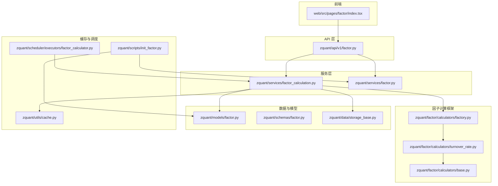
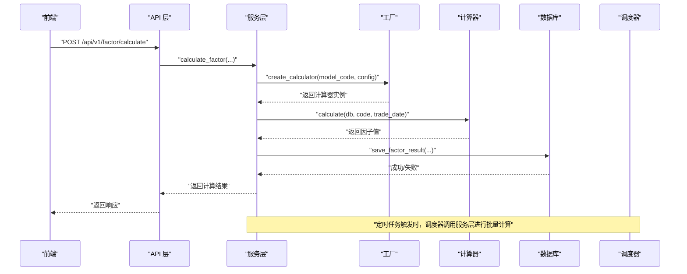
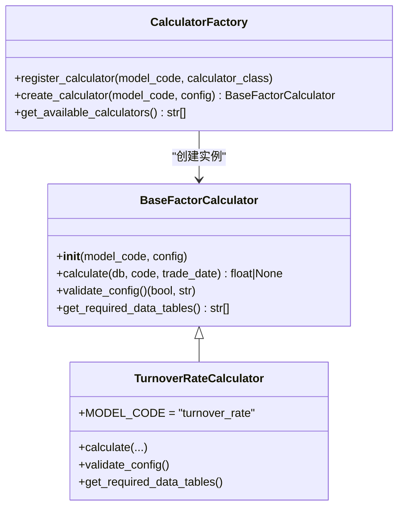
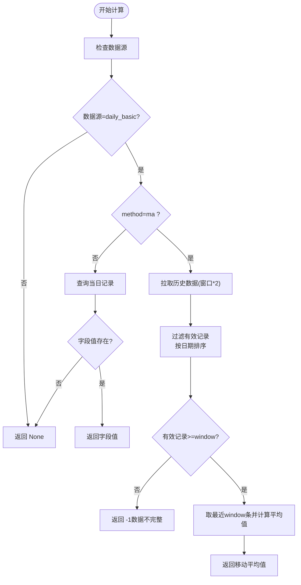
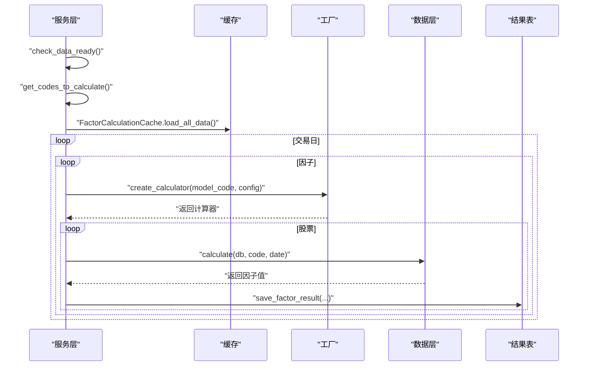
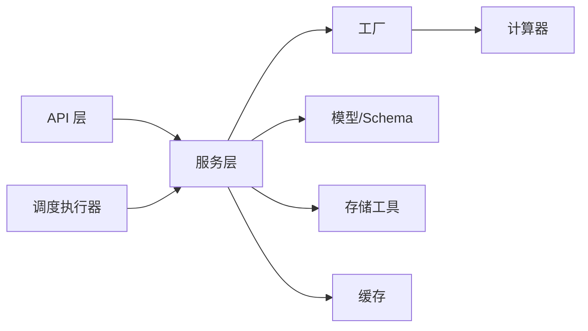
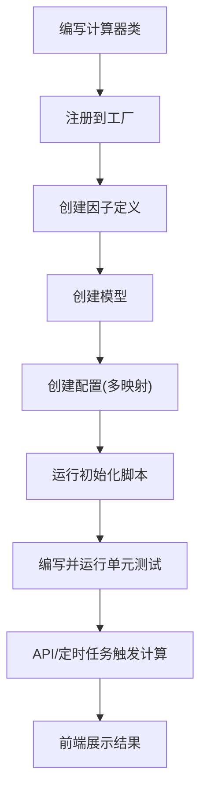

# 因子管理

<cite>
**本文引用的文件**
- [zquant/factor/calculators/base.py](file://zquant/factor/calculators/base.py)
- [zquant/factor/calculators/factory.py](file://zquant/factor/calculators/factory.py)
- [zquant/factor/calculators/turnover_rate.py](file://zquant/factor/calculators/turnover_rate.py)
- [zquant/services/factor_calculation.py](file://zquant/services/factor_calculation.py)
- [zquant/models/factor.py](file://zquant/models/factor.py)
- [zquant/schemas/factor.py](file://zquant/schemas/factor.py)
- [zquant/api/v1/factor.py](file://zquant/api/v1/factor.py)
- [zquant/utils/cache.py](file://zquant/utils/cache.py)
- [zquant/data/storage_base.py](file://zquant/data/storage_base.py)
- [zquant/scheduler/executors/factor_calculator.py](file://zquant/scheduler/executors/factor_calculator.py)
- [zquant/scripts/init_factor.py](file://zquant/scripts/init_factor.py)
- [zquant/tests/unittest/test_turnover_rate_calculator.py](file://zquant/tests/unittest/test_turnover_rate_calculator.py)
- [web/src/pages/factor/index.tsx](file://web/src/pages/factor/index.tsx)
</cite>

## 目录
1. [简介](#简介)
2. [项目结构](#项目结构)
3. [核心组件](#核心组件)
4. [架构总览](#架构总览)
5. [详细组件分析](#详细组件分析)
6. [依赖分析](#依赖分析)
7. [性能考虑](#性能考虑)
8. [故障排查指南](#故障排查指南)
9. [结论](#结论)
10. [附录](#附录)

## 简介
本文件系统性介绍 zquant 因子管理系统的设计与使用，重点阐述：
- 插件式架构：基于 BaseCalculator 抽象基类与 CalculatorFactory 工厂模式实现的可扩展性
- 以 turnover_rate.py 为例，说明如何定义新因子：输入数据依赖（如成交量、流通股本）、计算逻辑实现、输出结果的标准化格式
- 服务层 factor_calculation.py 如何调度计算任务并将结果持久化到数据库（factor.py 模型）
- 因子元数据（名称、描述、更新频率）的管理方式及其与任务调度系统的集成（如定时计算）
- 前端通过 API 获取因子列表与计算结果（web/src/pages/factor/）
- 提供自定义因子开发的完整示例：从代码编写、注册到测试验证的全流程
- 计算性能优化：利用缓存（utils/cache.py）避免重复计算，以及处理大规模股票池时的分块计算策略

## 项目结构
围绕因子管理的关键目录与文件如下：
- 因子计算器与工厂：zquant/factor/calculators
- 服务层：zquant/services/factor_calculation.py
- 数据模型与Schema：zquant/models/factor.py、zquant/schemas/factor.py
- API 层：zquant/api/v1/factor.py
- 缓存与存储工具：zquant/utils/cache.py、zquant/data/storage_base.py
- 定时调度执行器：zquant/scheduler/executors/factor_calculator.py
- 初始化脚本：zquant/scripts/init_factor.py
- 前端页面：web/src/pages/factor/index.tsx
- 单元测试：zquant/tests/unittest/test_turnover_rate_calculator.py

图表来源
- [zquant/api/v1/factor.py](file://zquant/api/v1/factor.py#L1-L120)
- [zquant/services/factor_calculation.py](file://zquant/services/factor_calculation.py#L1-L120)
- [zquant/factor/calculators/base.py](file://zquant/factor/calculators/base.py#L1-L82)
- [zquant/factor/calculators/factory.py](file://zquant/factor/calculators/factory.py#L1-L90)
- [zquant/factor/calculators/turnover_rate.py](file://zquant/factor/calculators/turnover_rate.py#L1-L60)
- [zquant/models/factor.py](file://zquant/models/factor.py#L1-L120)
- [zquant/schemas/factor.py](file://zquant/schemas/factor.py#L1-L120)
- [zquant/data/storage_base.py](file://zquant/data/storage_base.py#L1-L120)
- [zquant/utils/cache.py](file://zquant/utils/cache.py#L1-L120)
- [zquant/scheduler/executors/factor_calculator.py](file://zquant/scheduler/executors/factor_calculator.py#L1-L120)
- [zquant/scripts/init_factor.py](file://zquant/scripts/init_factor.py#L1-L120)

章节来源
- [zquant/api/v1/factor.py](file://zquant/api/v1/factor.py#L1-L120)
- [zquant/services/factor_calculation.py](file://zquant/services/factor_calculation.py#L1-L120)
- [zquant/factor/calculators/base.py](file://zquant/factor/calculators/base.py#L1-L82)
- [zquant/factor/calculators/factory.py](file://zquant/factor/calculators/factory.py#L1-L90)
- [zquant/factor/calculators/turnover_rate.py](file://zquant/factor/calculators/turnover_rate.py#L1-L60)
- [zquant/models/factor.py](file://zquant/models/factor.py#L1-L120)
- [zquant/schemas/factor.py](file://zquant/schemas/factor.py#L1-L120)
- [zquant/data/storage_base.py](file://zquant/data/storage_base.py#L1-L120)
- [zquant/utils/cache.py](file://zquant/utils/cache.py#L1-L120)
- [zquant/scheduler/executors/factor_calculator.py](file://zquant/scheduler/executors/factor_calculator.py#L1-L120)
- [zquant/scripts/init_factor.py](file://zquant/scripts/init_factor.py#L1-L120)

## 核心组件
- 抽象基类与工厂
  - BaseFactorCalculator：定义统一的 calculate、validate_config、get_required_data_tables 接口
  - CalculatorFactory：注册与创建计算器，支持配置校验与模型代码映射
- 因子定义与模型
  - FactorDefinition：因子元数据（名称、描述、列名、启用状态）
  - FactorModel：因子模型（模型代码、配置、默认模型标记）
  - FactorConfig：因子配置（以 JSON 存储，支持多映射）
- 服务层
  - FactorCalculationService：负责数据准备、表结构初始化、因子计算、结果保存、结果查询
  - FactorService：因子定义、模型、配置的 CRUD 与查询
- API 层
  - 提供因子定义、模型、配置、计算、结果查询的 REST 接口
- 缓存与存储
  - utils/cache.py：本地内存/Redis 缓存抽象
  - data/storage_base.py：表存在性检查、UPSER/ON DUPLICATE KEY UPDATE 工具
- 调度与初始化
  - scheduler/executors/factor_calculator.py：定时任务执行器
  - scripts/init_factor.py：因子表初始化、示例因子与配置创建

章节来源
- [zquant/factor/calculators/base.py](file://zquant/factor/calculators/base.py#L1-L82)
- [zquant/factor/calculators/factory.py](file://zquant/factor/calculators/factory.py#L1-L90)
- [zquant/models/factor.py](file://zquant/models/factor.py#L1-L267)
- [zquant/schemas/factor.py](file://zquant/schemas/factor.py#L1-L345)
- [zquant/services/factor_calculation.py](file://zquant/services/factor_calculation.py#L1-L200)
- [zquant/api/v1/factor.py](file://zquant/api/v1/factor.py#L1-L120)
- [zquant/utils/cache.py](file://zquant/utils/cache.py#L1-L120)
- [zquant/data/storage_base.py](file://zquant/data/storage_base.py#L1-L161)
- [zquant/scheduler/executors/factor_calculator.py](file://zquant/scheduler/executors/factor_calculator.py#L1-L120)
- [zquant/scripts/init_factor.py](file://zquant/scripts/init_factor.py#L1-L120)

## 架构总览
下图展示因子管理系统的端到端流程：前端请求经 API 层进入服务层，服务层通过工厂创建具体计算器，读取数据并计算，最后将结果写入数据库，并支持定时调度与缓存优化。

图表来源
- [zquant/api/v1/factor.py](file://zquant/api/v1/factor.py#L730-L800)
- [zquant/services/factor_calculation.py](file://zquant/services/factor_calculation.py#L575-L800)
- [zquant/factor/calculators/factory.py](file://zquant/factor/calculators/factory.py#L53-L90)
- [zquant/factor/calculators/turnover_rate.py](file://zquant/factor/calculators/turnover_rate.py#L59-L154)
- [zquant/models/factor.py](file://zquant/models/factor.py#L1-L120)
- [zquant/scheduler/executors/factor_calculator.py](file://zquant/scheduler/executors/factor_calculator.py#L40-L120)

## 详细组件分析

### 抽象基类与工厂模式
- BaseFactorCalculator
  - 统一接口：calculate(db, code, trade_date)、validate_config()、get_required_data_tables()
  - 便于扩展新的因子计算器，遵循一致的生命周期与契约
- CalculatorFactory
  - 注册映射：将 model_code 映射到具体计算器类
  - 创建与校验：create_calculator(model_code, config) 会验证配置有效性
  - 可扩展性：通过 register_calculator 动态注册新计算器

图表来源
- [zquant/factor/calculators/base.py](file://zquant/factor/calculators/base.py#L34-L82)
- [zquant/factor/calculators/factory.py](file://zquant/factor/calculators/factory.py#L41-L90)
- [zquant/factor/calculators/turnover_rate.py](file://zquant/factor/calculators/turnover_rate.py#L37-L188)

章节来源
- [zquant/factor/calculators/base.py](file://zquant/factor/calculators/base.py#L1-L82)
- [zquant/factor/calculators/factory.py](file://zquant/factor/calculators/factory.py#L1-L90)
- [zquant/factor/calculators/turnover_rate.py](file://zquant/factor/calculators/turnover_rate.py#L1-L188)

### 以 turnover_rate 为例：定义新因子
- 输入数据依赖
  - 数据源：daily_basic（每日指标表）
  - 字段：默认使用 turnover_rate，可通过配置切换
  - 方法：支持直接取值或移动平均（ma），窗口大小默认5，最大60
- 计算逻辑
  - 直接取值：按交易日查询 daily_basic，取目标字段
  - 移动平均：向前推 window*2 天拉取历史数据，过滤有效记录，按日期排序取最近 window 条，计算平均值
  - 异常与边界：空值、日期格式、数据不足、无效配置等均有处理
- 输出结果
  - 返回数值或 None；当无数据或数据不足时返回 -1 作为“数据不完整”的占位
  - 通过服务层统一保存到对应表的列中

图表来源
- [zquant/factor/calculators/turnover_rate.py](file://zquant/factor/calculators/turnover_rate.py#L59-L154)

章节来源
- [zquant/factor/calculators/turnover_rate.py](file://zquant/factor/calculators/turnover_rate.py#L1-L188)
- [zquant/tests/unittest/test_turnover_rate_calculator.py](file://zquant/tests/unittest/test_turnover_rate_calculator.py#L1-L200)

### 服务层：调度与持久化
- 数据准备与日期范围
  - 根据参数或默认规则确定 start_date/end_date，校验日期合法性
  - 获取交易日列表，支持单日与日期范围模式
- 代码集合与缓存
  - get_codes_to_calculate：若未指定代码，使用全量股票池
  - FactorCalculationCache：一次性加载因子定义、模型、配置，建立 code->model 映射，减少多次查询
- 表结构与列管理
  - ensure_factor_result_table：确保因子结果表存在，缺失列时动态添加
  - sync_factor_columns：按因子定义同步列到所有因子表
- 结果保存
  - save_factor_result：按 trade_date/ts_code 去重，存在则更新，不存在则插入
  - 使用 CodeConverter 将代码标准化为 TS 格式
- 计算流程
  - 遍历交易日与因子，按配置选择模型，逐股票计算并保存

图表来源
- [zquant/services/factor_calculation.py](file://zquant/services/factor_calculation.py#L215-L800)
- [zquant/factor/calculators/factory.py](file://zquant/factor/calculators/factory.py#L53-L90)
- [zquant/data/storage_base.py](file://zquant/data/storage_base.py#L77-L161)

章节来源
- [zquant/services/factor_calculation.py](file://zquant/services/factor_calculation.py#L1-L800)
- [zquant/data/storage_base.py](file://zquant/data/storage_base.py#L1-L161)

### 数据模型与 Schema
- 模型
  - FactorDefinition：因子元数据与关系
  - FactorModel：模型定义与配置
  - FactorConfig：以 factor_id 为主键的 JSON 配置，支持多映射
- Schema
  - 定义 API 请求/响应结构，如 FactorDefinitionCreate/Update/Response、FactorModelCreate/Update/Response、FactorConfigCreate/Update/Response、FactorCalculationRequest/Response、FactorResultQueryRequest/Response

章节来源
- [zquant/models/factor.py](file://zquant/models/factor.py#L1-L267)
- [zquant/schemas/factor.py](file://zquant/schemas/factor.py#L1-L345)

### API 与前端
- API
  - 因子定义、模型、配置的增删改查
  - 手动触发计算与结果查询
- 前端
  - web/src/pages/factor/index.tsx 当前为占位页面，后续将接入因子列表与结果展示

章节来源
- [zquant/api/v1/factor.py](file://zquant/api/v1/factor.py#L1-L800)
- [web/src/pages/factor/index.tsx](file://web/src/pages/factor/index.tsx#L1-L39)

### 定时调度与初始化
- 定时执行器
  - FactorCalculatorExecutor：接收任务配置（factor_id、codes、start_date、end_date），调用服务层执行计算
- 初始化脚本
  - scripts/init_factor.py：创建因子相关表、初始化换手率因子定义与模型、创建示例配置（多映射）

章节来源
- [zquant/scheduler/executors/factor_calculator.py](file://zquant/scheduler/executors/factor_calculator.py#L1-L120)
- [zquant/scripts/init_factor.py](file://zquant/scripts/init_factor.py#L1-L427)

## 依赖分析
- 组件耦合
  - 服务层依赖工厂与模型，通过 Schema 与 API 层解耦
  - 计算器通过工厂注入，降低对上层的耦合
- 外部依赖
  - 数据库：SQLAlchemy ORM、MySQL 方言
  - 缓存：本地内存或 Redis（通过工厂按配置选择）
  - 日志：loguru
- 循环依赖
  - 未发现明显循环依赖；工厂与计算器之间为单向依赖

图表来源
- [zquant/api/v1/factor.py](file://zquant/api/v1/factor.py#L1-L120)
- [zquant/services/factor_calculation.py](file://zquant/services/factor_calculation.py#L1-L120)
- [zquant/factor/calculators/factory.py](file://zquant/factor/calculators/factory.py#L1-L90)
- [zquant/factor/calculators/turnover_rate.py](file://zquant/factor/calculators/turnover_rate.py#L1-L60)
- [zquant/models/factor.py](file://zquant/models/factor.py#L1-L120)
- [zquant/schemas/factor.py](file://zquant/schemas/factor.py#L1-L120)
- [zquant/data/storage_base.py](file://zquant/data/storage_base.py#L1-L120)
- [zquant/utils/cache.py](file://zquant/utils/cache.py#L1-L120)
- [zquant/scheduler/executors/factor_calculator.py](file://zquant/scheduler/executors/factor_calculator.py#L1-L120)

## 性能考虑
- 缓存优化
  - FactorCalculationCache：一次性加载因子定义、模型、配置与映射，显著减少数据库查询次数
  - utils/cache.py：支持本地内存与 Redis 两种后端，按配置切换，适合高并发场景
- 分块与批处理
  - get_codes_to_calculate：支持传入 codes 列表，避免全量股票池遍历
  - 服务层按交易日与因子循环，结合缓存与批量表列同步，减少重复开销
- 数据一致性与去重
  - save_factor_result：按 trade_date/ts_code 去重，存在即更新，避免重复写入
  - storage_base.build_update_dict/execute_upsert：提供 UPSERT 通用能力

章节来源
- [zquant/services/factor_calculation.py](file://zquant/services/factor_calculation.py#L44-L214)
- [zquant/utils/cache.py](file://zquant/utils/cache.py#L1-L247)
- [zquant/data/storage_base.py](file://zquant/data/storage_base.py#L105-L161)

## 故障排查指南
- 常见问题
  - 未找到因子定义或模型：检查 FactorDefinition/FactorModel 是否存在且启用
  - 配置无效：validate_config 返回错误信息，检查 source、field、method、window 等
  - 数据不足：返回 -1 或 None，确认历史数据是否充足
  - 表不存在或列缺失：ensure_factor_result_table 与 sync_factor_columns 会自动创建/添加
- 日志与追踪
  - 使用 loguru 记录关键步骤与异常，便于定位
- 测试验证
  - 单元测试覆盖基础计算、移动平均、配置校验、边界与异常处理

章节来源
- [zquant/factor/calculators/turnover_rate.py](file://zquant/factor/calculators/turnover_rate.py#L155-L188)
- [zquant/services/factor_calculation.py](file://zquant/services/factor_calculation.py#L266-L374)
- [zquant/tests/unittest/test_turnover_rate_calculator.py](file://zquant/tests/unittest/test_turnover_rate_calculator.py#L1-L487)

## 结论
zquant 因子管理系统采用插件式架构，通过抽象基类与工厂模式实现高度可扩展的计算器体系；服务层提供完善的调度、缓存、持久化与结果管理能力；模型与 Schema 清晰定义了因子元数据与配置结构；API 层与前端页面提供友好的交互入口；定时调度与初始化脚本保障系统稳定运行。整体设计兼顾易用性与性能，适合在大规模股票池与复杂因子场景下部署与演进。

## 附录

### 自定义因子开发全流程示例
- 步骤
  1) 定义计算器类：继承 BaseFactorCalculator，实现 calculate/validate_config/get_required_data_tables
  2) 注册计算器：在工厂中注册 model_code 与类映射
  3) 创建因子定义与模型：通过 FactorService 创建 FactorDefinition 与 FactorModel
  4) 配置因子：创建 FactorConfig（支持多映射），指定默认模型与特定股票映射
  5) 初始化与验证：运行初始化脚本，确保表结构与示例数据就绪
  6) 单元测试：编写测试用例覆盖正常、边界与异常场景
  7) API 调用：通过 API 触发计算或定时任务执行
  8) 前端接入：在 web 页面展示因子列表与结果

图表来源
- [zquant/factor/calculators/base.py](file://zquant/factor/calculators/base.py#L34-L82)
- [zquant/factor/calculators/factory.py](file://zquant/factor/calculators/factory.py#L41-L90)
- [zquant/services/factor.py](file://zquant/services/factor.py#L1-L200)
- [zquant/scripts/init_factor.py](file://zquant/scripts/init_factor.py#L243-L427)
- [zquant/tests/unittest/test_turnover_rate_calculator.py](file://zquant/tests/unittest/test_turnover_rate_calculator.py#L1-L120)

章节来源
- [zquant/factor/calculators/base.py](file://zquant/factor/calculators/base.py#L1-L82)
- [zquant/factor/calculators/factory.py](file://zquant/factor/calculators/factory.py#L1-L90)
- [zquant/services/factor.py](file://zquant/services/factor.py#L1-L200)
- [zquant/scripts/init_factor.py](file://zquant/scripts/init_factor.py#L1-L427)
- [zquant/tests/unittest/test_turnover_rate_calculator.py](file://zquant/tests/unittest/test_turnover_rate_calculator.py#L1-L120)