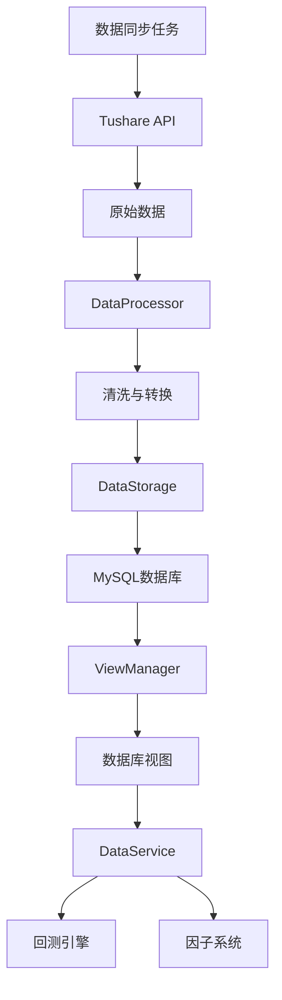
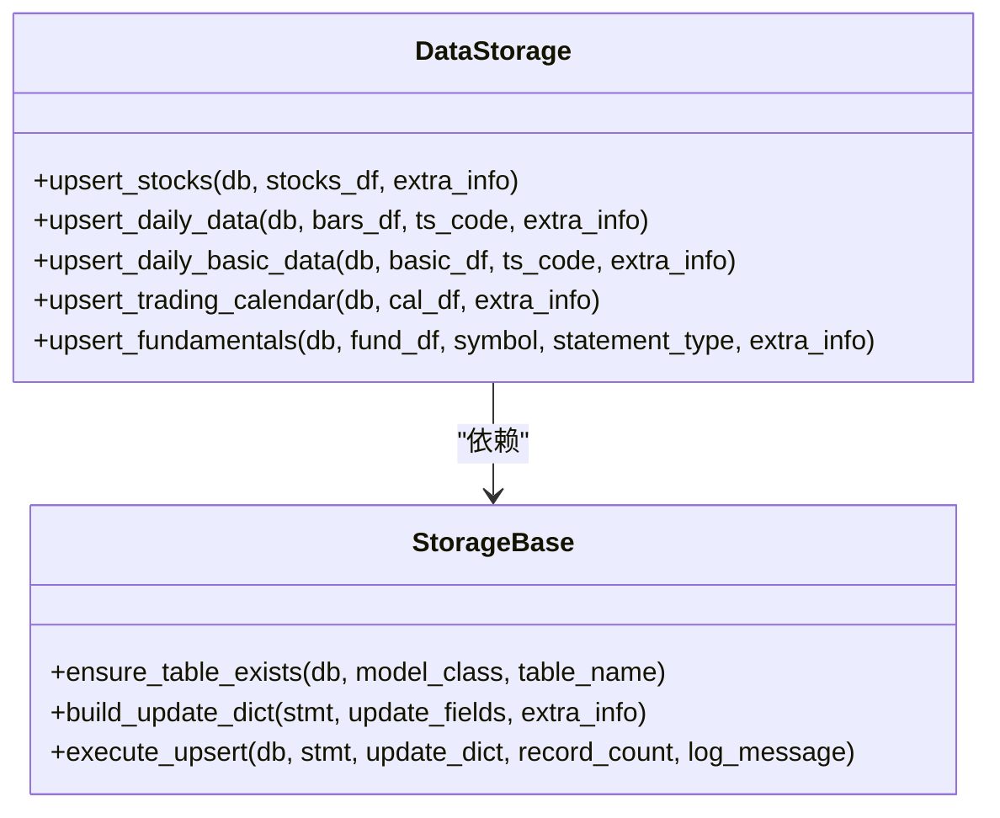
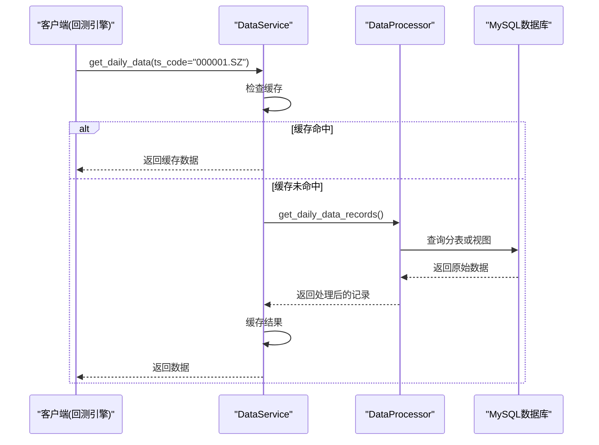

# 数据服务

<cite>
**本文档引用的文件**   
- [tushare.py](file://zquant/data/etl/tushare.py)
- [processor.py](file://zquant/data/processor.py)
- [storage.py](file://zquant/data/storage.py)
- [storage_base.py](file://zquant/data/storage_base.py)
- [view_manager.py](file://zquant/data/view_manager.py)
- [data.py](file://zquant/services/data.py)
- [fundamental_fields.py](file://zquant/data/fundamental_fields.py)
- [sync_daily_data.py](file://zquant/scheduler/job/sync_daily_data.py)
- [models/data.py](file://zquant/models/data.py)
</cite>

## 目录
1. [引言](#引言)
2. [ETL流程与架构设计](#etl流程与架构设计)
3. [数据获取与清洗](#数据获取与清洗)
4. [数据存储抽象化](#数据存储抽象化)
5. [数据库视图管理](#数据库视图管理)
6. [数据服务层接口](#数据服务层接口)
7. [数据同步任务](#数据同步任务)
8. [财务数据字段映射](#财务数据字段映射)
9. [数据查询示例](#数据查询示例)
10. [数据一致性与性能优化](#数据一致性与性能优化)
11. [结论](#结论)

## 引言
zquant数据服务提供了一套完整的金融数据处理解决方案，专注于从Tushare API获取原始数据，并通过一系列ETL（提取、转换、加载）流程，将数据清洗、标准化后存储于数据库中。该服务为回测引擎和因子系统提供了统一、高效的数据访问接口。本文档将深入剖析其核心架构与实现细节。

## ETL流程与架构设计
zquant数据服务的ETL流程是一个高度模块化和可扩展的系统，其核心架构围绕数据的获取、处理、存储和访问展开。整个流程由数据同步任务驱动，通过`TushareClient`从Tushare API获取原始数据，经由`DataProcessor`进行清洗和转换，再通过`DataStorage`类持久化到数据库。`StorageBase`和`Storage`类提供了对多种后端存储的抽象化操作，而`ViewManager`则通过创建数据库视图来优化复杂查询的性能。最终，`DataService`作为服务层，为上层应用提供了统一的数据访问接口。



**图源**
- [tushare.py](file://zquant/data/etl/tushare.py)
- [processor.py](file://zquant/data/processor.py)
- [storage.py](file://zquant/data/storage.py)
- [view_manager.py](file://zquant/data/view_manager.py)
- [data.py](file://zquant/services/data.py)

## 数据获取与清洗
数据获取的核心是`zquant.data.etl.tushare`模块中的`TushareClient`类。该类封装了对Tushare Pro API的调用，负责从`stock_basic`、`daily`、`daily_basic`、`trade_cal`等接口获取原始数据。`TushareClient`通过`ConfigService`安全地获取API Token，并提供了统一的日志记录机制，便于监控API调用状态。

获取到的原始数据随后被送入`zquant.data.processor`模块中的`DataProcessor`类进行清洗和转换。`DataProcessor`的主要职责包括：
- **数据类型转换**：将API返回的日期字符串转换为Python的`date`对象，将数值字段转换为`float`类型。
- **数据标准化**：处理`NaN`值，确保数据的完整性和一致性。
- **数据对齐**：根据交易日历，使用前向填充（`ffill`）等方法处理股票停牌期间的数据缺失问题。
- **数据过滤**：根据指定日期过滤股票列表，防止回测时出现“未来函数”问题。

**节源**
- [tushare.py](file://zquant/data/etl/tushare.py#L39-L392)
- [processor.py](file://zquant/data/processor.py#L46-L555)

## 数据存储抽象化
为了支持灵活的存储后端并简化数据库操作，zquant实现了`StorageBase`和`DataStorage`两个核心类。

`zquant.data.storage_base`模块提供了数据存储的公共逻辑。`ensure_table_exists`函数确保目标表存在，如果不存在则自动创建；`build_update_dict`和`execute_upsert`函数共同实现了`INSERT ... ON DUPLICATE KEY UPDATE`的UPSERT语义，保证了数据的幂等性写入。

`zquant.data.storage`模块中的`DataStorage`类是数据存储的主服务类。它利用`StorageBase`提供的基础功能，实现了针对不同数据类型（如日线数据、每日指标、财务数据）的批量插入或更新方法。例如，`upsert_daily_data`方法负责将清洗后的日线数据写入以`ts_code`命名的分表中。该类还支持分表存储，每个股票代码对应一个独立的数据表，这有助于提高大规模数据写入的性能。



**图源**
- [storage.py](file://zquant/data/storage.py#L57-L767)
- [storage_base.py](file://zquant/data/storage_base.py#L77-L159)

## 数据库视图管理
为了解决分表存储带来的查询复杂性问题，zquant引入了`zquant.data.view_manager`模块来管理数据库视图。该模块的核心是`create_or_update_*_view`系列函数，如`create_or_update_daily_view`。

这些函数会动态地扫描数据库中所有相关的分表（例如，所有以`zq_data_tustock_daily_`开头的表），然后创建一个`UNION ALL`视图（如`zq_data_tustock_daily_view`）。这个视图将所有分表的数据联合起来，使得上层应用可以像查询单个大表一样查询所有股票的数据，极大地简化了查询逻辑。

视图的创建优先尝试调用数据库的存储过程以获得最佳性能，如果存储过程不存在或执行失败，则会回退到使用Python代码直接构建SQL语句的方式，保证了系统的健壮性。

**节源**
- [view_manager.py](file://zquant/data/view_manager.py#L111-L544)

## 数据服务层接口
`zquant.services.data`模块中的`DataService`类是整个数据服务的统一入口，它为回测引擎和因子系统提供了高层次的、易于使用的数据访问接口。

该服务层的主要方法包括：
- `get_daily_data`: 获取日线数据。
- `get_daily_basic_data`: 获取每日指标数据（如换手率、市盈率）。
- `get_fundamentals`: 获取财务数据。
- `get_factor_data`: 获取技术因子数据。

这些方法在内部会调用`DataProcessor`从数据库中获取原始记录，并进行必要的后处理（如日期格式化、`NaN`值清理）。为了提升性能，`DataService`还集成了缓存机制，将频繁查询的结果缓存一段时间，减少对数据库的直接访问。



**图源**
- [data.py](file://zquant/services/data.py#L42-L408)

## 数据同步任务
整个ETL流程由数据同步任务驱动，`zquant.scheduler.job.sync_daily_data`模块中的`SyncDailyDataJob`是核心驱动器。

该任务通过命令行参数（如`--ts-code`、`--start-date`、`--end-date`）来控制同步范围。其执行逻辑遵循两条规则：
1.  **规则一**：当所有参数均未传入时，任务会调用Tushare的批量API，一次性获取所有股票在最后一个交易日的数据，实现高效的增量更新。
2.  **规则二**：当至少传入一个参数时，任务会循环遍历指定的股票列表，对每只股票调用API获取指定日期范围内的数据。

任务通过`DataScheduler`协调`TushareClient`、`DataProcessor`和`DataStorage`，完成从数据获取到存储的完整流程，并记录详细的日志和操作统计。

**节源**
- [sync_daily_data.py](file://zquant/scheduler/job/sync_daily_data.py#L80-L232)

## 财务数据字段映射
`zquant.data.fundamental_fields`模块定义了财务数据的字段映射与处理逻辑。该模块通过三个字典`INCOME_FIELD_DESCRIPTIONS`、`BALANCE_FIELD_DESCRIPTIONS`和`CASHFLOW_FIELD_DESCRIPTIONS`，为利润表、资产负债表和现金流量表中的每一个字段提供了清晰的中文释义。

`get_fundamental_field_descriptions`函数是访问这些映射的入口。当`DataService`返回财务数据时，会同时返回这些字段释义，使得前端应用能够将晦涩的英文字段名（如`total_revenue`）显示为用户友好的中文名称（如“营业总收入”），极大地提升了用户体验。

**节源**
- [fundamental_fields.py](file://zquant/data/fundamental_fields.py#L27-L317)

## 数据查询示例
以下是一个前端通过API获取日线数据的代码示例：

```python
# 假设已有一个API客户端
api_client = ZQuantAPIClient(api_key="your_api_key")

# 请求000001.SZ从2023-01-01到2023-12-31的日线数据
response = api_client.get("/api/v1/data/daily", params={
    "ts_code": "000001.SZ",
    "start_date": "20230101",
    "end_date": "20231231"
})

# 解析响应
if response.status_code == 200:
    data = response.json()["data"]
    for record in data:
        print(f"日期: {record['trade_date']}, 收盘价: {record['close']}")
else:
    print(f"请求失败: {response.text}")
```

## 数据一致性与性能优化
zquant数据服务通过多种机制保障数据一致性并优化性能：

1.  **数据一致性保障**：
    *   **增量更新**：数据同步任务默认只获取最新数据，避免全量覆盖，保证了数据的连续性。
    *   **UPSERT操作**：使用`ON DUPLICATE KEY UPDATE`语义，确保即使重复执行同步任务，数据也不会重复或冲突。
    *   **错误重试**：在API调用和数据库操作中捕获异常，并记录详细的错误日志，便于问题排查和手动重试。

2.  **性能优化策略**：
    *   **分表存储**：按`ts_code`分表，将海量数据分散到多个小表中，显著提升了单表的写入和查询性能。
    *   **数据库视图**：通过视图将分表数据虚拟成一个大表，简化了跨股票的复杂查询。
    *   **数据缓存**：在服务层使用Redis等缓存系统，缓存高频查询结果，减少数据库压力。
    *   **批量操作**：`DataStorage`类提供`upsert_*_batch`方法，支持批量写入，减少了数据库的连接开销。

## 结论
zquant数据服务通过精心设计的ETL流程和模块化架构，成功地解决了金融数据处理中的诸多挑战。其分表存储与视图管理相结合的策略，在保证高性能的同时，提供了简洁的查询接口。服务层的抽象化设计使得上层应用可以专注于业务逻辑，而无需关心底层数据的复杂性。这套系统为量化研究和交易提供了坚实、可靠的数据基础。