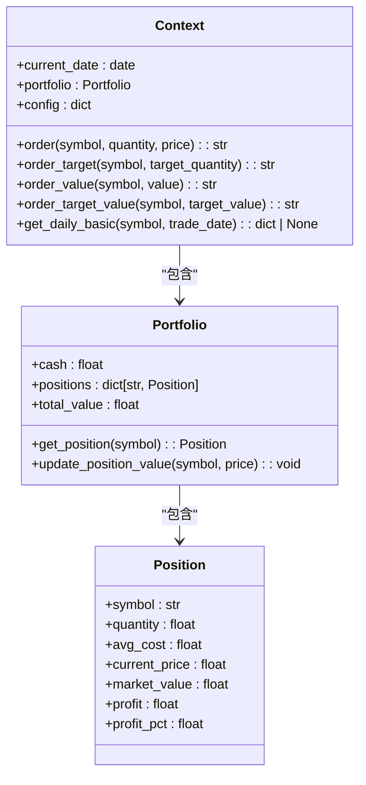
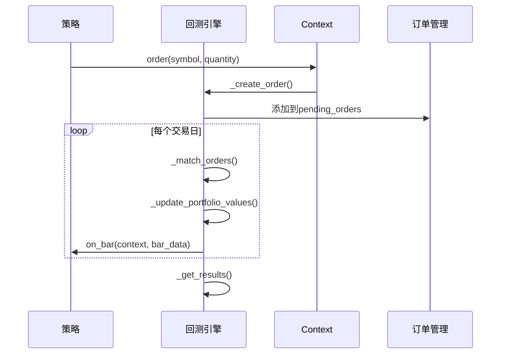
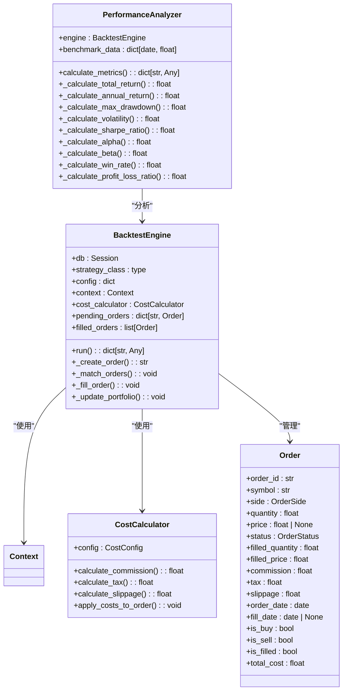
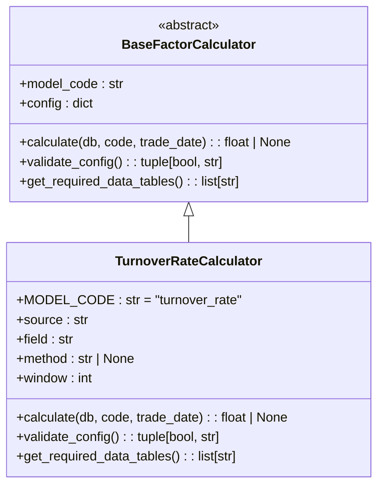
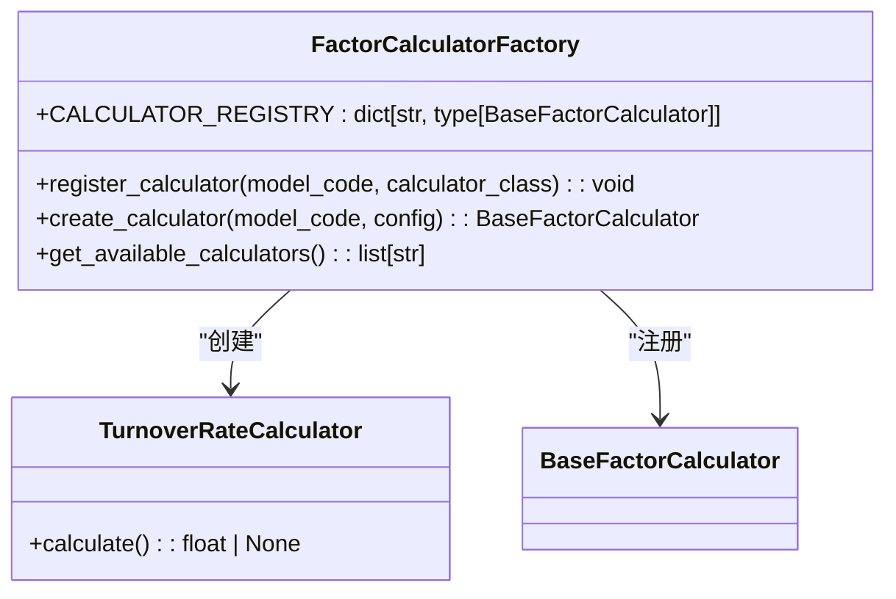
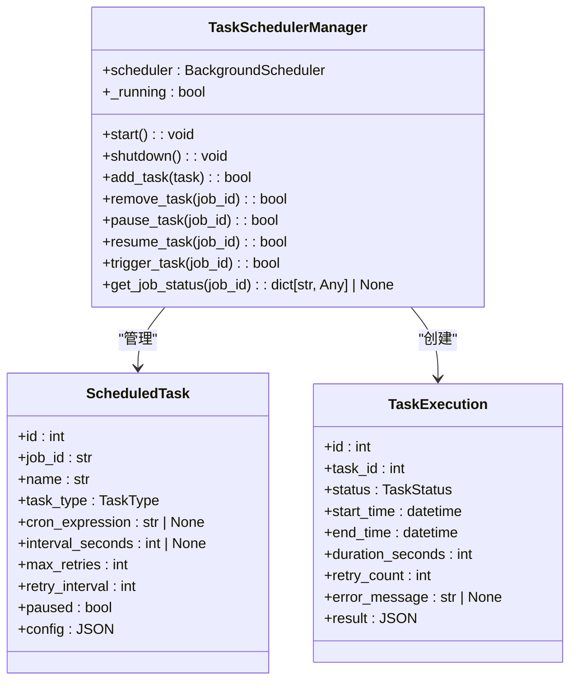
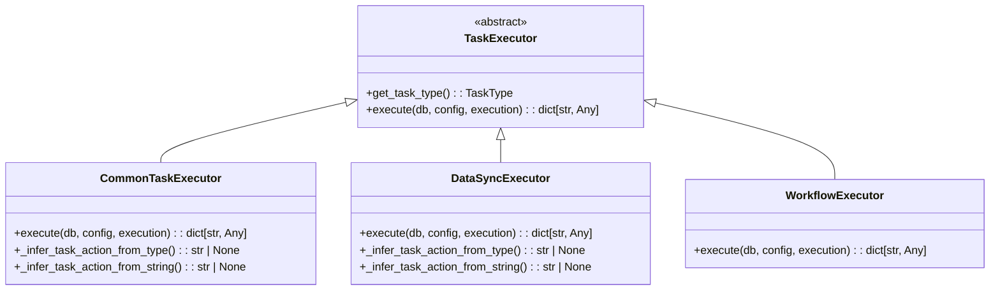
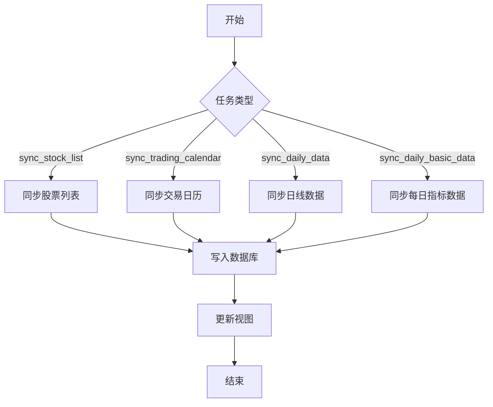

# 核心功能详解

<cite>
**本文档引用的文件**   
- [engine.py](file://zquant/backtest/engine.py)
- [context.py](file://zquant/backtest/context.py)
- [order.py](file://zquant/backtest/order.py)
- [cost.py](file://zquant/backtest/cost.py)
- [performance.py](file://zquant/backtest/performance.py)
- [base.py](file://zquant/factor/calculators/base.py)
- [factory.py](file://zquant/factor/calculators/factory.py)
- [turnover_rate.py](file://zquant/factor/calculators/turnover_rate.py)
- [manager.py](file://zquant/scheduler/manager.py)
- [common_executor.py](file://zquant/scheduler/executors/common_executor.py)
- [executor.py](file://zquant/scheduler/executor.py)
- [processor.py](file://zquant/data/processor.py)
- [storage.py](file://zquant/data/storage.py)
</cite>

## 目录
1. [回测引擎](#回测引擎)
2. [因子管理系统](#因子管理系统)
3. [任务调度系统](#任务调度系统)
4. [数据服务](#数据服务)

## 回测引擎

回测引擎是zquant系统的核心模块，负责执行策略、模拟交易和生成绩效报告。其主要功能包括策略执行、订单撮合、成本计算和绩效分析。

### 策略编写接口

回测引擎通过`Context`对象为策略提供统一的编程接口。策略开发者通过继承`BaseStrategy`类并实现`on_bar`方法来编写策略逻辑。`Context`对象提供了以下核心方法：

- `order(symbol, quantity, price)`: 下单接口，支持市价单和限价单。
- `order_target(symbol, target_quantity)`: 目标持仓下单。
- `order_value(symbol, value)`: 按金额下单。
- `order_target_value(symbol, target_value)`: 目标市值下单。
- `get_daily_basic(symbol, trade_date)`: 获取每日指标数据（如PE、PB、换手率等）。

**代码片段路径**
- [context.py](file://zquant/backtest/context.py#L82-L188)

### 回测执行流程

回测引擎的执行流程遵循事件驱动模型，主要步骤如下：

1. **初始化**: 加载配置、初始化投资组合、加载交易日历和价格数据。
2. **事件循环**: 遍历每个交易日，执行以下操作：
   - 撮合T-1日的订单（T+1延迟成交）。
   - 更新持仓市值。
   - 调用策略的`on_bar`方法。
3. **结果生成**: 计算最终投资组合价值和已成交订单列表。

**代码片段路径**
- [engine.py](file://zquant/backtest/engine.py#L405-L454)

### 订单模拟与绩效分析机制

回测引擎实现了T+1延迟成交机制，订单在T日下单，T+1日以开盘价撮合。订单撮合时会检查涨跌停情况，涨停时买入订单被拒绝，跌停时卖出订单被拒绝。

成本计算包括佣金、印花税和滑点。佣金按交易金额的固定比例收取，有最低佣金限制；印花税仅在卖出时收取；滑点按交易金额的固定比例计算。

绩效分析模块提供全面的指标，包括累计收益率、年化收益率、最大回撤、波动率、夏普比率、胜率和盈亏比。

**代码片段路径**
- [engine.py](file://zquant/backtest/engine.py#L41-L498)
- [order.py](file://zquant/backtest/order.py#L32-L86)
- [cost.py](file://zquant/backtest/cost.py#L43-L116)
- [performance.py](file://zquant/backtest/performance.py#L36-L330)

## 因子管理系统

因子管理系统负责因子的定义、计算和存储。系统采用插件式架构，支持多种因子计算模型。

### 因子定义

因子通过`BaseFactorCalculator`基类定义，所有因子计算器必须继承该类并实现`calculate`和`validate_config`方法。因子配置通过`config`字典传递，支持灵活的参数化。

**代码片段路径**
- [base.py](file://zquant/factor/calculators/base.py#L34-L82)
- [turnover_rate.py](file://zquant/factor/calculators/turnover_rate.py#L37-L188)

### 计算引擎（calculators/）

计算引擎采用工厂模式，通过`create_calculator`函数根据`model_code`创建对应的因子计算器实例。系统维护一个`CALCULATOR_REGISTRY`注册表，用于注册和查找因子计算器。

**代码片段路径**
- [factory.py](file://zquant/factor/calculators/factory.py#L41-L90)

### 结果存储查询方式

因子计算结果按股票代码分表存储，表名为`zq_data_tustock_factor_{ts_code}`。系统提供`DataStorage`类用于写入因子数据，`DataProcessor`类用于查询因子数据。查询时支持单个股票和多个股票，多个股票查询通过视图`zq_data_tustock_factor_view`实现。

**代码片段路径**
- [storage.py](file://zquant/data/storage.py#L564-L697)
- [processor.py](file://zquant/data/processor.py#L579-L644)

## 任务调度系统

任务调度系统基于APScheduler实现，支持定时任务和手动任务的管理。

### 定时任务配置

定时任务通过`ScheduledTask`模型定义，支持Cron表达式和固定间隔两种调度方式。任务配置存储在数据库中，支持动态增删改查。

**代码片段路径**
- [manager.py](file://zquant/scheduler/manager.py#L46-L475)

### 执行器（executors/）模型

执行器采用策略模式，`TaskExecutor`是所有执行器的基类。`CommonTaskExecutor`作为通用执行器，根据`task_action`字段路由到不同的具体执行器。`DataSyncExecutor`负责数据同步任务，使用策略模式委托给具体的同步策略。

**代码片段路径**
- [executor.py](file://zquant/scheduler/executor.py#L36-L152)
- [common_executor.py](file://zquant/scheduler/executors/common_executor.py#L37-L135)

### 工作流管理

工作流管理通过`WorkflowExecutor`实现，支持复杂任务的编排。工作流任务的`config`中包含`steps`字段，定义了任务执行的步骤列表。每个步骤可以是其他任务的引用，支持串行和并行执行。

## 数据服务

数据服务负责数据的ETL流程、存储结构和访问接口。

### 数据ETL流程

数据ETL流程由`DataScheduler`类管理，支持同步股票列表、交易日历、日线数据、每日指标数据等。ETL任务通过命令行脚本触发，如`sync_stock_list.py`、`sync_daily_data.py`等。

**代码片段路径**
- [sync_daily_basic_data.py](file://zquant/scheduler/job/sync_daily_basic_data.py#L49-L122)

### 存储结构

数据存储采用分表策略，按股票代码分表存储，以提高查询性能。主要数据表包括：
- `zq_data_tustock_{ts_code}`: 股票基础信息
- `zq_data_tustock_daily_{ts_code}`: 日线数据
- `zq_data_tustock_daily_basic_{ts_code}`: 每日指标数据
- `zq_data_tustock_factor_{ts_code}`: 因子数据

系统创建视图`zq_data_tustock_daily_view`、`zq_data_tustock_daily_basic_view`等，用于查询多个股票的数据。

**代码片段路径**
- [storage.py](file://zquant/data/storage.py#L57-L767)

### 访问接口

数据访问通过`DataProcessor`类提供，支持按股票代码、日期范围查询数据。查询接口返回字典列表，包含所有字段的值。对于大量数据查询，系统提供批量查询接口，优化性能。

**代码片段路径**
- [processor.py](file://zquant/data/processor.py#L46-L528)