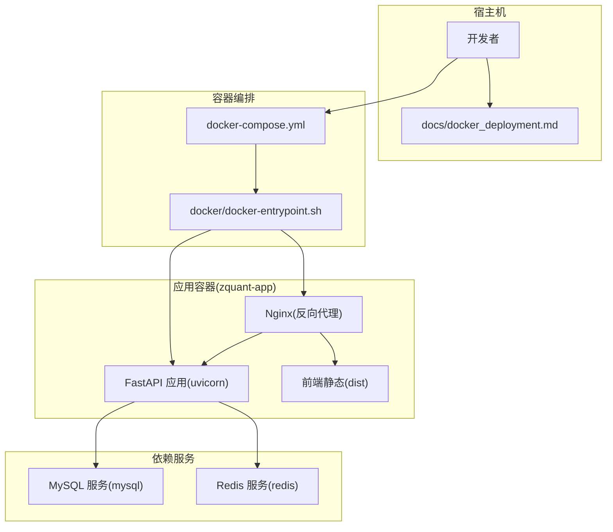
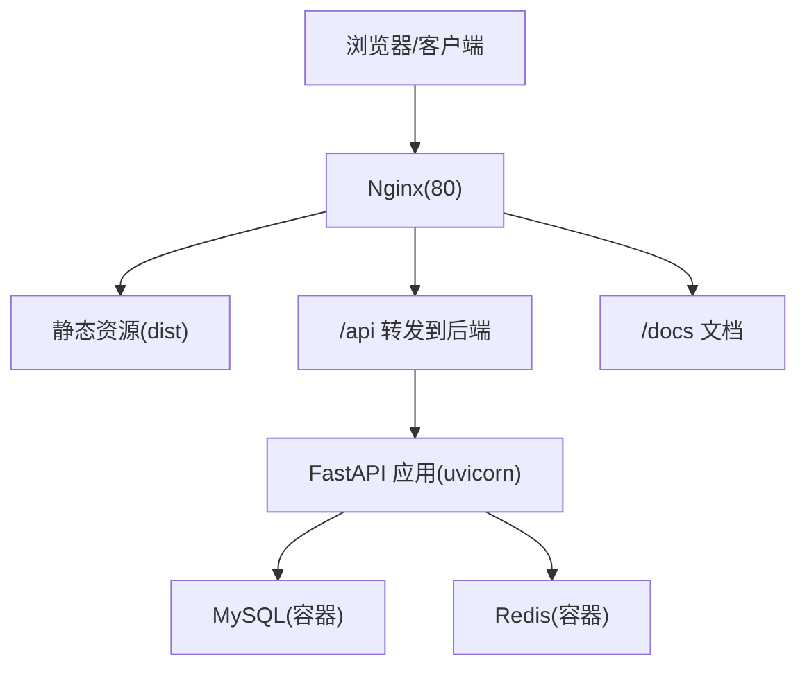
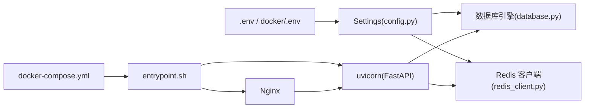
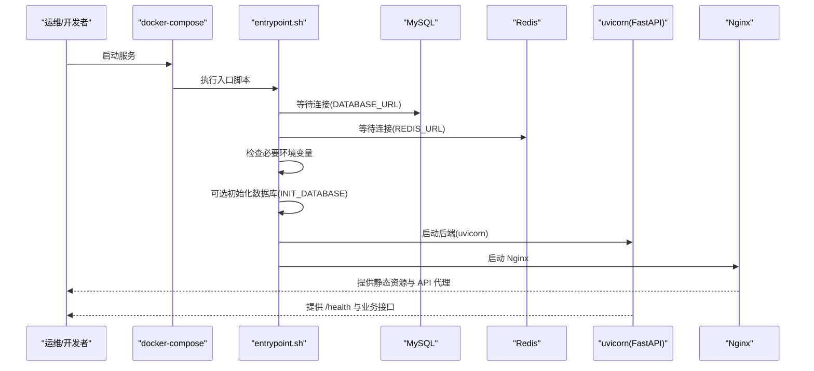

# 环境配置与部署

<cite>
**本文引用的文件**
- [.env.example](file://.env.example)
- [docker/.env.example](file://docker/.env.example)
- [zquant/config.py](file://zquant/config.py)
- [docker-compose.yml](file://docker-compose.yml)
- [Dockerfile](file://Dockerfile)
- [docker/nginx.conf](file://docker/nginx.conf)
- [docker/nginx-site.conf](file://docker/nginx-site.conf)
- [docker/docker-entrypoint.sh](file://docker/docker-entrypoint.sh)
- [docs/docker_deployment.md](file://docs/docker_deployment.md)
- [zquant/database.py](file://zquant/database.py)
- [zquant/utils/redis_client.py](file://zquant/utils/redis_client.py)
- [zquant/api/v1/config.py](file://zquant/api/v1/config.py)
- [zquant/services/config.py](file://zquant/services/config.py)
</cite>

## 目录
1. [简介](#简介)
2. [项目结构](#项目结构)
3. [核心组件](#核心组件)
4. [架构总览](#架构总览)
5. [详细组件分析](#详细组件分析)
6. [依赖关系分析](#依赖关系分析)
7. [性能考虑](#性能考虑)
8. [故障排查指南](#故障排查指南)
9. [结论](#结论)
10. [附录](#附录)

## 简介
本指南面向运维与开发人员，提供 zquant 项目的环境配置与部署完整操作手册。内容覆盖：
- 基于 .env.example 与 config.py 的关键配置项说明（数据库、Redis、Tushare Token、JWT 密钥、加密密钥等）
- Docker 化部署流程：Dockerfile 构建镜像、docker-compose.yml 编排 Web、API、Nginx、数据库，以及 nginx.conf 的反向代理配置
- 本地开发环境搭建与生产环境部署最佳实践
- 按 docs/docker_deployment.md 完成一键部署并验证服务运行
- 常见配置错误与排查方法

## 项目结构
围绕环境配置与部署的关键文件分布如下：
- 应用配置与运行时环境
  - .env.example：顶层示例环境变量文件（用于本地开发）
  - docker/.env.example：Docker 部署示例环境变量文件（必填项集中在此）
  - zquant/config.py：应用配置类 Settings，负责从 .env 与环境变量读取配置并生成数据库/Redis URL
- 编排与容器化
  - docker-compose.yml：编排 zquant-app、mysql、redis 服务及网络/卷
  - Dockerfile：多阶段构建（前端构建、后端混淆、运行时镜像）
  - docker/docker-entrypoint.sh：容器启动入口脚本，负责等待依赖、初始化数据库、启动后端与 Nginx
  - docker/nginx.conf 与 docker/nginx-site.conf：Nginx 核心配置与站点配置（反向代理、静态资源、健康检查、API 文档）
- 文档与脚本
  - docs/docker_deployment.md：官方一键部署与运维指南
  - zquant/scripts/*：数据库初始化、视图、定时任务等脚本（由入口脚本触发）

图表来源
- [docker-compose.yml](file://docker-compose.yml#L1-L114)
- [Dockerfile](file://Dockerfile#L1-L192)
- [docker/docker-entrypoint.sh](file://docker/docker-entrypoint.sh#L1-L199)
- [docker/nginx.conf](file://docker/nginx.conf#L1-L61)
- [docker/nginx-site.conf](file://docker/nginx-site.conf#L1-L91)

章节来源
- [docker-compose.yml](file://docker-compose.yml#L1-L114)
- [Dockerfile](file://Dockerfile#L1-L192)
- [docker/docker-entrypoint.sh](file://docker/docker-entrypoint.sh#L1-L199)
- [docker/nginx.conf](file://docker/nginx.conf#L1-L61)
- [docker/nginx-site.conf](file://docker/nginx-site.conf#L1-L91)

## 核心组件
本节聚焦环境配置与部署相关的核心组件，解释其职责与交互。

- 应用配置 Settings（zquant/config.py）
  - 负责从 .env 与环境变量读取配置，生成 DATABASE_URL 与 REDIS_URL
  - 提供数据库连接池参数、Redis 参数、JWT 密钥、日志级别、缓存类型等
  - 顶层 .env 与 docker/.env 的优先级不同，需按场景选择

- 数据库引擎（zquant/database.py）
  - 基于 Settings.database_url 创建连接池，启用 pool_pre_ping、pool_recycle、max_overflow、pool_timeout 等参数
  - 通过连接池事件监听记录连接取出/归还日志

- Redis 客户端（zquant/utils/redis_client.py）
  - 依据 Settings 初始化 Redis 客户端，支持密码、decode_responses、socket_connect_timeout
  - 提供 get/set/delete/exists 等常用缓存操作

- 编排与启动（docker-compose.yml、Dockerfile、docker/docker-entrypoint.sh）
  - docker-compose.yml：编排 zquant-app、mysql、redis，设置环境变量、健康检查、数据卷
  - Dockerfile：多阶段构建，前端构建与混淆、后端 PyArmor 混淆、运行时镜像安装 Nginx
  - docker/docker-entrypoint.sh：等待数据库/Redis、检查必要环境变量、可选初始化数据库、启动后端与 Nginx

- Nginx 反向代理（docker/nginx.conf、docker/nginx-site.conf）
  - docker/nginx.conf：通用 HTTP/安全/压缩/日志配置
  - docker/nginx-site.conf：站点监听 80，静态资源缓存，/health、/api、/docs 文档代理至后端

章节来源
- [zquant/config.py](file://zquant/config.py#L32-L121)
- [zquant/database.py](file://zquant/database.py#L37-L74)
- [zquant/utils/redis_client.py](file://zquant/utils/redis_client.py#L30-L162)
- [docker-compose.yml](file://docker-compose.yml#L1-L114)
- [Dockerfile](file://Dockerfile#L1-L192)
- [docker/docker-entrypoint.sh](file://docker/docker-entrypoint.sh#L1-L199)
- [docker/nginx.conf](file://docker/nginx.conf#L1-L61)
- [docker/nginx-site.conf](file://docker/nginx-site.conf#L1-L91)

## 架构总览
下图展示生产环境典型部署拓扑：Nginx 作为反向代理，将静态资源与 API 请求转发至后端 FastAPI 应用；后端通过 Settings 读取 .env/docker/.env 的配置，连接 MySQL 与 Redis。

图表来源
- [docker/nginx-site.conf](file://docker/nginx-site.conf#L1-L91)
- [docker/docker-entrypoint.sh](file://docker/docker-entrypoint.sh#L141-L170)
- [zquant/config.py](file://zquant/config.py#L98-L112)

## 详细组件分析

### 环境变量与配置项详解
- 顶层 .env 示例（.env.example）
  - ENCRYPTION_KEY：用于加密敏感配置（如 API Token 等），可通过工具生成密钥
  - 用途：本地开发时使用，配合 zquant/config.py 的 Settings 读取

- Docker 环境变量示例（docker/.env.example）
  - 必填项
    - DB_HOST、DB_PORT、DB_USER、DB_PASSWORD、DB_NAME、DB_CHARSET：数据库连接参数
    - REDIS_HOST、REDIS_PORT、REDIS_DB、REDIS_PASSWORD（可选）：Redis 连接参数
    - SECRET_KEY：JWT 密钥（必须修改为强密码）
    - TUSHARE_TOKEN：Tushare 数据源 Token（通过管理后台或 API 配置）
  - 可选项
    - WORKERS：工作进程数（建议与 CPU 核心数一致）
    - LOG_LEVEL：日志级别
    - INIT_DATABASE：首次部署时是否自动初始化数据库
    - DEBUG：调试模式
    - APP_PORT、APP_HOST：应用端口与主机（容器内）

- 应用配置 Settings（zquant/config.py）
  - 数据库相关：DB_HOST、DB_PORT、DB_USER、DB_PASSWORD、DB_NAME、DB_CHARSET、DB_POOL_*、DB_ECHO
  - Redis 相关：REDIS_HOST、REDIS_PORT、REDIS_DB、REDIS_PASSWORD、CACHE_TYPE、CACHE_MAX_SIZE
  - 安全相关：SECRET_KEY、ALGORITHM、ACCESS_TOKEN_EXPIRE_MINUTES、REFRESH_TOKEN_EXPIRE_DAYS、ENCRYPTION_KEY
  - 日志与调度：LOG_LEVEL、SCHEDULER_THREAD_POOL_SIZE
  - URL 生成：database_url、redis_url
  - 优先级：环境变量 > .env 文件 > 类属性默认值

- 配置来源与调试
  - zquant/config.py 提供 print_config_debug_info，用于打印配置加载信息与优先级说明，便于定位端口/数据库连接异常

章节来源
- [.env.example](file://.env.example#L1-L5)
- [docker/.env.example](file://docker/.env.example#L1-L84)
- [zquant/config.py](file://zquant/config.py#L32-L121)
- [zquant/config.py](file://zquant/config.py#L126-L166)

### Docker 化部署流程

#### 1) Dockerfile 构建镜像
- 多阶段构建
  - 阶段1：前端构建与混淆（Node 20，UmiJS 使用 Terser）
  - 阶段2：后端混淆（PyArmor 8.5.7，排除测试/迁移/初始化脚本）
  - 阶段3：运行时镜像（Python 3.11-slim，安装 Nginx，非 root 用户，复制前端产物与 Nginx 配置，设置 HEALTHCHECK）
- 关键点
  - 前端静态资源位于 /app/web/dist
  - Nginx 配置位于 /etc/nginx/nginx.conf 与 /etc/nginx/conf.d/default.conf
  - 入口脚本 /usr/local/bin/docker-entrypoint.sh

章节来源
- [Dockerfile](file://Dockerfile#L1-L192)

#### 2) docker-compose.yml 编排服务
- 服务
  - zquant-app：构建镜像，暴露 80 端口，注入 DATABASE_URL/REDIS_URL/APP_* 等环境变量，依赖 mysql 与 redis，健康检查 /health
  - mysql：MySQL 8.0，设置字符集与时区，持久化卷 mysql_data，初始化脚本目录
  - redis：Redis 7-alpine，AOF 持久化，持久化卷 redis_data
- 网络与卷
  - 自定义桥接网络 zquant-network
  - 数据卷 mysql_data、redis_data

章节来源
- [docker-compose.yml](file://docker-compose.yml#L1-L114)

#### 3) Nginx 反向代理配置
- docker/nginx.conf：通用 HTTP/安全/压缩/日志配置
- docker/nginx-site.conf：
  - upstream 指向 127.0.0.1:8000
  - 静态资源缓存与 immutable 策略
  - /health、/api、/docs 文档代理到后端
  - 安全响应头与禁止访问隐藏文件

章节来源
- [docker/nginx.conf](file://docker/nginx.conf#L1-L61)
- [docker/nginx-site.conf](file://docker/nginx-site.conf#L1-L91)

#### 4) 容器启动入口脚本
- 功能
  - 等待数据库连接（解析 DATABASE_URL，轮询 socket 连接）
  - 等待 Redis 连接（解析 REDIS_URL，轮询 socket 连接）
  - 检查必要环境变量（DATABASE_URL、SECRET_KEY）
  - 可选初始化数据库（INIT_DATABASE=true 时执行 init_db/init_scheduler/init_view/init_strategies）
  - 启动后端 uvicorn（127.0.0.1:8000），等待 /health 就绪
  - 启动 Nginx 并接管容器生命周期
- 健康检查
  - 容器 HEALTHCHECK 与 compose healthcheck 均指向 /health

章节来源
- [docker/docker-entrypoint.sh](file://docker/docker-entrypoint.sh#L1-L199)

### 一键部署与验证
- 按 docs/docker_deployment.md 快速开始
  - 复制 docker/.env.example 为 docker/.env，编辑必填项（SECRET_KEY、DB_PASSWORD、TUSHARE_TOKEN）
  - docker-compose up -d 启动服务
  - 访问 http://localhost（前端）、http://localhost/docs（API 文档）、http://localhost/health（健康检查）
- 首次部署初始化数据库
  - 方式1：设置 INIT_DATABASE=true，重启 zquant-app
  - 方式2：进入容器执行初始化脚本（init_db、init_scheduler、init_view、init_strategies）
- 日志与监控
  - docker-compose logs -f zquant-app 查看应用日志
  - docker-compose ps 查看容器状态
  - curl http://localhost/health 验证健康检查

章节来源
- [docs/docker_deployment.md](file://docs/docker_deployment.md#L36-L110)
- [docs/docker_deployment.md](file://docs/docker_deployment.md#L81-L95)
- [docs/docker_deployment.md](file://docs/docker_deployment.md#L97-L102)
- [docs/docker_deployment.md](file://docs/docker_deployment.md#L313-L324)

## 依赖关系分析
- 组件耦合
  - zquant/config.py 与 zquant/database.py、zquant/utils/redis_client.py 强耦合，前者提供 URL，后者消费
  - docker/docker-entrypoint.sh 依赖 DATABASE_URL/REDIS_URL/INIT_DATABASE/WORKERS/LOG_LEVEL 等环境变量
  - docker-compose.yml 通过 env_file 与 environment 注入配置，同时设置上游与反向代理
- 外部依赖
  - MySQL 8.0、Redis 7、Nginx、uvicorn、PyArmor、前端构建工具链

图表来源
- [zquant/config.py](file://zquant/config.py#L98-L112)
- [zquant/database.py](file://zquant/database.py#L37-L74)
- [zquant/utils/redis_client.py](file://zquant/utils/redis_client.py#L30-L162)
- [docker-compose.yml](file://docker-compose.yml#L1-L114)
- [docker/docker-entrypoint.sh](file://docker/docker-entrypoint.sh#L141-L170)

## 性能考虑
- 连接池与缓存
  - 数据库连接池：DB_POOL_SIZE、DB_MAX_OVERFLOW、DB_POOL_RECYCLE、DB_POOL_PRE_PING、DB_POOL_TIMEOUT
  - Redis：合理设置密码、超时与持久化（AOF），避免阻塞命令
- Nginx 优化
  - gzip、keepalive、静态资源缓存、隐藏版本号、安全响应头
- 并发与进程
  - WORKERS 根据 CPU 核心数设置，uvicorn 默认单进程，建议按需扩展
- 日志级别
  - 生产环境建议 LOG_LEVEL=info，减少 IO 压力

[本节为通用建议，无需列出具体文件来源]

## 故障排查指南
- 容器启动失败
  - 检查日志：docker-compose logs zquant-app
  - 检查环境变量：docker-compose config
  - 检查端口占用与磁盘空间
- 数据库连接失败
  - 检查 mysql 服务状态与日志
  - 使用 docker-compose exec mysql mysql -u root -p 测试连接
  - 检查网络连通性：docker-compose exec zquant-app ping mysql
- Redis 连接失败
  - 检查 redis 服务状态与日志
  - 使用 docker-compose exec redis redis-cli ping 测试
  - 如启用密码，使用带密码的 ping 验证
- 前端页面无法访问
  - 检查 Nginx 配置：docker-compose exec zquant-app nginx -t
  - 检查前端 dist 是否存在
  - 检查端口映射与健康检查
- 代码混淆失败
  - 查看构建日志：docker-compose build --no-cache zquant-app
  - 检查 PyArmor 版本与可用性
- 配置优先级导致的异常
  - 使用 zquant/config.py 的调试函数打印配置来源与优先级，确认 DB_PORT/DB_HOST 等是否被环境变量覆盖

章节来源
- [docs/docker_deployment.md](file://docs/docker_deployment.md#L336-L428)
- [zquant/config.py](file://zquant/config.py#L126-L166)

## 结论
通过 .env 与 docker/.env 的清晰分离、Dockerfile 的多阶段构建与 PyArmor 混淆、docker-compose.yml 的服务编排与健康检查，以及 Nginx 的反向代理与静态资源缓存，zquant 提供了可一键部署、可维护、可扩展的生产级部署方案。建议在生产环境中严格设置密钥与密码、启用 Redis 密码认证、配置 HTTPS 与监控告警，并定期备份数据。

[本节为总结性内容，无需列出具体文件来源]

## 附录

### 本地开发环境搭建步骤
- 准备 .env（本地开发）
  - 复制 .env.example 为 .env，按需填写数据库、Redis、JWT、加密密钥等
- 启动依赖服务（可选）
  - 若不使用 Docker，可本地安装 MySQL 与 Redis，确保端口与账号正确
- 启动应用
  - 使用 uvicorn 启动 FastAPI 应用（参考入口脚本逻辑）
  - 访问 http://localhost:8000/docs 查看 API 文档

章节来源
- [.env.example](file://.env.example#L1-L5)
- [zquant/config.py](file://zquant/config.py#L98-L112)

### 生产环境部署最佳实践
- 安全
  - 修改默认密码与密钥，使用强密码（至少 32 位）
  - 启用 Redis 密码认证
  - 配置防火墙与只开放必要端口
  - 使用 HTTPS（在 Nginx 层配置证书）
- 性能
  - 根据 CPU 核心数设置 WORKERS
  - 调整数据库连接池大小与超时
  - 启用 Redis 缓存与 Nginx 压缩/缓存
- 监控与备份
  - 配置日志收集与监控告警
  - 定期备份 MySQL 与 Redis 数据
  - 使用健康检查与自动重启策略

章节来源
- [docs/docker_deployment.md](file://docs/docker_deployment.md#L429-L459)

### 关键流程时序图：容器启动与初始化

图表来源
- [docker/docker-entrypoint.sh](file://docker/docker-entrypoint.sh#L141-L170)
- [docker-compose.yml](file://docker-compose.yml#L1-L114)
- [docker/nginx-site.conf](file://docker/nginx-site.conf#L1-L91)