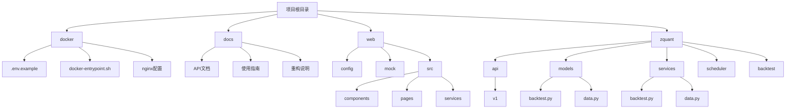
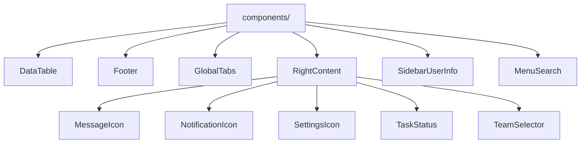
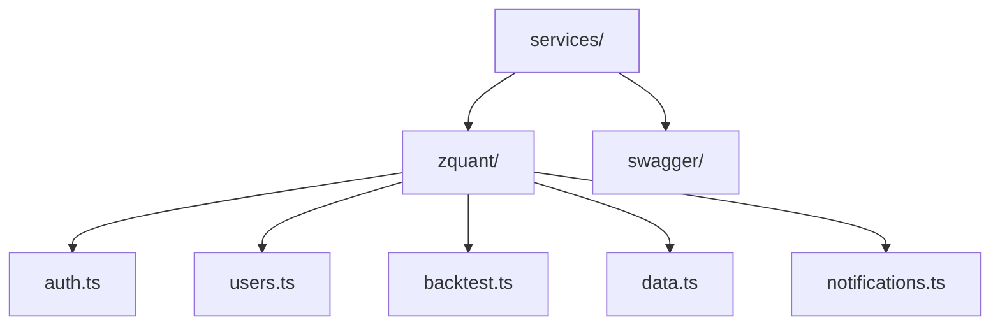
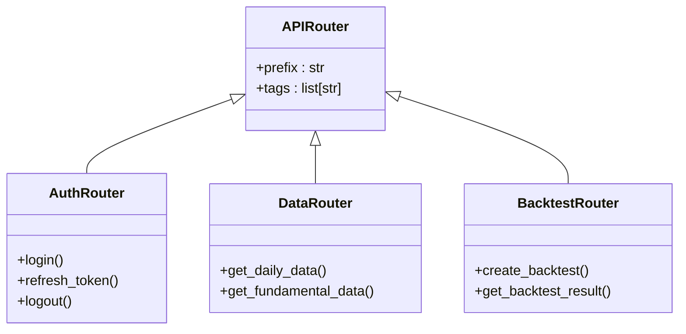
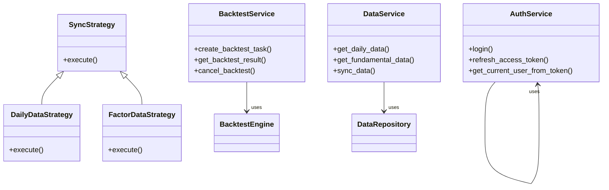
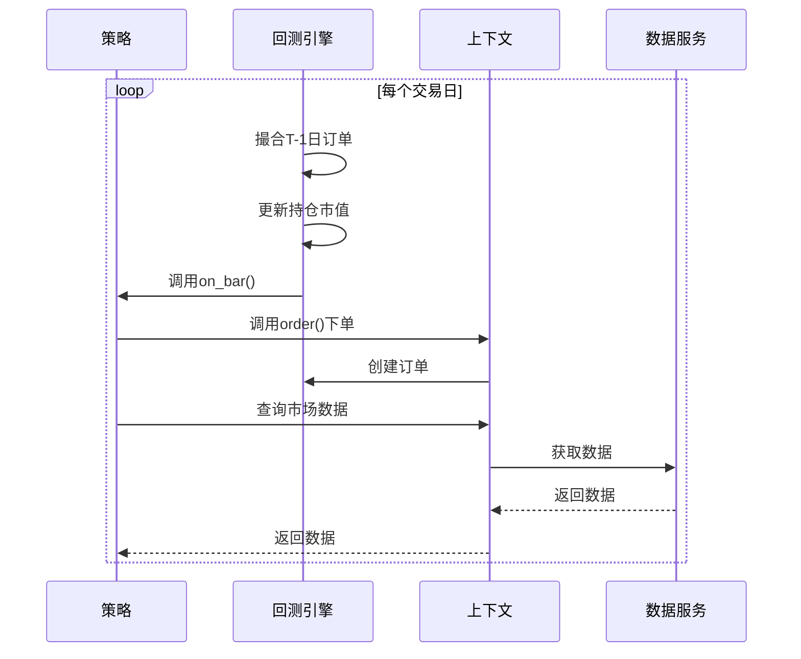
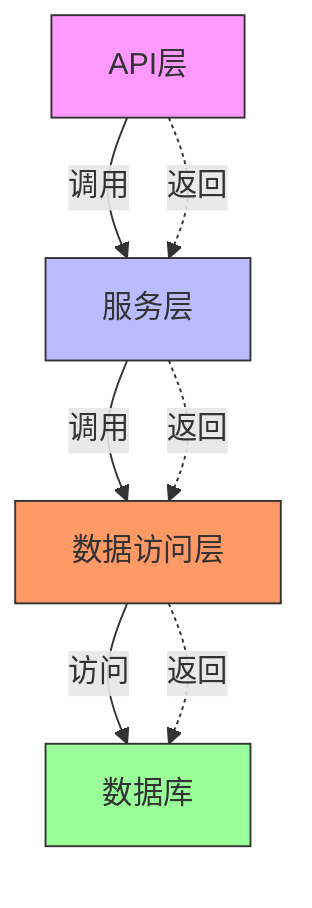

# 目录结构解析

<cite>
**本文档引用的文件**  
- [README.md](file://README.md)
- [docker-entrypoint.sh](file://docker/docker-entrypoint.sh)
- [main.py](file://zquant/main.py)
- [app.tsx](file://web/src/app.tsx)
- [auth.py](file://zquant/api/v1/auth.py)
- [auth.ts](file://web/src/services/zquant/auth.ts)
- [backtest/engine.py](file://zquant/backtest/engine.py)
- [models/__init__.py](file://zquant/models/__init__.py)
- [services/auth.py](file://zquant/services/auth.py)
- [repositories/__init__.py](file://zquant/repositories/__init__.py)
- [components/index.ts](file://web/src/components/index.ts)
- [Admin.tsx](file://web/src/pages/Admin.tsx)
</cite>

## 目录结构解析

zquant项目采用清晰的分层架构设计，通过合理的目录划分实现了前后端分离、功能模块化和代码复用。项目的根目录主要包含`docker/`、`docs/`、`web/`和`zquant/`四个核心文件夹，分别承担不同的职责。这种结构不仅便于开发者快速定位关键模块，也体现了分层架构原则在物理文件组织上的应用。

**目录来源**  
- [README.md](file://README.md)
- [项目结构](file://README.md#项目结构)

## 根目录核心文件夹职责

zquant项目的根目录结构设计遵循了现代Web应用的最佳实践，将配置、文档、前端和后端代码物理分离，便于团队协作和维护。

### docker/（Docker配置）

`docker/`目录包含了项目容器化部署所需的全部配置文件，是实现一键部署的关键。该目录通过Docker Compose将应用、数据库和缓存服务整合，大大简化了开发和生产环境的搭建过程。

- **.env.example**: 环境变量模板文件，定义了`DATABASE_URL`、`REDIS_URL`、`TUSHARE_TOKEN`和`SECRET_KEY`等关键配置项，开发者需复制并修改此文件以适配自己的环境。
- **docker-entrypoint.sh**: 容器启动脚本，负责等待数据库和Redis服务就绪、检查环境变量、初始化数据库并启动后端服务，确保了容器的健壮启动。
- **nginx配置文件**: 包含`nginx.conf`和`nginx-site.conf`，用于配置Nginx反向代理，将前端静态资源和后端API请求正确路由。

**Section sources**
- [docker-entrypoint.sh](file://docker/docker-entrypoint.sh)
- [.env.example](file://docker/.env.example)

### docs/（文档）

`docs/`目录是项目的知识中心，包含了从部署指南到功能使用的全面文档，帮助开发者和用户快速上手。

- **API文档**: `api/api_reference.md`提供了完整的API接口参考。
- **使用指南**: 包含`docker_deployment.md`（Docker部署）、`database_init.md`（数据库初始化）、`scheduler_guide.md`（调度器使用）等实用指南。
- **技术文档**: `refactoring_summary.md`和`refactoring_2025_summary.md`详细记录了项目的架构演进和优化成果，如Repository模式、批量查询优化和Strategy模式的应用。

**Section sources**
- [README.md](file://README.md#文档)

### web/（前端代码）

`web/`目录存放了基于React和UmiJS构建的前端应用代码，实现了现代化的用户界面。

- **config/**: 包含API配置、路由定义和应用设置。
- **mock/**: 提供前端开发时的模拟数据。
- **public/**: 存放静态资源，如加载脚本和CNAME文件。
- **src/**: 前端源码主目录，包含组件、页面和服务封装。

**Section sources**
- [README.md](file://README.md#项目结构)

### zquant/（后端代码）

`zquant/`目录是项目的核心，基于FastAPI构建的后端服务，实现了数据管理、回测引擎和用户系统等核心功能。

- **api/**: API路由层，定义了所有HTTP接口。
- **models/**: 数据模型层，使用SQLAlchemy定义数据库表结构。
- **services/**: 业务逻辑层，包含认证、数据同步、回测等核心服务。
- **scheduler/**: 任务调度系统，基于APScheduler实现定时任务管理。
- **backtest/**: 回测引擎，提供事件驱动的策略回测能力。

**Section sources**
- [README.md](file://README.md#项目结构)

## 前端代码结构分析

前端代码位于`web/src/`目录下，采用模块化设计，清晰地分离了UI组件、页面路由和API服务。

### web/src/components（可复用UI组件）

`components/`目录存放了所有可复用的UI组件，通过组件化提高了代码的复用性和维护性。

- **DataTable/ 和 DataTablePage/**: 通用数据表格组件，通过配置驱动，减少了重复的表格展示代码。
- **HeaderDropdown/ 和 AvatarDropdown/**: 用户头像和下拉菜单组件，封装了用户信息展示和登出逻辑。
- **GlobalTabs/**: 全局标签页组件，用于管理多标签页状态。
- **RightContent/**: 右上角内容区域，集成了消息、通知和设置图标。
- **index.ts**: 组件导出入口文件，统一管理所有组件的对外输出。

**目录来源**  
- [项目结构](file://README.md#项目结构)
- [index.ts](file://web/src/components/index.ts)

### web/src/pages（路由页面）

`pages/`目录按照功能模块组织，每个子目录对应一个应用页面。

- **account/**: 用户账户中心，包含个人中心和设置页面。
- **admin/**: 管理员功能模块，包含配置管理、权限管理和调度器监控。
- **backtest/**: 回测功能，支持策略创建、回测执行和绩效分析。
- **data/**: 数据管理页面，提供股票、财务和因子数据的查询和同步。
- **factor/**: 因子管理，支持因子定义、配置和结果查看。
- **user/login/**: 用户登录页面，处理认证流程。

**Section sources**
- [项目结构](file://README.md#项目结构)
- [Admin.tsx](file://web/src/pages/Admin.tsx)

### web/src/services（API服务封装）

`services/`目录封装了对后端API的调用，实现了前后端的解耦。

- **zquant/**: 项目专属API服务，按功能模块组织，如`auth.ts`、`backtest.ts`和`data.ts`。
- **swagger/**: Swagger API服务，可能用于接口文档集成。
- **index.ts**: 服务导出入口，统一管理所有API服务的引用。

**目录来源**  
- [项目结构](file://README.md#项目结构)
- [index.ts](file://web/src/services/zquant/index.ts)

## 后端核心模块组织

后端代码严格遵循分层架构原则，将API层、服务层和数据访问层物理分离，提高了代码的可维护性和可测试性。

### zquant/api（接口层）

`api/`目录是应用的入口层，负责HTTP请求的接收和响应。

- **v1/**: API版本1，包含`auth.py`、`backtest.py`、`data.py`等模块，每个文件对应一个功能域。
- **路由注册**: 在`main.py`中通过`app.include_router()`将各模块的路由注册到应用。
- **统一处理**: 通过装饰器实现统一的错误处理和响应格式转换。

**Diagram sources**
- [auth.py](file://zquant/api/v1/auth.py)
- [main.py](file://zquant/main.py#L218-L231)

### zquant/models（数据模型）

`models/`目录定义了所有数据库实体，使用SQLAlchemy ORM映射到数据库表。

- **集中导出**: `__init__.py`文件统一导出了所有模型类，如`User`、`BacktestTask`和`ScheduledTask`。
- **关系映射**: 定义了用户、角色、权限之间的多对多关系，以及回测任务和结果的关联。
- **数据表**: 对应数据库中的`users`、`roles`、`backtest_tasks`等表。

**Section sources**
- [models/__init__.py](file://zquant/models/__init__.py)

### zquant/services（业务逻辑）

`services/`目录包含了核心业务逻辑的实现，是应用的大脑。

- **AuthService**: 处理用户认证，包含登录、Token刷新和失败次数限制。
- **BacktestService**: 管理回测任务的创建、执行和结果获取。
- **DataService**: 封装数据查询逻辑，提供给API层调用。
- **SyncStrategies**: 基于Strategy模式的数据同步策略，易于扩展新的同步方式。

**Diagram sources**
- [services/auth.py](file://zquant/services/auth.py)
- [backtest/engine.py](file://zquant/backtest/engine.py)

### zquant/scheduler（任务调度）

`scheduler/`目录实现了强大的定时任务系统，支持Cron表达式和间隔调度。

- **job/**: 包含各种调度任务的实现，如`sync_daily_data.py`和`sync_factor_data.py`。
- **executor/**: 任务执行器，基于APScheduler实现。
- **manager.py**: 调度管理器，负责任务的添加、启动和关闭。

**Section sources**
- [README.md](file://README.md#功能特性)

### zquant/backtest（回测引擎）

`backtest/`目录是量化分析的核心，提供了事件驱动的回测能力。

- **engine.py**: 回测引擎主类，按交易日历推进，模拟订单撮合。
- **context.py**: 回测上下文，提供策略访问市场数据和投资组合的接口。
- **performance.py**: 绩效分析模块，计算夏普比率、最大回撤等指标。
- **strategy.py**: 策略基类，所有用户策略需继承此类。

**Diagram sources**
- [backtest/engine.py](file://zquant/backtest/engine.py)
- [backtest/context.py](file://zquant/backtest/context.py)

## 分层架构原则体现

zquant项目通过物理目录的划分，清晰地体现了典型的分层架构原则：

1. **API层 (api/)**: 处理HTTP请求，定义接口契约。
2. **服务层 (services/)**: 实现核心业务逻辑，是应用的业务核心。
3. **数据访问层 (repositories/)**: 统一数据访问接口，集中管理缓存和批量查询。
4. **模型层 (models/)**: 定义数据结构和关系。

这种分层设计实现了关注点分离，使得各层可以独立开发和测试。例如，`AuthService`在服务层实现认证逻辑，通过`User`模型访问数据库，而`auth.py`在API层只负责接收请求并调用服务层。

**Diagram sources**
- [main.py](file://zquant/main.py)
- [services/auth.py](file://zquant/services/auth.py)
- [repositories/__init__.py](file://zquant/repositories/__init__.py)
- [models/__init__.py](file://zquant/models/__init__.py)

## 功能代码定位指南

开发者可以通过以下路径快速定位特定功能的实现代码：

- **用户认证**: `zquant/api/v1/auth.py` (API) → `zquant/services/auth.py` (服务) → `zquant/models/user.py` (数据)
- **数据服务**: `zquant/api/v1/data.py` → `zquant/services/data.py` → `zquant/repositories/price_data_repository.py`
- **回测引擎**: `zquant/api/v1/backtest.py` → `zquant/services/backtest.py` → `zquant/backtest/engine.py`
- **前端登录**: `web/src/pages/user/login/index.tsx` → `web/src/services/zquant/auth.ts`
- **管理员界面**: `web/src/pages/admin/` → `web/src/components/`

这种清晰的路径映射，使得开发者能够快速理解功能的完整调用链，提高了开发效率。

**Section sources**
- [main.py](file://zquant/main.py)
- [auth.py](file://zquant/api/v1/auth.py)
- [services/auth.py](file://zquant/services/auth.py)
- [app.tsx](file://web/src/app.tsx)