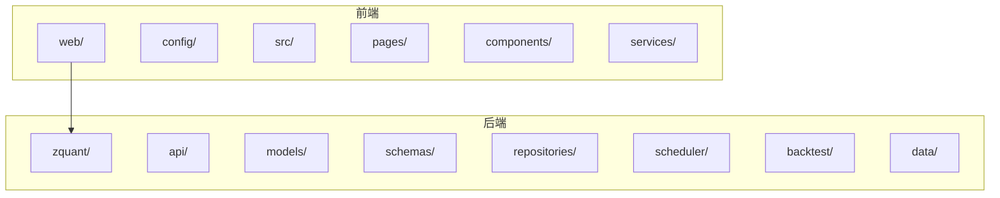
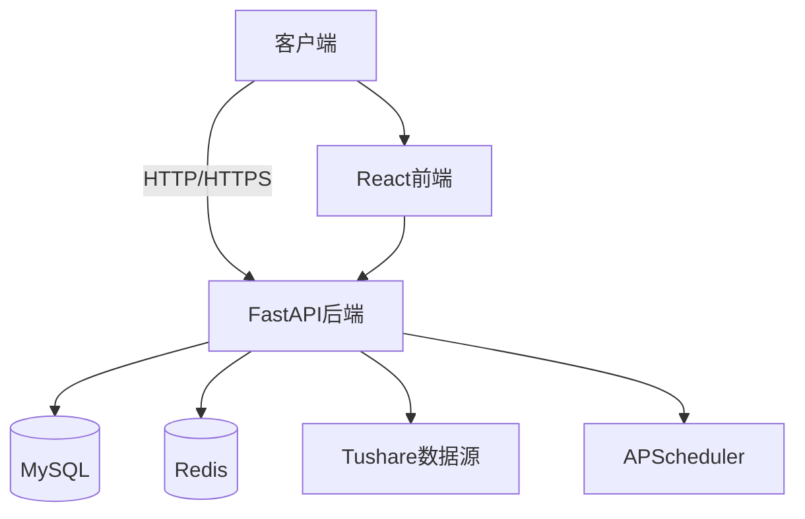
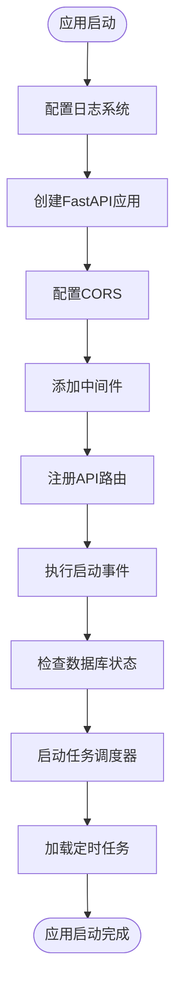
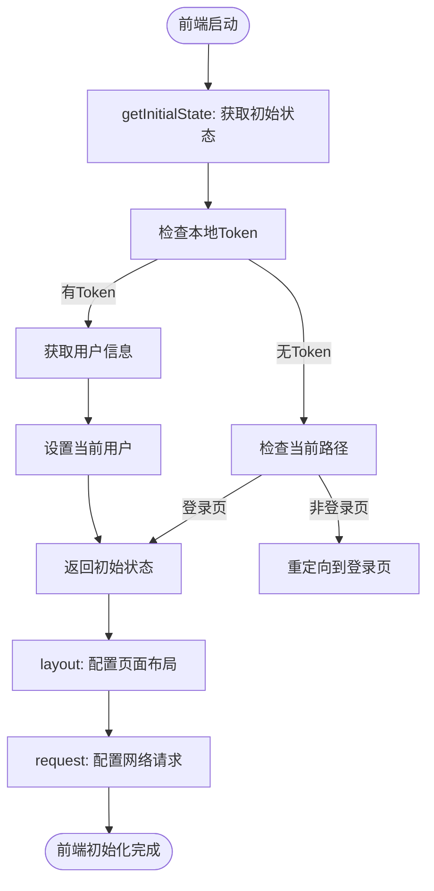
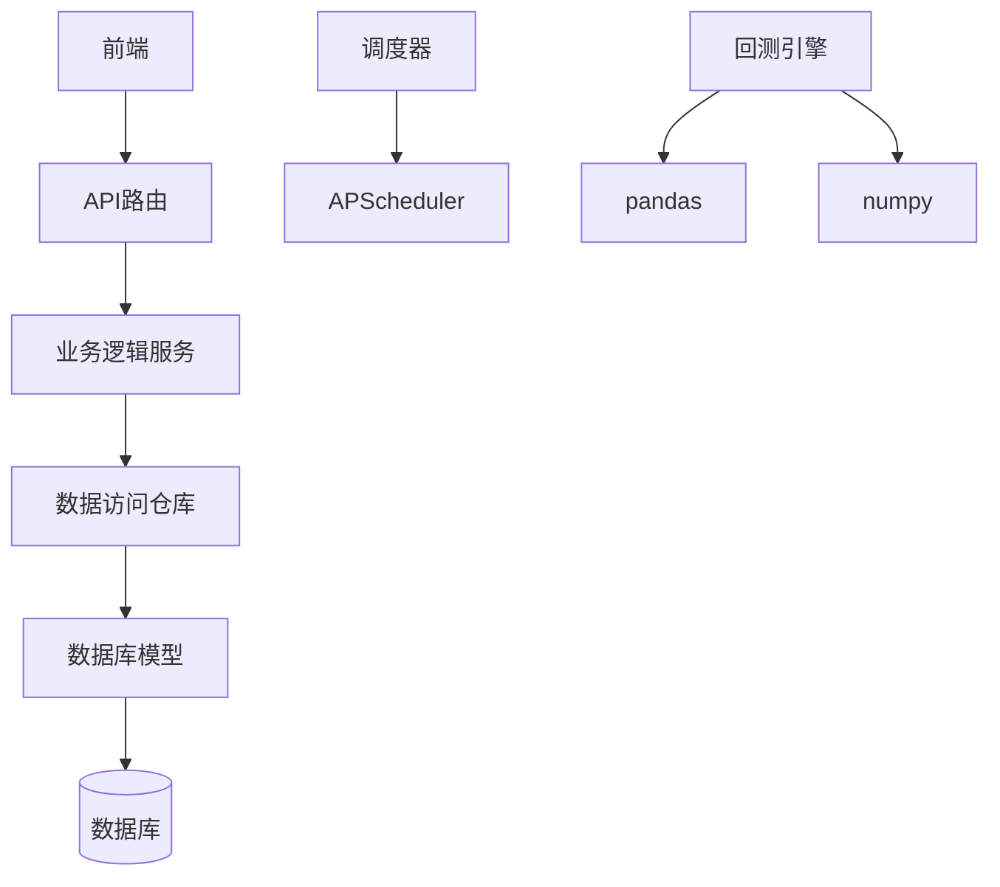

# 系统概述

<cite>
**本文档引用的文件**   
- [main.py](file://zquant/main.py)
- [app.tsx](file://web/src/app.tsx)
- [config.py](file://zquant/config.py)
- [routes.ts](file://web/config/routes.ts)
- [README.md](file://README.md)
</cite>

## 目录
1. [引言](#引言)
2. [项目结构](#项目结构)
3. [核心组件](#核心组件)
4. [架构概览](#架构概览)
5. [详细组件分析](#详细组件分析)
6. [依赖分析](#依赖分析)
7. [性能考虑](#性能考虑)
8. [故障排除指南](#故障排除指南)
9. [结论](#结论)

## 引言
ZQuant量化分析平台是一个功能完整的股票量化分析系统，旨在为量化分析者提供从数据采集、策略开发、回测分析到结果管理的一站式解决方案。该平台采用前后端分离架构，后端基于FastAPI构建RESTful API，前端基于React与UmiJS构建用户界面。平台为用户提供数据服务、回测引擎、因子管理与任务调度能力，支持策略开发者和系统管理员等不同用户角色。

## 项目结构
ZQuant平台采用清晰的分层架构，将代码库分为多个逻辑模块。后端代码位于`zquant/`目录，采用分层架构设计，包括API路由、数据库模型、业务逻辑服务、数据访问仓库、调度器、回测引擎等组件。前端代码位于`web/`目录，基于React和UmiJS框架，采用组件化设计，包含页面、组件、服务、配置等模块。这种分离的架构设计使得前后端可以独立开发、测试和部署，提高了开发效率和系统的可维护性。

**Diagram sources**
- [README.md](file://README.md#L69-L127)

## 核心组件
ZQuant平台的核心组件包括数据服务、回测引擎、因子管理和任务调度系统。数据服务负责从Tushare专业数据源自动采集和清洗股票数据，并提供统一的API接口。回测引擎采用事件驱动的设计，支持多种策略类型和全面的绩效分析。因子管理系统允许用户定义和计算各种量化因子。任务调度系统基于APScheduler实现，支持Cron表达式和间隔调度，用于自动化数据同步和因子计算等任务。

**Section sources**
- [README.md](file://README.md#L31-L49)

## 架构概览
ZQuant平台采用前后端分离的全栈架构。后端使用FastAPI框架，利用其高性能、异步支持和自动生成API文档的特性。前端使用React与UmiJS，提供现代化的用户界面和良好的开发体验。系统通过RESTful API进行通信，实现了前后端的解耦。平台采用基于JWT的认证和RBAC权限控制，保障系统安全。选择FastAPI与React组合的原因是两者都具有活跃的社区、丰富的生态系统和优秀的开发体验，能够快速构建高性能的Web应用。

**Diagram sources**
- [README.md](file://README.md#L58-L68)

## 详细组件分析

### 后端启动流程分析
ZQuant平台的后端启动流程从`main.py`文件开始。应用首先配置日志系统，然后创建FastAPI应用实例。接着配置CORS中间件以支持跨域请求，并按顺序添加多个中间件，包括安全响应头、XSS防护、速率限制、审计日志和请求日志。应用启动事件中会检查数据库状态，并启动任务调度器，加载已启用的定时任务。最后，注册各个API路由，完成应用的初始化。

**Section sources**
- [main.py](file://zquant/main.py#L116-L247)

#### 后端启动流程图

**Diagram sources**
- [main.py](file://zquant/main.py#L116-L204)

### 前端启动流程分析
ZQuant平台的前端启动流程从`app.tsx`文件开始。应用首先定义`getInitialState`函数，用于获取初始状态，包括用户信息和系统设置。该函数会检查本地存储中的认证令牌，如果存在则尝试获取当前用户信息。`layout`函数配置了页面布局，包括头部、侧边栏、菜单搜索等功能。`request`配置定义了网络请求的全局设置，如基础URL和错误处理。整个流程确保了用户状态的正确初始化和页面的正常渲染。

**Section sources**
- [app.tsx](file://web/src/app.tsx#L54-L154)

#### 前端启动流程图

**Diagram sources**
- [app.tsx](file://web/src/app.tsx#L54-L453)

### 系统配置分析
ZQuant平台的配置系统采用分层设计，优先级从高到低为：环境变量 > .env文件 > 代码中的默认值。后端配置通过`config.py`文件中的`Settings`类定义，使用Pydantic Settings进行类型验证和环境变量加载。配置项包括应用、数据库、Redis、日志、速率限制、JWT等多个方面。前端配置通过`config.ts`文件定义，使用UmiJS的配置系统，包括路由、代理、主题、国际化等设置。这种配置方式使得应用可以在不同环境中灵活部署。

**Section sources**
- [config.py](file://zquant/config.py#L32-L166)
- [config.ts](file://web/config/config.ts#L41-L227)

## 依赖分析
ZQuant平台的依赖关系清晰，各组件之间耦合度低。后端API路由依赖于业务逻辑服务，服务层依赖于数据访问仓库，仓库层依赖于数据库模型。调度器依赖于APScheduler库，回测引擎依赖于pandas和numpy等数据分析库。前端组件通过服务层与后端API通信，服务层封装了具体的API调用细节。这种分层依赖结构使得代码易于维护和测试，也便于未来的功能扩展。

**Diagram sources**
- [README.md](file://README.md#L58-L68)

## 性能考虑
ZQuant平台在设计时充分考虑了性能因素。后端使用FastAPI框架，支持异步处理，能够高效处理大量并发请求。数据库连接池配置优化，避免了频繁创建和销毁连接的开销。回测引擎采用批量查询优化，减少了数据库查询次数。前端使用UmiJS的代码分割和懒加载功能，减少了初始加载时间。任务调度系统使用线程池异步执行任务，避免了阻塞主线程。这些性能优化措施确保了平台在高负载下的稳定运行。

## 故障排除指南
当ZQuant平台出现问题时，可以按照以下步骤进行排查：首先检查应用日志，日志文件位于`logs/zquant.log`，查看是否有错误信息。其次检查数据库连接是否正常，确认数据库服务是否运行，配置是否正确。然后检查Redis服务是否正常，因为缓存和任务队列依赖Redis。对于前端问题，可以检查浏览器控制台是否有JavaScript错误，以及网络请求是否成功。最后，可以使用健康检查接口`/health`来确认应用的基本状态。

**Section sources**
- [main.py](file://zquant/main.py#L243-L246)

## 结论
ZQuant量化分析平台通过采用前后端分离架构，结合FastAPI和React等现代技术栈，成功构建了一个功能完整、性能优越的量化分析系统。平台的设计充分考虑了可扩展性、安全性和易用性，为用户提供了一站式的量化分析解决方案。通过清晰的分层架构和模块化设计，系统具有良好的可维护性和可扩展性，能够满足不同用户角色的需求。未来可以进一步优化性能，增加更多高级功能，提升用户体验。